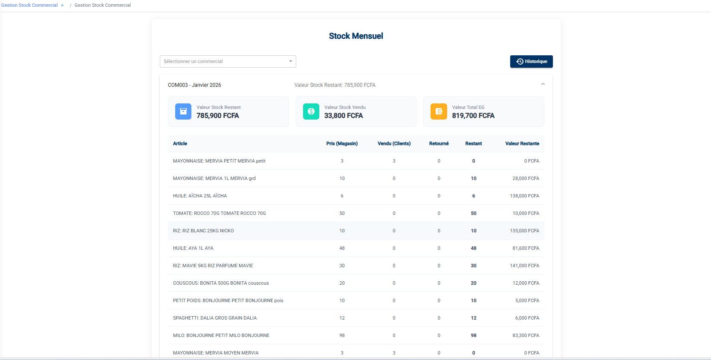

# Gestion de votre Stock

En tant que commercial, vous êtes responsable d'un stock "ambulant" ou personnel que vous distribuez aux clients. Ce module vous permet de gérer ce stock.

## 1. Mon Stock (Consultation)
Allez dans **Stock Commercial > Stock** (ou *My Stock*).

Ce tableau de bord vous montre l'état de votre stock par mois.
En haut, trois cartes résument la situation financière :
*   **Valeur Stock Restant** : Ce que vous avez en main.
*   **Valeur Stock Vendu** : Ce que vous avez déjà écoulé.
*   **Valeur Total Dû** : Ce que vous devez reverser.

Le tableau détaille ensuite par article :
*   **Article** : Nom du produit.
*   **Pris (Magasin)** : Quantité totale récupérée chez le magasinier.
*   **Vendu (Clients)** : Quantité vendue.
*   **Retourné** : Quantité que vous avez ramenée au stock central.
*   **Restant** : Ce qu'il vous reste physiquement.
*   **Valeur Restante** : Valorisation de ce stock restant.

## 2. Se Réapprovisionner (Demandes)
Lorsque votre stock baisse, vous devez demander du matériel au magasin central.

1.  Allez dans **Stock Commercial > Demandes Sortie**.
2.  Cliquez sur **Nouvelle Demande**.
    
3.  **Articles** : Sélectionnez les produits et les quantités souhaitées.
4.  **Envoyer** : La demande part chez le Gestionnaire pour validation.
    *   *Statut Créé* : En attente de validation manager.
    *   *Statut Validé* : Validé, en attente que le Magasinier vous livre.
    *   *Statut Livré* : Le magasinier a validé la sortie, votre stock personnel est augmenté.

## 3. Retourner du Matériel
Si vous avez des invendus ou des produits défectueux :
1.  Allez dans **Stock Commercial > Retours**.
2.  Créez un retour en sélectionnant les articles.
3.  Rapportez physiquement le matériel au magasinier.
4.  Le magasinier validera le retour, ce qui déduira ces articles de votre responsabilité.

## 4. Stock Tontine
Le menu **Stock Tontine** fonctionne exactement de la même manière, mais concerne uniquement les produits réservés aux contrats Tontine. Veillez à ne pas mélanger les deux stocks.
