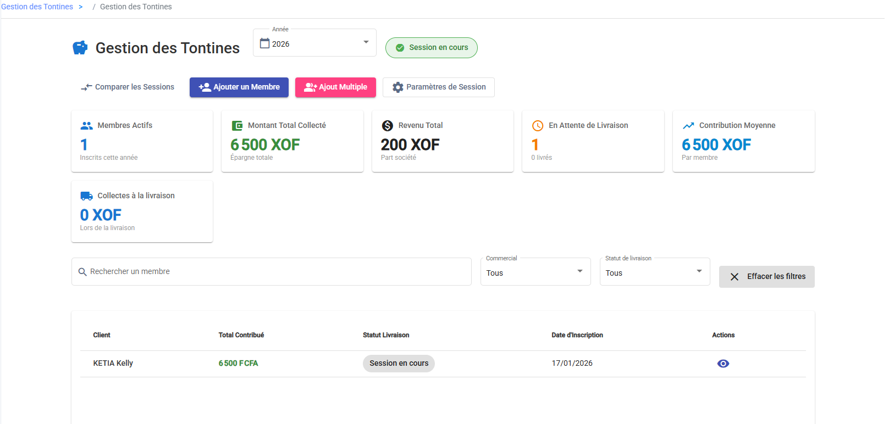
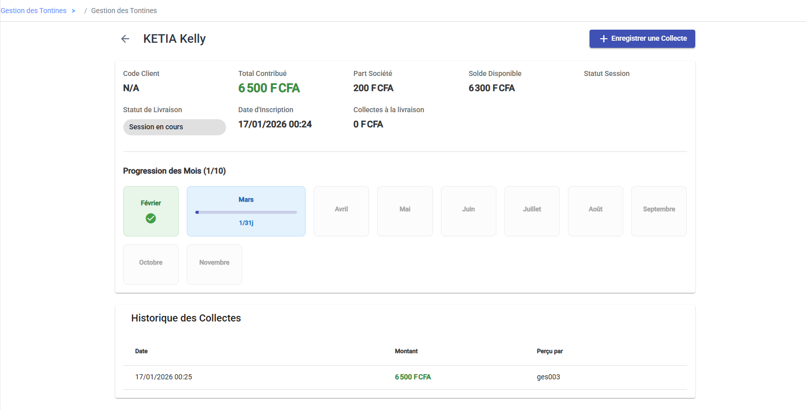

# La Gestion des Tontines

La Tontine est un produit très populaire. C'est un système d'épargne programmée qui permet à vos clients de cotiser petit à petit pour s'offrir des produits en fin d'année.

Votre rôle est d'inscrire les membres, de collecter leurs mises régulières, et d'assurer la livraison finale. Tout se passe dans le menu **Tontines**.

---

## 1. Piloter votre Tontine

Le **Tableau de Bord Tontine** vous donne la température de votre session en cours.

Vous pouvez voir immédiatement :
*   Combien de **Membres Actifs** cotisent actuellement.
*   Le **Montant Total** que vous avez déjà collecté.
*   Qui a fini de payer et attend sa livraison (**En Attente de Livraison**).

C'est aussi d'ici que vous pouvez basculer pour voir les archives des années précédentes si besoin.

Vous avez la vue d'ensemble. Voyons comment faire grandir ce groupe.

---

## 2. Gérer vos Membres

### Inscrire un nouveau membre

Un client veut rejoindre la tontine ?
1.  Cliquez sur **Ajouter un Membre**.
2.  Choisissez le client.
3.  Définissez les règles du jeu avec lui :
    *   **Combien ?** (Montant de la mise).
    *   **Tous les quand ?** (Fréquence : tous les jours, toutes les semaines...).
    *   **Pendant combien de temps ?** (Nombre de mises).
4.  Enregistrez. Le voilà inscrit !

*Astuce : Si vous démarrez un nouveau groupe, utilisez le bouton **Ajout Multiple** pour inscrire plein de monde d'un coup avec les mêmes paramètres.*

### Suivre les cotisations

Pour savoir où en est un client, cliquez sur son nom dans la liste. Sa fiche détaillée est très visuelle :
*   Une **grille de progression** vous montre les cases vertes (payées) et grises (restantes).
*   Vous avez l'historique précis de chaque versement avec la date.

Si un client vous donne de l'argent hors de votre tournée habituelle, vous pouvez utiliser le bouton **Enregistrer une Collecte** directement depuis cette fiche.

Vos membres cotisent régulièrement, c'est parfait. Arrive enfin le moment tant attendu : la livraison.

---

## 3. La Livraison (La récompense !)

C'est le moment préféré des clients : la fin du cycle. Quand un membre a payé toutes ses mises, il est temps de transformer son épargne en produits.

**Comment faire ?**
1.  Allez sur la fiche du membre.
2.  Si tout est payé, un bouton **Préparer la Livraison** apparaît. Cliquez dessus.
3.  Avec le client, choisissez les articles qu'il veut pour le montant de son épargne.
4.  Validez la demande.

La demande part alors en validation. Une fois approuvée par le gestionnaire, vous pourrez récupérer les produits dans votre **Stock Tontine** et les remettre au client heureux.

Voilà, le cycle de la tontine est bouclé !
