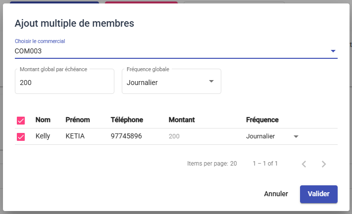

# Gestion des Tontines

Le module Tontine permet de gérer les programmes d'épargne produits pour vos clients. Il offre une vue complète sur les cotisations et les livraisons.

## 1. Tableau de Bord Tontine

### a. En-tête et Sessions
*   **Sélecteur de Session** : Permet de basculer entre la session en cours et les sessions passées (Historique).
*   **Comparer les Sessions** : Outil pour analyser la performance par rapport aux cycles précédents.
*   **Paramètres de Session** : Configuration du cycle actuel.

### b. Indicateurs Clés (KPIs)
Des cartes en haut de page résument la santé de la tontine :
*   **Membres Actifs** : Nombre de souscripteurs.
*   **Montant Total Collecté** : Somme des cotisations perçues.
*   **Revenu Total** : Part revenant à la société.
*   **En Attente de Livraison** : Nombre de membres ayant terminé leur cycle et attendant leur lot.

### c. Actions Principales
Trois boutons d'action sont disponibles en haut à droite :
1.  **Ajouter un Membre** : Inscription individuelle classique.
2.  **Ajout Multiple** : Inscription en masse (utile pour initialiser un groupe).
3.  **Comparer** : Accès aux statistiques comparatives.

## 2. Gestion des Membres

### a. Liste et Filtres
Le tableau central liste tous les souscripteurs. Vous pouvez filtrer cette liste via la barre d'outils :
*   **Recherche** : Par nom de client.
*   **Statut de Livraison** : Filtrer pour voir uniquement les "Validés" ou "En attente".
*   **Commercial** : Filtrer par agent responsable.

### b. Créer une Souscription (Ajout Membre)

1.  Cliquez sur **Ajouter un Membre**.
2.  **Client** : Sélectionnez le souscripteur.
3.  **Fréquence** : Journalier, Hebdomadaire, etc.
4.  **Montant de la mise** : Somme à verser périodiquement.
5.  **Nombre de Mises** : Durée du cycle (ex: 30 mises).
6.  Cliquez sur **Enregistrer**.

### c. Ajout Multiple (Bulk)

Pour aller plus vite :
1.  Cliquez sur **Ajout Multiple**.
2.  Définissez des paramètres globaux (Mise par défaut, Fréquence).
3.  Sélectionnez une liste de clients à inscrire en une seule fois.
4.  Ajustez si nécessaire pour chaque ligne avant de valider.

4.  Ajustez si nécessaire pour chaque ligne avant de valider.

### d. Suivi Détaillé (Fiche Membre)
En cliquant sur un membre dans la liste, vous accédez à sa fiche détaillée. Elle est divisée en plusieurs zones :

1.  **Résumé Financier** (Carte du haut) :
    *   *Total Contribué* : Ce que le client a versé à ce jour.
    *   *Solde Disponible* : Le montant utilisable pour la livraison.
    *   *Part Société* : La retenue pour frais de gestion.
    *   *Statut* : Indique si le cycle est en cours ou terminé.
2.  **Progression** :
    *   Une grille visuelle montre les mois validés (Vert) et le mois en cours (Barre de progression).
    *   Cela permet de voir instantanément si le membre est à jour de ses cotisations.
3.  **Historique des Collectes** :
    *   Liste de tous les versements effectués avec la date et le nom du percepteur.
4.  **Actions Rapides** (Haut de page) :
    *   **Enregistrer une Collecte** : Pour ajouter manuellement un paiement hors tournée.

## 3. Livraison Tontine (Fin de Cycle)
Lorsque la session est clôturée et que le membre est éligible (statut *En attente*) :

1.  Allez sur la fiche du membre (**Détails**).
2.  Cliquez sur le bouton **Préparer la Livraison**.
    *   *Note : Ce bouton n'apparaît que si la session est terminée.*
3.  Une fenêtre s'ouvre : sélectionnez les **Articles** correspondant au montant cotisé.
4.  Validez.
5.  La demande passe en statut *En attente de validation*. Le gestionnaire validera la demande, puis le magasinier effectuera la sortie de stock.
