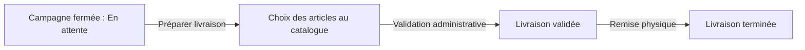

# Guide Tontines

Le module **Tontines** gère l'épargne collective et les cotisations annuelles des clients ELYKIA. Il permet d'inscrire des membres, de suivre leurs versements quotidiens sur un cycle annuel de 10 mois (de février à novembre), de vérifier la conformité de leurs carnets physiques, d'effectuer des contrôles sur le terrain, d'organiser la remise des articles de fin d'année et d'assurer l'archivage propre des campagnes passées.

> [!NOTE]
> **Visibilité selon votre profil d'utilisateur** :
> - **En tant que commercial** : vous accédez exclusivement aux membres, cotisations et livraisons de votre propre portefeuille.
> - **En tant que gestionnaire ou responsable d'agence** : vous bénéficiez d'une vision d'ensemble sur toute l'agence et pouvez filtrer les données pour chaque commercial.
> - **Habilitations** : si certaines actions, boutons ou indicateurs décrits dans ce guide ne s'affichent pas sur votre écran, c'est que vous ne disposez pas des droits d'accès correspondants.

---

## 1. Vue d'ensemble de la navigation

Le menu **Tontines** propose quatre espaces de travail adaptés au déroulement de la campagne :

| Menu / Écran | Ce que vous y trouvez | Utilisation au quotidien |
|---|---|---|
| **Tontines > Liste** | Le tableau de bord de la session active, les indicateurs d'épargne, la liste des membres et les outils de vérification. | Inscrire de nouveaux membres, suivre les adhésions, vérifier les carnets et consulter la progression. |
| **Tontines > Collectes** | Le journal chronologique de l'ensemble des cotisations enregistrées. | Contrôler les versements perçus, rechercher un paiement par période ou par commercial. |
| **Tontines > Livraison** | Le suivi des commandes de marchandises de fin d'année. | Suivre les colis à préparer, valider les livraisons et confirmer la remise aux membres. |
| **Tontines > Archives collectes** | L'historique des campagnes annuelles clôturées. | Consulter et télécharger les récapitulatifs PDF par commercial et par quartier des années antérieures. |

---

## 2. Tableau de bord de la session

L'écran principal de la liste vous donne une vue synthétique sur la campagne en cours.

### Les indicateurs clés de la campagne
En haut de l'écran, les cartes récapitulatives vous informent en temps réel sur la santé de la tontine :
- **Membres Actifs** : Nombre total d'adhérents inscrits cette année.
- **Montant Total Collecté** : Somme globale des cotisations versées par les membres (en FCFA).
- **Revenu Total (Part Société)** : Rémunération statutaire acquise par ELYKIA pour la gestion de la tontine.
- **En Attente de Livraison** : Nombre de membres éligibles qui attendent encore leurs articles de fin d'année (avec le nombre de colis déjà livrés).
- **Contribution Moyenne** : Montant moyen épargné par adhérent.
- **Collectes à la livraison** : Montants perçus lors de la délivrance des articles.

### Session en cours vs Sessions antérieures
- **Session en cours (Active)** : La campagne annuelle est ouverte. Toutes les opérations quotidiennes (inscriptions, cotisations, ajustements de mise, vérifications de carnet) sont accessibles.
- **Sessions passées (Historiques)** : Permet de consulter les campagnes précédentes en mode consultation seule. Un bandeau d'information rappelle que les modifications y sont désactivées. Le bouton **« Session actuelle »** vous ramène immédiatement à l'année en cours.
- **Comparaison pluriannuelle** : Le bouton **Comparer** vous permet de sélectionner de 2 à 5 années pour observer l'évolution du nombre d'adhérents et des montants collectés.

### Trouver rapidement un membre
La barre de recherche et de filtres vous permet de cibler des dossiers précis :
- **Par texte** : Tapez le nom, prénom, numéro de téléphone ou code du client.
- **Par commercial** : Pour un gestionnaire, sélectionnez un commercial dans la liste déroulante pour isoler son secteur. Pour un commercial, votre secteur est pré-sélectionné.
- **Par statut de livraison** : Filtrez les membres en cours de session, ceux dont la livraison est en attente, validée ou déjà terminée.
- **Par état du carnet** : Affichez uniquement les membres dont le carnet est vérifié ou ceux restant à contrôler.

### Téléchargements et exports PDF
La barre d'outils propose des exports prêts à imprimer :
- **Export des membres par commercial** : Génère un document récapitulant les coordonnées, la mise journalière et le total cotisé pour le portefeuille choisi.
- **Export des vérifications de carnets** : Produit la liste des carnets déjà vérifiés ou en attente de vérification, idéal pour organiser les tournées de contrôle.

### Vérifier les carnets en masse
Pour les utilisateurs habilités à viser les carnets physiques :
1. Cochez les cases des membres dont vous avez inspecté les carnets.
2. Cliquez sur le bouton **Vérifier la sélection** dans la barre d'actions groupées.
3. Confirmez l'opération : la date, l'heure et votre nom sont automatiquement enregistrés sur chacun des dossiers cochés.

### Inscrire un nouveau membre
- **Inscription individuelle** : Cliquez sur **Ajouter un Membre**, sélectionnez le client dans la liste, indiquez le montant de sa mise journalière (par exemple 500 ou 1 000 FCFA) et enregistrez.
- **Inscriptions multiples** : En début de campagne, le bouton **Ajout Multiple** permet d'enrôler rapidement plusieurs adhérents à la chaîne.

---

## 3. Fiche détaillée d'un membre

En cliquant sur un membre, vous ouvrez sa fiche complète à 360°, véritable dossier de suivi pour toute la durée de la campagne.

### 1. En-tête du dossier et statut du carnet
- Rappel du nom, du code client et du commercial assigné.
- **Badge d'état du carnet** :
  - 🟢 **Carnet vérifié** : Indique la date, l'heure et le nom de l'agent qui a certifié le carnet.
  - ⚪ **Carnet non vérifié** : Indique que le carnet physique n'a pas encore été visé.
- **Bouton Vérifier / Annuler la vérification** : Permet à un utilisateur habilité d'apposer ou de retirer la certification du carnet en un clic.
- **Bouton Télécharger** : Génère une attestation PDF complète des cotisations du membre.
- **Bouton Contrôle terrain** : Permet au chef de recouvrement de consigner un audit contradictoire.

### 2. Situation financière du membre
Quatre indicateurs résument sa position :
- **Total Contribué** : Montant brut total de ses cotisations depuis le début de la session.
- **Solde Disponible** : Somme réellement utilisable pour choisir les marchandises de fin d'année (après déduction de la part société).
- **Part Société (Payé / Dû)** : Montant de la cotisation société versée par rapport au montant théorique attendu. Le montant dû se calcule selon les mois validés et les jours entamés. Si le montant versé est insuffisant, l'indicateur apparaît en orange.
- **Collectes à la livraison** : Montants additionnels encaissés au moment de la livraison.

### 3. Répartition des cotisations par commercial
Si le membre a cotisé auprès de plusieurs commerciaux au cours de l'année (remplacement de tournée, déménagement de quartier), une grille affiche pour chaque commercial :
- Son nom et ses initiales.
- Le nombre de fois où il a encaissé pour ce membre.
- Le total perçu.
- Un badge **Actuel** met en avant le commercial officiellement affecté au dossier aujourd'hui.

### 4. Contrôle terrain contradictoire
Lorsqu'un chef de recouvrement contrôle le carnet au domicile du client, un volet dédié compare les deux sources :
- **Total système** : Somme enregistrée dans l'application sur les mois audités.
- **Total carnet** : Montant écrit de la main du commercial sur le carnet papier.
- **Écart constaté** : Différence entre le système et le carnet.
- **Statut** : 🟢 **Conforme** (aucun écart) ou 🔴 **Disparité** (différence constatée).
- Date, nom du contrôleur, remarques éventuelles et décomposition mois par mois pour localiser précisément tout écart.

### 5. Progression sur les 10 mois (Février à Novembre)
Le cycle annuel de tontine compte exactement 10 mois d'épargne. Chaque mois nécessite **31 jours de mise** pour être considéré comme validé :
- Une grille présente les 10 mois de l'année (*Février, Mars, Avril, Mai, Juin, Juillet, Août, Septembre, Octobre, Novembre*).
- **Mois validé** : Pastille verte cochée dès que les 31 jours de cotisation sont atteints.
- **Mois en cours** : Jauge animée montrant l'avancement exact (ex. `21/31 j`).
- **Mois à venir** : Mois futurs en attente.

### 6. Synthèse des collectes et pastilles journalières
Un tableau liste chaque mois avec :
- Le nombre de cotisations et le montant total en FCFA.
- **Des pastilles numérotées** : Chaque pastille représente un jour complet de mise acquis par le membre, calculé d'après sa mise journalière en vigueur.

### 7. Historique des changements de mise
Si la mise quotidienne du membre est modifiée en cours d'année (par exemple de 500 à 1 000 FCFA), un tableau retrace chaque période : date de début, date de fin éventuelle, montant de la mise et statut en cours ou clôturé.

### 8. Enregistrer une cotisation
Deux boutons vous permettent d'enregistrer des versements :
- **Enregistrer une Collecte** : Pour un encaissement réalisé le jour même.
- **Collecte de rattrapage** : Si une cotisation d'un jour antérieur n'avait pas pu être saisie à temps. Vous choisissez la date concernée, confirmez la mise applicable à ce moment-là, et visualisez immédiatement l'effet sur le solde et les mois validés avant de confirmer.

### 9. Annulation d'une collecte
En cas d'erreur de saisie, les utilisateurs habilités peuvent annuler une ligne de collecte directement dans l'historique. Après confirmation, l'application recalcule automatiquement le total épargné, le solde disponible, la part société et les compteurs de jours.

### Cotisations à distance par Mobile Money
Les membres peuvent également cotiser en toute autonomie depuis leur Espace Client ELYKIA :
- Le membre effectue son transfert vers le numéro Mobile Money attribué à son commercial tontine référent.
- La déclaration est transmise dans le menu **Paiements clients > Cotisations tontine** (`/customer-payments?tab=tontine`).
- Après validation du paiement, la cotisation s'enregistre sur la session active du membre et son compteur de jours cotisés progresse immédiatement.

---

## 4. Livraisons de fin d'année

En fin de campagne, lorsque la session arrive à son terme, les membres utilisent leur épargne pour retirer des marchandises (appareils, vivres, équipements).

### Le cycle d'une livraison

```mermaid
flowchart LR
    A[Campagne fermée : En attente] -->|Préparer livraison| B[Choix des articles au catalogue]
    B -->|Validation administrative| C[Livraison validée]
    C -->|Remise physique| D[Livraison terminée]
```

1. **Préparer la Livraison** :
   - Lorsque la session de collecte est fermée, le bouton **Préparer la Livraison** devient actif sur la fiche du membre.
   - Une fenêtre s'ouvre avec le **Solde Disponible** mobilisable.
   - Choisissez les articles souhaités dans le catalogue en indiquant les quantités.
   - Le système vérifie en direct que le montant total des articles ne dépasse pas le solde disponible du membre.
   - Si les articles choisis coûtent moins que l'épargne, la différence reste conservée comme **Solde non utilisé** au profit du client.
   - Le dossier passe au statut **En attente**.

2. **Valider la Livraison** :
   - Un responsable examine la sélection et clique sur **Valider la Livraison**. Le statut passe à **Validé**.

3. **Marquer comme Livré** :
   - Au moment de la remise en mains propres des articles au membre, le commercial ou le magasinier clique sur **Marquer comme Livré**.
   - Cette action déduit définitivement les articles du stock tontine et clôture le dossier du membre.
   - La fiche conserve la preuve complète : date, commercial ayant servi le client, détail des articles livrés et solde non utilisé éventuel.

### Consulter l'ensemble des livraisons (`/tontine/livraisons`)
Le sous-menu **Livraison** centralise toutes les opérations de distribution de l'agence :
- Indicateurs globaux : nombre de colis livrés, montant total distribué, livraisons restant à honorer, soldes non utilisés.
- Filtres temporels (ce jour, cette semaine, ce mois, plage de dates) et filtre par commercial.
- Recherche instantanée par nom ou référence de client.

---

## 5. Journal des collectes (`/tontine/collectes`)

Le sous-menu **Collectes** est le grand livre de caisse de la tontine :
- Il présente la totalité des encaissements enregistrés jour après jour.
- Vous pouvez filtrer les résultats par période (*du ... au ...*) et par commercial.
- Chaque ligne affiche l'heure exacte, le montant, le commercial encaisseur, le membre concerné et les codes de confirmation client.

---

## 6. Archives et transition annuelle (`/tontine/reset-collectes`)

Cet espace est réservé aux responsables de l'agence pour réaliser la clôture administrative de fin d'année et préparer la plateforme pour la nouvelle campagne.

### Bibliothèque des archives PDF
Toutes les archives générées sont rangées dans une arborescence par année :
- **Par année** : Par exemple `2025`, `2026`.
- **Par exécution** : Horodatage précis de l'opération d'archivage avec le statut.
- **Par fichier** : Les récapitulatifs PDF sont découpés **par commercial et par quartier**. Un bouton de téléchargement permet d'ouvrir chaque document pour impression ou classement.

### Les deux actions disponibles
1. **Archiver uniquement** : Génère l'ensemble des documents PDF de sauvegarde pour tous les commerciaux sans modifier aucune donnée dans l'application. Recommandé pour préparer les bilans de fin d'année.
2. **Archiver et réinitialiser** :
   - Opération majeure réalisée une seule fois par an, au changement de session.
   - L'application sauvegarde d'abord l'intégralité des collectes en PDF.
   - Puis elle remet à zéro les compteurs d'épargne de la session active pour ouvrir la nouvelle année.
   - **Tous les membres, leurs coordonnées et leurs affectations commerciales restent précieusement conservés** : les clients n'ont pas besoin d'être réenrôlés pour la nouvelle campagne.
