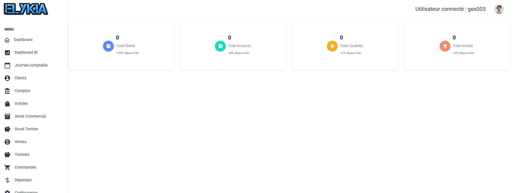
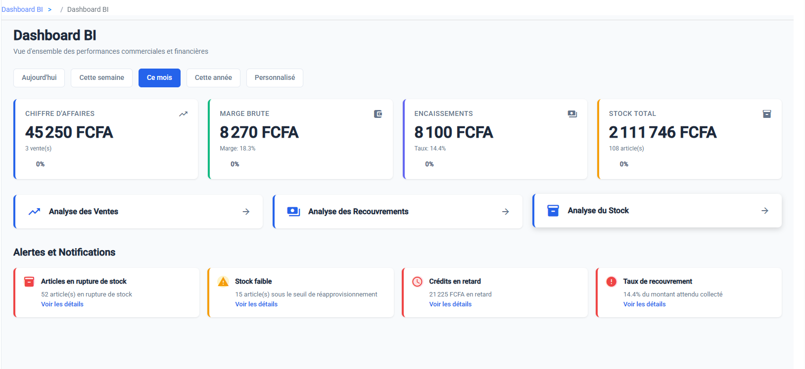

# Vos Tableaux de Bord (Dashboards)

Piloter une entreprise sans tableau de bord, c'est comme conduire les yeux fermés. Ici, nous vous donnons les outils pour voir clair, tout de suite.

Nous avons séparé les choses en deux : l'opérationnel (pour l'action immédiate) et le décisionnel (pour l'analyse).

---

## 1. Le Dashboard Principal (L'Opérationnel)

C'est la première chose que vous voyez en arrivant. Son but est simple : vous dire ce qui se passe **maintenant**.

### a. La Vue d'Ensemble
Tout en haut, quatre chiffres vous donnent le pouls de l'agence :
*   Combien de **Clients** avons-nous ? (Avec la tendance : est-ce que ça monte ?)
*   Combien de **Comptes** actifs ?
*   Quelle est l'étendue de notre catalogue (**Total Articles**) ?
*   Combien de **Localités** couvrons-nous ?

### b. Les Alertes Stock (Urgent !)
Si vous gérez aussi le stock, cette partie est critique. Elle vous crie ce qui ne va pas :
1.  **Rupture de stock** : Ces produits sont à 0. Il faut commander tout de suite !
2.  **Rupture imminente** : Attention, le stock est bas (zone orange ou rouge). Prévoyez le réassort.

Vous avez géré les urgences ? Passons à l'analyse de fond.

---

## 2. Le Dashboard BI (Le Décisionnel)

Besoin de prendre du recul ? Cliquez sur **Dashboard BI** dans le menu. Ici, on parle argent et stratégie.

### a. Choisissez votre période
Vous voulez voir les chiffres d'aujourd'hui ? De la semaine ? Ou de l'année entière ?
Utilisez les filtres en haut pour définir la période d'analyse.

### b. La Santé Financière
Quatre cartes vous disent si l'entreprise est en bonne santé :
1.  **Chiffre d'Affaires** : Combien avons-nous vendu ?
2.  **Marge Brute** : Combien avons-nous réellement gagné (Bénéfice) ?
3.  **Encaissements** : L'argent est-il rentré dans la caisse ?
4.  **Valeur du Stock** : Combien d'argent "dort" dans notre entrepôt ?

### c. Le Centre d'Alertes
C'est votre radar à problèmes. Il surveille pour vous :
*   Les articles qui manquent.
*   Les crédits clients qui sont en retard (Impayés).
*   Votre taux de recouvrement (Êtes-vous efficace dans la collecte des dettes ?).

*Conseil de pro : Si le taux de recouvrement est rouge (< 50%), c'est votre priorité numéro 1 : relancez les commerciaux !*

### d. Liens Rapides
Besoin de creuser un chiffre ? Utilisez les boutons d'accès direct pour ouvrir les rapports détaillés :
*   *Analyse des Ventes*
*   *Analyse des Recouvrements*
*   *Analyse du Stock*

Vous avez maintenant une vision claire de la situation. Passons à l'action sur le terrain.
