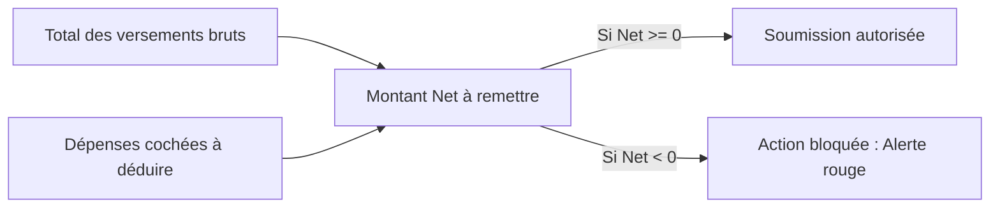

# Gestion financière, Dépenses & Remises de trésorerie (Guide Gestionnaire)

Ce guide détaille l'ensemble des mécanismes de gestion financière, de suivi des dépenses d'exploitation et de validation des remises de trésorerie d'agence.

---

## 1. Tableau de bord des dépenses

Pour y accéder, rendez-vous dans le menu latéral puis cliquez sur **Finances > Tableau de bord** (ou directement **Dépenses** selon la configuration de votre menu).

Le tableau de bord des dépenses offre une vision synthétique et immédiate des flux de décaissement engagés pour le fonctionnement de l'agence.

<!-- CAPTURE À INSÉRER : Tableau de bord des dépenses avec horloge temps réel, KPIs comparatifs par période et tableau des dernières dépenses. -->

### A. Présentation et outils rapides
* **Horloge en temps réel** : Affiche la date et l'heure système en direct.
* **Heure d'actualisation** : Indique l'horodatage exact de la dernière synchronisation avec le serveur.
* **Bouton « Actualiser »** : Recharge instantanément les indicateurs et les listes sans recharger la page.
* **Bouton « Types »** : Raccourci vers la gestion du catalogue des types de dépense.
* **Bouton « + Nouvelle dépense »** : Ouvre immédiatement le formulaire de saisie d'un nouveau décaissement.

### B. Bandeau des indicateurs comparatifs de dépenses
Sous réserve de disposer des habilitations financières requises (si ce bandeau ne s'affiche pas, vous ne disposez pas des autorisations nécessaires) :
* Une série de cartes d'indicateurs met en regard les montants décaissés sur plusieurs périodes de référence (mois en cours, mois précédent, etc.).
* Chaque carte précise l'intervalle calendaire exact (*du JJ/MM au JJ/MM/AAAA*) et le montant cumulé en Francs CFA.

### C. Tableau des dernières dépenses
* Liste chronologique paginée des 10 dernières opérations enregistrées.
* Colonnes : Date, Type de dépense, Montant formaté en FCFA, et bouton d'action.
* Un clic sur une ligne ouvre une fenêtre récapitulative présentant le détail complet de la pièce justificative.

---

## 2. Registre et gestion des dépenses

Pour consulter le registre complet, ouvrez le menu latéral et cliquez sur **Finances > Liste des dépenses** (ou l'onglet **Dépenses**).

Cet écran centralise la totalité des décaissements de l'agence et permet leur filtrage multicritères.

<!-- CAPTURE À INSÉRER : Liste complète des dépenses avec sélecteurs de mois et de type, badge Comptabilisée et actions Éditer/Supprimer. -->

### A. Barre de filtres et recherche
1. **Filtre par Mois** : Menu déroulant listant les mois civils de l'année en cours pour isoler rapidement les charges d'une période précise.
2. **Filtre par Type** : Liste déroulante des catégories de dépense (ex: Loyer, Carburant, Fournitures, Électricité, Maintenance, etc.).
3. **Compteur de résultats** : Affiche en direct le nombre de dépenses correspondant aux critères sélectionnés.

### B. Informations détaillées par dépense
| Colonne | Description fonctionnelle |
|---|---|
| **Date** | Date calendaire à laquelle la charge a été engagée. |
| **Type & Statut** | Intitulé de la catégorie et présence éventuelle du badge vert **« Comptabilisée »**. |
| **Montant** | Montant décaissé en Francs CFA. |
| **Description** | Motif explicatif et justification opérationnelle de la dépense. |
| **Référence** | Numéro de pièce justificative (facture, reçu de caisse, bon de carburant). |
| **Actions** | Boutons **Éditer** (icône crayon) et **Supprimer** (icône corbeille). |

### C. La règle d'intégrité : Dépense Comptabilisée
> **Verrou d'intégrité comptable.** Lorsqu'une dépense porte le badge vert **« Comptabilisée »**, elle a été intégrée dans une remise de trésorerie validée par le gestionnaire :
> - Les boutons **Éditer** et **Supprimer** sont **strictement désactivés**.
> - Une infobulle précise : *« Dépense comptabilisée — modification/suppression impossible »*.
> - Ce verrou interdit toute altération rétroactive des comptes une fois la trésorerie actée.

---

## 3. Enregistrement d'une dépense

Pour saisir une nouvelle dépense, cliquez sur le bouton bleu **« + Nouvelle dépense »** :

1. **Type de dépense** *(Obligatoire)* : Sélectionnez la nature de la charge dans la liste paramétrée (ex: Carburant, Fournitures).
2. **Montant en FCFA** *(Obligatoire)* : Saisissez la somme exacte déboursée (montant strictement positif).
3. **Date de dépense** *(Obligatoire)* : Date d'engagement de la charge.
4. **Référence de pièce** : Numéro officiel de la facture ou du bon de caisse pour audit.
5. **Description** : Commentaire libre détaillant le contexte du décaissement.
6. Cliquez sur **« Enregistrer »** pour acter la dépense.

---

## 4. Remise de trésorerie au gestionnaire

Pour y accéder, rendez-vous dans le menu latéral **Rapport Journalier**, puis cliquez sur l'onglet **Remise**.

La **Remise** est le processus formel par lequel le caissier ou la secrétaire verse au gestionnaire de l'agence les espèces collectées sur une période, en déduisant les dépenses d'exploitation autorisées.

<!-- CAPTURE À INSÉRER : Écran de Remise au gestionnaire avec bandeau des 6 KPIs, liste à cocher des dépenses à déduire et boutons Soumettre/Accuser réception. -->

### A. Paramétrage de la période de remise
La remise s'effectue au sein d'un mois civil, avec la possibilité d'isoler un intervalle de dates grâce aux champs **« Du »** et **« Au »** :
* Permet d'effectuer des remises intermédiaires (hebdomadaires, décadaires ou de mi-mois).
* N'affiche et ne prend en compte que les encaissements qui n'ont **pas encore été remis** au gestionnaire.

---

### B. Le bandeau des 6 indicateurs de trésorerie
Dès la sélection de la période, l'application calcule instantanément les masses financières :

1. **Reste à remettre (ou Montant en attente)** : Total brut des versements enregistrés sur la plage de dates qui n'ont pas encore fait l'objet d'une remise acceptée. Si des remises partielles antérieures ont déjà eu lieu sur le mois, la mention *« Déjà remis : X FCFA »* s'affiche en sous-titre.
2. **Crédit** : Part des versements provenant des acomptes et des remboursements de crédit.
3. **Tontine** : Part des versements provenant des cotisations d'épargne tontine.
4. **Solde Nouveaux comptes** : Dépôts initiaux versés par les nouveaux clients lors de l'ouverture de leur compte.
5. **Dépenses** : Cumul des dépenses cochées pour déduction sur cette remise.
6. **Montant net** : `Versements bruts - Dépenses à déduire`. C'est le montant physique en espèces que la secrétaire doit remettre en main propre au gestionnaire.

> **Contrôle bloquant : Montant net négatif.** Si le total des dépenses cochées dépasse le montant des versements collectés, la carte du Montant net vire au rouge et le message d'alerte apparaît : *« Le total des dépenses dépasse le montant versé. Retirez des dépenses pour continuer. »* Toute soumission est bloquée tant que l'équilibre financier n'est pas rétabli.

---

### C. Sélection des dépenses à déduire
* La section **Dépenses associées** présente la liste de toutes les dépenses de la période non encore rattachées à une remise.
* La secrétaire coche les cases des dépenses correspondant aux justificatifs physiques présentés.
* Chaque coche met à jour en direct le montant net à remettre.
* **Règle de gestion** : Les dépenses de type *Approvisionnement* ne peuvent jamais être déduites d'une remise d'exploitation.

---

### D. Cycle de validation entre Secrétaire et Gestionnaire

| Étape | Rôle opérationnel | Action dans l'application | Conséquence système |
|---|---|---|---|
| **1. Préparation** | Secrétaire / Caissier | Sélectionne les dates et coche les dépenses justificatives. | Le montant net se calcule automatiquement. |
| **2. Soumission** | Secrétaire / Caissier | Clique sur le bouton bleu **« Soumettre la remise »**. | La remise passe au statut **En attente**. Les dates de la remise sont verrouillées. |
| **3. Contrôle contradictoire** | Gestionnaire | Reçoit les espèces et les pièces justificatives au bureau. | Le gestionnaire examine les dépenses associées. Tant que la remise est en attente, il peut décocher une dépense non admise. |
| **4. Accusé de réception** | Gestionnaire | Clique sur le bouton vert **« Accuser réception »**. | La remise passe au statut **Réceptionnée**. Les dépenses cochées deviennent définitivement **Comptabilisées**. |
| **Option directe** | Gestionnaire | Clique sur le bouton **« Initier la réception »**. | Permet au gestionnaire de préparer et d'acter la remise en une seule étape sans attendre la soumission secrétaire. |

---

### E. Historique des remises et audit
Le bas de page conserve le journal exhaustif de toutes les remises passées :
* **Période** : Mois et année concernés.
* **Ventilation financière** : Total brut, Crédit, Tontine, Nouveaux comptes, Dépenses, Montant net remis.
* **Statut** : Badge coloré **En attente** (jaune) ou **Réceptionnée** (vert).
* **Traçabilité** : Nom de la personne ayant soumis la remise et nom du gestionnaire ayant accusé réception avec horodatage.
* **Déploiement accordéon (petite flèche)** : Permet d'ouvrir le détail de tous les versements individuels inclus dans la remise pour un contrôle pièce par pièce.
