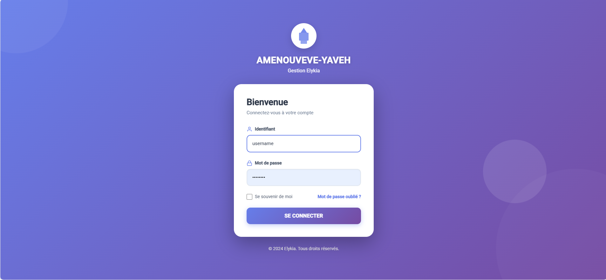
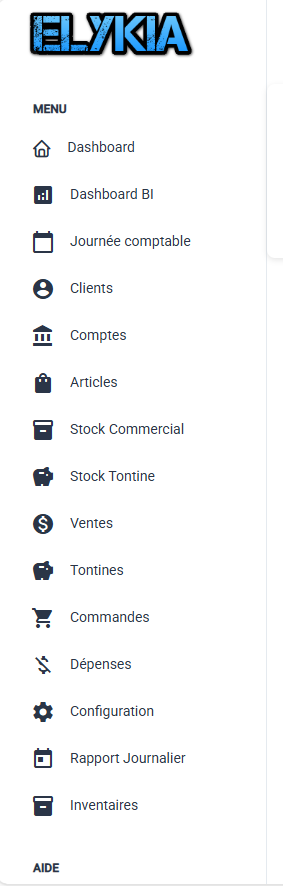

# Guide Gestionnaire - Introduction

Ce guide est destiné aux utilisateurs ayant le profil **Gestionnaire (Admin)**. Il détaille l'utilisation de l'application **Gestion Elykia** pour la supervision complète des opérations.

## 1. Connexion

Pour accéder à l'application, vous devez vous authentifier avec vos identifiants.

1.  Rendez-vous sur la page de connexion.
2.  Saisissez votre **Identifiant** (ex: `ges003`).
3.  Saisissez votre **Mot de passe** (ex: `Abcd1234`).
4.  Cliquez sur le bouton **SE CONNECTER**.

## 2. Présentation de l'interface

Une fois connecté, vous accédez à l'interface principale. Celle-ci est composée de deux zones majeures :

1.  **Le Menu Latéral (Sidebar)** : Situé à gauche, il permet de naviguer entre les différentes fonctionnalités.
2.  **La Zone Principale** : Située au centre, elle affiche le contenu de la fonctionnalité sélectionnée.

### Structure du Menu Gestionnaire

Le menu est organisé comme suit (ordre d'apparition) :

*   **Dashboard** : Vue d'ensemble des indicateurs clés.
*   **Dashboard BI** : Analyses graphiques avancées.
*   **Journée comptable** : Gestion de l'ouverture et fermeture des journées.
*   **Clients** : Gestion du portefeuille client (Création, Modification, Détails).
*   **Comptes** : Gestion des comptes financiers.
*   **Articles** : Catalogue des produits et services.
*   **Stock Commercial** : Suivi des stocks par commercial.
*   **Stock Tontine** : Suivi des stocks liés aux tontines.
*   **Ventes** : Historique et gestion des ventes.
*   **Tontines** : Gestion des carnets de tontine.
*   **Commandes** : Suivi des commandes fournisseurs/clients.
*   **Dépenses** : Enregistrement et suivi des charges.
*   **Configuration** : Paramètres globaux de l'application.
*   **Rapport Journalier** : Bilan quotidien de l'activité.
*   **Inventaires** : Gestion des inventaires physiques de stock.
