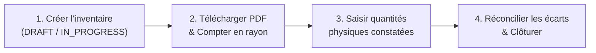

# Gestion des stocks, réceptions et inventaires (Vision Gestionnaire)

Dans l'architecture ELYKIA, la marchandise suit un circuit d'approvisionnement et de distribution hautement sécurisé. Chaque mouvement physique est tracé par un statut informatique strict, interdisant toute entrée ou sortie non autorisée.

L'organisation repose sur **trois niveaux étanches de stock** :
1. **Stock Central Magasin** : Stock physique détenu au dépôt principal, administré par le magasinier et audité par les inventaires.
2. **Stock Commercial (`/stock`)** : Stock opérationnel attribué aux commerciaux pour les ventes directes au comptant et à crédit.
3. **Stock Tontine (`/stock-tontine`)** : Stock tampon strictement réservé aux livraisons de fin d'année des membres épargnants de la tontine, interdisant tout mélange avec le flux commercial standard.

---

## 1. Référentiel Articles et Valorisation du Stock (`/article/list`)

Le catalogue centralise les articles commercialisables, leurs grilles tarifaires et leurs seuils d'alerte logistique (`ROLE_EDIT_ARTICLE`, `ROLE_STOREKEEPER`).

<!-- CAPTURE À INSÉRER : Liste du catalogue d'articles avec filtres de type, prix d'achat/vente et seuils de réapprovisionnement. -->

### A. Données obligatoires de la fiche article (`/article/add`)
* **Identification produit** : Nom de l'article, Marque, Modèle et Catégorie/Type (`/article-type`).
* **Grille tarifaire à 3 niveaux** :
  * **Prix d'achat fournisseur** : Coût d'acquisition servant de base au calcul de valorisation du stock et aux marges brutes.
  * **Prix de vente comptant** : Montant appliqué lors des règlements immédiats en espèces.
  * **Prix de vente à crédit** : Montant contractuel pour les paiements échelonnés sur 30 jours (incluant la marge financière).
* **Paramètres de réapprovisionnement** :
  * **Point de commande (Seuil d'alerte)** : Quantité minimale en deçà de laquelle l'article bascule en alerte orange *Rupture imminente*.
  * **Niveau de stock optimal** : Quantité cible recommandée en magasin.

---

## 2. Entrées Fournisseurs & Historique des Réceptions (`/stock/receptions`)

Toute livraison de marchandise par un fournisseur doit faire l'objet d'une saisie d'entrée, soumise à une **validation préalable obligatoire** du gestionnaire avant d'impacter le stock disponible.

<!-- CAPTURE À INSÉRER : Page Historique des réceptions avec les filtres de recherche, les statuts et les boutons Valider / Refuser / Abandonner. -->

### A. Circuit d'approbation d'une réception
1. **Saisie de l'entrée** : Le magasinier saisit les articles et quantités reçus via le bouton **« Entrées stock »** d'Inventaires (`/inventory/list`).
2. **Statut `PENDING` (En attente)** : Une référence de réception unique est générée. Les articles ne sont **pas encore intégrés** au stock vendable.
3. **Contrôle et Validation gestionnaire (`ROLE_REPORT` ou profil Gestionnaire)** :
   * Ouvrez **Historique Entrée** (`/stock/receptions`).
   * Cliquez sur **« Voir »** pour contrôler la concordance entre le bon de livraison fournisseur et les quantités saisies.
   * **Valider** : Confirme la conformité de la réception. Le stock magasin est **instantanément augmenté**.
   * **Refuser** : Rejette la réception en cas de non-conformité majeure (marchandise abîmée, erreur de produit). Le statut passe à `REFUSED`.
   * **Abandonner** : Permet au créateur de la réception en attente de supprimer sa saisie avant validation (`canAbandonPending`).
   * **Annuler** : Réservé aux gestionnaires pour annuler une réception déjà validée suite à une régularisation comptable (`canCancelValidated`), décrémentant le stock du magasin.

| Statut Réception | Badge Couleur | Impact sur le Stock Magasin | Actions Disponibles |
|---|---|---|---|
| `PENDING` | Jaune | **Aucun impact** (en cours de contrôle) | Valider, Refuser, Abandonner |
| `VALIDATED` | Vert | **Stock magasin augmenté** | Voir, Annuler (si habilité) |
| `REFUSED` | Rouge | Aucun impact (rejeté) | Voir |
| `CANCELLED` | Gris | Stock préalablement ajouté est **retiré** | Voir |

---

## 3. Demandes de Sortie de Stock Commercial (`/stock/request`)

Le réapprovisionnement des commerciaux suit un flux rigoureux en 3 étapes : **Création $\rightarrow$ Validation $\rightarrow$ Livraison**.

<!-- CAPTURE À INSÉRER : Liste des demandes de sortie de stock commercial avec statuts CREATED, VALIDATED, DELIVERED et boutons d'action. -->

### A. Les étapes de traitement
1. **Étape 1 : Création (`CREATED`)** :
   * Le commercial (ou le gestionnaire) soumet une demande via **« Nouvelle demande »** en sélectionnant le commercial destinataire, les articles et les quantités voulues.
   * La demande est en attente d'approbation hiérarchique. Le commercial ou le gestionnaire peut encore la **Modifier** ou l'**Annuler**.
2. **Étape 2 : Validation gestionnaire (`VALIDATED`)** :
   * Le gestionnaire contrôle la disponibilité physique en magasin et les encours du commercial, puis clique sur le bouton vert **« Valider »** (`data-testid="e2e-stock-request-validate"`).
   * La demande passe au statut `VALIDATED`. La marchandise est alors réservée au magasin.
3. **Étape 3 : Livraison magasinier (`DELIVERED`)** :
   * Le magasinier physique remet les articles au commercial et clique sur le bouton **« Livrer »** (`data-testid="e2e-stock-request-deliver"`).
   * **Conséquence instantanée** : Le stock magasin est débité et le stock personnel du commercial est crédité. La date de livraison est horodatée.

### B. Téléchargements et exports PDF
* **Fiche de sortie unitaire** : Téléchargement du bon de sortie physique signé pour une demande précise.
* **Télécharger sélection (N)** : Sélection multiple de demandes par cases à cocher et génération groupée d'un PDF d'approvisionnement consolidé.
* **Fiche sortie PDF globale** : Export synthétique sur la période active (*Aujourd'hui, Cette semaine, Ce mois, Mois précédents*).

---

## 4. Module Stock Tontine (`/stock-tontine`)

Le **Stock Tontine** dispose de son propre sous-menu indépendant (**Stock Tontine > Demandes Sortie**, **Stock** et **Retours**).

* **Étanche et dédié** : Les articles sortis sous ce module ne peuvent en aucun cas être vendus à crédit dans le circuit commercial régulier.
* **Finalité opérationnelle** : Ce stock est constitué en fin d'année pour préparer les paniers de distribution de fin d'exercice des membres de la tontine ayant cotisé régulièrement.
* Le cycle d'approbation (**Créée $\rightarrow$ Validée $\rightarrow$ Livrée**) et de retour est rigoureusement identique à celui du stock commercial.

---

## 5. Inventaires physiques et réconciliation des écarts (`/inventory/list`)

Accessible via le menu **Inventaires**, ce module permet de confronter le stock théorique calculé par l'informatique au stock physique réel compté sur les étagères du magasin dépôt.

<!-- CAPTURE À INSÉRER : Panneau d'actions inventaire avec boutons Créer un inventaire, Saisir quantités physiques, Réconcilier les écarts et Clôturer. -->

### A. Indicateurs de valorisation du stock magasin
Pour les gestionnaires, le bandeau supérieur présente 5 métriques financières stratégiques :
1. **Valeur d'achat FIFO / Total achat** : Valeur monétaire du stock au coût d'acquisition fournisseur.
2. **Prix total vente crédit** : Valeur projetée de réalisation du stock si l'ensemble des articles est distribué à crédit.
3. **Marge estimée (crédit)** : Marge brute prévisionnelle dégagée sur le stock (Vente crédit $-$ Coût d'achat).
4. **Prix total vente comptant** : Valeur du stock au prix de vente comptant.
5. **Marge estimée (comptant)** : Marge brute projetée au comptant.

### B. Déroulement méthodique d'une session d'inventaire
Une session d'inventaire se déroule en 4 étapes séquentielles :

1. **Création de session** : Cliquez sur **« Créer un inventaire »**. La session passe à l'état `IN_PROGRESS` et affiche la date, le statut et l'auteur.
2. **Impression de la feuille de comptage** : Cliquez sur **« Télécharger PDF »** pour éditer le document de comptage vierge destiné aux équipes de magasin.
3. **Saisie des quantités réelles** : Cliquez sur **« Saisir quantités physiques »**. Dans la fenêtre modale, saisissez les quantités effectivement dénombrées pour chaque référence d'article.
4. **Réconciliation des écarts (`ROLE_RECONCILE_INVENTORY`)** :
   * Cliquez sur **« Réconcilier les écarts »** pour afficher la balance comparative : `Quantité Théorique Système` vs `Quantité Physique Constatée` = `Écart (Surplus ou Manquant)`.
   * Enregistrez les motifs d'écart (casse, avarie, vol, erreur de saisie).
5. **Clôture définitive** : Cliquez sur **« Clôturer l'inventaire »**. Les stocks théoriques sont automatiquement réalignés sur le comptage physique approuvé et la session est archivée dans l'**Historique inventaires** (`/inventory/history`).

