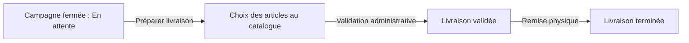

# Guide Utilisateur - Profil Commercial

_Ce document est une compilation de la documentation pour impression._

\newpage

# Guide Commercial

Ce guide présente les parcours de terrain disponibles sur le web et, dans sa dernière partie, sur l’application mobile. Votre interface montre uniquement les actions correspondant à vos droits : l’absence d’un bouton de validation, d’export ou de réaffectation est normale si l’habilitation n’est pas attribuée.

<!-- CAPTURE À INSÉRER : Menu d’un commercial avec Clients, Stock Commercial, Ventes, Tontines et Rapport Journalier. -->

## Votre cycle de travail

| Moment | Module | Objectif |
|---|---|---|
| Préparer le portefeuille | Clients | Créer et mettre à jour les informations client. |
| Obtenir les articles | Stock Commercial | Créer une demande de sortie et suivre sa livraison. |
| Distribuer et suivre | Ventes | Créer une vente, suivre son statut et encaisser les mises. |
| Collecter l’épargne | Tontines | Inscrire, collecter, suivre la progression et préparer la livraison. |
| Rendre compte | Caisse, Rapport Journalier | Contrôler les versements et les opérations de la période. |

Suivez les pages [Clients et comptes](clients_accounts.md), [Stock](stock.md), [Ventes et commandes](sales_orders.md), [Tontines](tontine.md) et [Application mobile](mobile_app.md).

\newpage

---

# Clients et comptes (Répertoire, Enrôlement & Suivi)

Le module **Clients** est le socle de l'ensemble des opérations commerciales et financières d'ELYKIA. Il centralise les données d'identité, les coordonnées géographiques, les pièces justificatives, les affectations commerciales ainsi que l'historique complet des crédits et de la tontine.

---

## 1. Rechercher et consulter la clientèle (Menu Clients > Liste)

Accessible via le menu latéral gauche **Clients**, la vue liste fournit un accès direct à l'ensemble du portefeuille.

<!-- CAPTURE À INSÉRER : Liste web des clients avec la barre de recherche, le filtre commercial, les KPI et les boutons d'action. -->

### A. Outils de filtrage et recherche
* **Recherche instantanée** : Saisissez un nom, un prénom, un numéro de téléphone (8 chiffres) ou un nom de localité dans le champ de recherche, puis appuyez sur Entrée ou cliquez sur la loupe.
* **Sélecteur de commercial** : Permet d'isoler en un clic le portefeuille géré par un commercial précis.
* **Persistance de navigation** : La recherche, le commercial sélectionné et la pagination sont conservés dans l'état de l'application lorsque vous ouvrez une fiche client et revenez à la liste.
* **Fiche Client PDF** : Dès qu'un commercial est filtré, le bouton **« Fiche Client PDF »** devient actif pour générer le document imprimable de son portefeuille clients.

### B. Indicateurs du bandeau supérieur
Quatre cartes KPIs résument la dynamique du portefeuille affiché :
1. **Clients enregistrés** : Nombre total de clients actifs (hors dossiers supprimés).
2. **Crédit en cours** : Nombre de clients ayant au moins une vente à crédit active en cours de remboursement.
3. **Membres tontine** : Nombre de clients souscripteurs d'un cycle d'épargne tontine.
4. **Sans crédit ni tontine** : Prospects ou clients n'ayant aucun engagement financier actif.

---

## 2. Enrôlement d'un nouveau client (Bouton + Ajouter)

Pour créer un nouveau client, cliquez sur le bouton bleu **« + Ajouter »** en haut à droite de la liste. Le formulaire est structuré en 7 sections normées :

<!-- CAPTURE À INSÉRER : Formulaire d'ajout client montrant l'envoi de la photo de profil, la saisie d'identité, la pièce justificative et les commerciaux. -->

### Section 1 : Identité
* **Photo de profil** :
  * Cliquez sur l'icône de l'appareil photo pour téléverser une photo d'identité (format JPG ou PNG, recadrage carré recommandé).
  * La photo est automatiquement convertie et enregistrée en base de données. Un bouton permet de la retirer ou de la remplacer si besoin.
* **Nom & Prénom** *(Obligatoires)* : Identité civile du client.
* **Adresse** *(Obligatoire)* : Adresse physique de résidence ou de commerce.
* **Numéro de téléphone** *(Obligatoire)* : Numéro principal du client (exactement 8 chiffres requis selon la numérotation nationale).

### Section 2 : Pièce d'identité
* **Type de pièce** *(Obligatoire)* : Sélection parmi les formats d'identification légaux autorisés :
  * `Carte d'électeur (CENI)`
  * `Passport`
  * `Carte nationale d'identité (ID Card)`
  * `Carte e-ID / Numéro d'Identification Unique (NIU)`
  * `Permis de conduire (Driver License)`
* **Numéro de pièce** *(Obligatoire)* : Numéro officiel d'enregistrement de la pièce d'identité.
* **Document numérisé (Fichier)** : Téléversement du scan ou de la photo de la pièce d'identité (formats acceptés : PDF, JPEG, PNG).

### Section 3 : Informations personnelles
* **Date de naissance** *(Obligatoire)* :
  * **Contrôle d'âge minimum (16 ans)** : L'application vérifie automatiquement que le client est âgé d'au moins 16 ans révolus à la date du jour. Une date inférieure à 16 ans bloque la validation avec le message d'alerte `Âge minimum 16 ans`.
* **Occupation** *(Obligatoire)* : Profession ou activité génératrice de revenus du client (ex: commerçante, couturière, artisan, etc.).
* **Localité** *(Obligatoire)* : Sélection avec autocomplétion intelligente parmi le référentiel des localités et quartiers enregistrés dans ELYKIA.

### Section 4 : Personne à contacter (Garant / Proche)
* **Nom complet** : Identité de la personne de confiance à contacter en cas d'injoignabilité.
* **Téléphone & Adresse** : Coordonnées de contact du garant.

### Section 5 : Géolocalisation
* **Mode Automatique GPS** : Cliquez sur le bouton **« Obtenir la position GPS »** pour capturer automatiquement les coordonnées géographiques actuelles depuis le navigateur ou l'appareil.
* **Mode Saisie Manuelle** : Activez l'interrupteur à bascule pour saisir directement la `Latitude` et la `Longitude` (utile pour les enregistrements a posteriori au bureau).

### Section 6 : Commerciaux associés
L'application sépare strictement les responsabilités commerciales pour une traçabilité optimale :
* **Commercial crédit** *(Obligatoire)* : Commercial chargé du recouvrement des crédits et de la distribution des articles.
* **Commercial tontine** *(Obligatoire)* : Commercial chargé des collectes de cotisations d'épargne.
* **Commercial agence** : Commercial référent rattaché à l'agence.

### Section 7 : Type & Compte
* **Type de client** *(Obligatoire)* : Choix entre `Client` (client final bénéficiaire) ou `Commercial` (compte interne pour un commercial).
* **Compte associé & Solde initial** :
  * **Numéro de compte** : Généré automatiquement par le système.
  * **Solde initial en FCFA** *(Obligatoire)* : Saisie du montant d'ouverture de compte, soumis à un plancher et un plafond réglementaires :
    * **Montant minimum** : `500 FCFA`.
    * **Montant maximum** : `2 000 000 FCFA`.

Cliquez sur **« Enregistrer »** pour créer le dossier client.

---

## 3. Consultation détaillée du client (Fiche client 360°)

En cliquant sur le nom d'un client dans la liste, vous accédez à sa **Fiche Client Détaillée**, structurée pour offrir une vue à 360 degrés de sa solvabilité :

<!-- CAPTURE À INSÉRER : Fiche client détaillée avec panneau d'identité, indicateurs financiers d'achats et onglets Achats / Historiques / En Attente. -->

### A. Synthèse d'en-tête
* **Informations de profil** : Nom, téléphone, adresse, profession, numéro de compte et lien vers le commercial référent.
* **Indicateurs financiers en temps réel** :
  * **Achats en cours** : Nombre de crédits actifs.
  * **Montant total de l'achat en cours** (FCFA).
  * **Montant total dû à date** (FCFA) : Montant théorique qui devrait être remboursé selon le calendrier d'échéances.
  * **Montant total payé à date** (FCFA) : Somme réelle des remboursements déjà perçus.
  * **Achats terminés** : Nombre de crédits entièrement soldés avec succès.
  * **Achats en retard** : Nombre de crédits en défaut de paiement.

### B. Les 3 Onglets chronologiques d'opérations
1. **Onglet « Achats »** : Liste détaillée des crédits actuellement en cours de remboursement, avec la référence, les articles associés, la mise journalière, le montant total et le reste à payer.
2. **Onglet « Historiques »** : Archives de l'ensemble des crédits soldés (entièrement remboursés) ou annulés dans le passé, permettant d'apprécier la ponctualité historique du client.
3. **Onglet « En Attente »** : Dossiers de vente créés ou validés par la gestion en attente de démarrage ou de livraison de marchandise.

---

## 4. Réaffectation en masse de portefeuille

Lorsque les tournées sont réorganisées, les gestionnaires peuvent transférer un groupe de clients vers un nouveau commercial :

1. Cochez les cases des clients concernés dans la liste.
2. Cliquez sur le bouton d'action **« Changer de commercial (N) »**.
3. Sélectionnez le nouveau **Commercial crédit** et/ou le nouveau **Commercial tontine**.
4. **Transfert automatique des ventes** : Cochez la case *« Transférer automatiquement les ventes du commercial vers le nouveau commercial »* pour que tous les crédits en cours suivent instantanément le client chez le nouvel agent.
5. Validez l'opération.

---

## 5. Gestion des comptes financiers (Menu Comptes)

Le sous-menu **Comptes** offre une vue d'ensemble des comptes de monnaie électronique ou de dépôt rattachés aux clients et aux agents :
* Affiche pour chaque compte : le numéro de compte unique, le titulaire (client ou commercial), le type de compte et le solde actuel disponible en FCFA.
* La fiche de détail d'un compte permet de tracer l'ensemble des écritures de débit (achats, prélèvements) et de crédit (approvisionnements, remboursements).

\newpage

---

# Stock commercial (Demandes, Suivi Mensuel & Retours)

Le **Stock Commercial** représente la marchandise physique effectivement confiée à un agent commercial pour réaliser ses ventes sur le terrain. L'agent est personnellement et financièrement comptable des articles mis à sa disposition jusqu'à leur vente enregistrée ou leur réintégration au magasin central.

---

## 1. Demander du stock au magasin (Menu Stock Commercial > Demandes Sortie)

Pour s'approvisionner, le commercial ou son responsable initie une **Demande de sortie stock**.

<!-- CAPTURE À INSÉRER : Formulaire Nouvelle demande de sortie stock avec sélection des articles, quantités et bouton d'envoi. -->

### A. Création de la demande (Bouton + Nouvelle demande)
1. Dans le menu latéral gauche, ouvrez **Stock Commercial > Demandes Sortie** et cliquez sur le bouton bleu **« + Nouvelle demande »** (si ce bouton n'apparaît pas, vous ne disposez pas des habilitations requises). En tant que commercial, vous visualisez uniquement vos propres demandes ; en tant que gestionnaire, vous avez la visibilité sur l'ensemble des commerciaux de l'agence.
2. Sélectionnez le commercial destinataire (pré-rempli à votre nom pour un commercial).
3. Ajoutez les articles souhaités dans la grille et indiquez pour chacun la quantité requise.
4. Cliquez sur **« Enregistrer »**.

### B. Cycle de vie de la demande
* **Statut En attente (Créée)** :
  * La demande est enregistrée et transmise pour arbitrage.
  * Tant qu'elle n'est pas validée, le commercial ou le gestionnaire peut la **Modifier** (icône crayon) ou l'**Annuler** (icône croix rouge).
  * Le gestionnaire peut la **Valider** (icône coche verte) ou la **Refuser**.
* **Statut Validée** :
  * Le gestionnaire a autorisé la sortie. La demande est transmise au magasin dépôt.
  * Les articles sont physiquement préparés par le magasinier.
* **Statut Livrée** :
  * Le magasinier remet la marchandise au commercial et clique sur **« Livrer »**.
  * **Effet immédiat** : Les articles sont instantanément crédités dans le **Stock Mensuel** du commercial. La date et l'heure de remise physique sont figées.

---

## 2. Tableau de bord « Mon Stock » mensuel (Menu Stock Commercial > Stock)

Accessible via le menu latéral gauche **Stock Commercial > Stock**, ce tableau de bord offre une analyse comptable exhaustive de la tournée du commercial, mois par mois.

<!-- CAPTURE À INSÉRER : Tableau de bord Mon Stock montrant l'accordéon mensuel, les 6 cartes de KPI et le tableau des mouvements d'articles. -->

### A. Navigation temporelle et sélection
* **Accordéon par mois** : Chaque mois d'activité fait l'objet d'un volet déroulant intitulé `[Nom Commercial] - [Mois] [Année]`.
* **Bouton « Historique »** : Permet d'afficher ou de masquer les mois civils antérieurs clôturés.
* **Télécharger rapport** : En tête de chaque panneau mensuel, un bouton d'export génère la fiche de stock mensuelle officielle au format PDF.

### B. Les 6 Indicateurs Financiers KPIs du Stock Mensuel
Chaque panneau mensuel calcule automatiquement 6 métriques financières de contrôle :

| KPI Financier | Couleur / Icône | Signification Opérationnelle | Interaction & Règle |
|---|---|---|---|
| **Valeur Stock Restant** | Bleu Cyan (`inventory_2`) | Valeur marchande des articles encore physiquement en possession du commercial. | Calculée sur la base du prix unitaire pondéré des articles non vendus. |
| **Valeur Stock Vendu** | Vert (`monetization_on`) | Montant total des ventes (crédit et comptant) conclues sur le stock du mois. | **Carte Cliquable** : Un clic ouvre instantanément la liste détaillée de l'ensemble des crédits et ventes associés. |
| **Valeur Total Dû** | Orange (`account_balance_wallet`) | Valeur globale totale de l'ensemble des marchandises confiées sur le mois (Stock restant + Stock vendu). | Représente l'engagement financier total initial du commercial. |
| **Montant Recouvré** | Vert Émeraude (`payments`) | Cumul réel des versements et encaissements perçus auprès des clients sur les ventes de ce stock. | Mesure le cash effectif rentré en caisse. |
| **Reste à Recouvrer** | Ambre (`hourglass_empty`) | Montant global restant à percevoir (Valeur du stock physique restant + créances clients non encore soldées). | Reste à recouvrer = Total Dû $-$ Montant Recouvré. |
| **Taux de Recouvrement** | Bleu Marine (`trending_up`) | Pourcentage d'efficacité de remboursement réalisé sur la valeur totale confiée. | Taux (%) = (Montant Recouvré / Valeur Total Dû) $\times$ 100. |

### C. Tableau d'analyse des mouvements par article
Au sein de chaque panneau mensuel, le tableau détaille pour chaque référence produit :
* **Article** : Nom commercial et désignation complète.
* **Pris (Magasin)** : Quantité totale livrée par le magasin central. *(Cellule cliquable pour inspecter le détail des bons de sortie).*
* **Vendu (Clients)** : Quantité totale écoulée auprès de la clientèle. *(Cellule cliquable pour ouvrir la liste des ventes clientes correspondantes).*
* **Retourné** : Quantité réintégrée au magasin central.
* **Restant** : Quantité nette actuellement détenue : $\text{Restant} = \text{Pris} - \text{Vendu} - \text{Retourné}$.
* **Valeur Restante (FCFA)** : Valorisation financière du reliquat au Prix Moyen Pondéré (PMP).

---

## 3. Retours de marchandise au magasin (Menu Stock Commercial > Retours)

Lorsqu'un commercial souhaite réintégrer un article invendu, défectueux ou faire une fin de tournée, il crée une opération de retour dans **Stock Commercial > Retours**.

### A. Déclaration du retour (Bouton + Nouveau retour)
1. Cliquez sur le bouton bleu **« + Nouveau retour »**.
2. Sélectionnez le commercial, l'article et la quantité à restituer.
3. Renseignez obligatoirement le **motif du retour** (invendu, emballage détérioré, demande du client annulée).
4. Enregistrez. Le retour passe au statut **En attente**.

### B. Réception magasin
* Le magasinier vérifie l'état physique de l'article au dépôt.
* Dès que le magasinier clique sur **« Réceptionner »**, le statut bascule à **Réceptionné**.
* **Impact comptable immédiat** : Le stock commercial de l'agent est automatiquement déchargé de la quantité retournée, et le stock central du magasin est réapprovisionné.

---

## 4. Retour de stock antérieur (Bouton Retour stock antérieur)

Pour les situations où des articles confiés lors d'un mois civil antérieur doivent être restitués plusieurs semaines après la clôture du mois d'origine :
* Le bouton **« Retour stock antérieur »** (accessible sous réserve de disposer des habilitations requises) permet d'enregistrer un retour rattaché spécifiquement au mois d'origine de la dotation.
* Cela garantit que les bilans mensuels d'ouverture et de clôture ne subissent aucun décalage d'imputation comptable.

\newpage

---

# Guide des Ventes, Crédits, Recouvrements et Commandes

Le module **Ventes** et le module **Commandes** constituent le moteur commercial de la plateforme ELYKIA. Ils permettent d'enregistrer des ventes au comptant ou à crédit, de suivre le remboursement quotidien des contrats, de gérer les retards et les échéances, d'organiser les réaffectations de dossiers entre commerciaux, de régulariser des ventes de rattrapage et de transformer les réservations clients en ventes effectives.

> [!NOTE]
> **Visibilité selon votre profil d'utilisateur** :
> - **En tant que commercial** : vous visualisez exclusivement vos propres ventes, vos clients rattachés et les articles présents dans votre stock commercial.
> - **En tant que gestionnaire ou responsable d'agence** : vous avez accès à l'ensemble des ventes de l'agence avec la possibilité de filtrer sur n'importe quel commercial.
> - **Habilitations** : si certaines fonctionnalités, boutons ou indicateurs décrits dans ce manuel ne s'affichent pas sur votre écran, c'est que vous ne disposez pas des habilitations nécessaires (contactez votre administrateur).

---

## 1. Vue d'ensemble de la navigation commerciale

Le menu latéral gauche vous donne accès aux espaces de vente selon vos attributions :

| Menu / Écran | Ce que vous y trouvez | Utilisation au quotidien |
|---|---|---|
| **Ventes > Liste** | Le tableau de bord principal des ventes, la recherche multicritères, le suivi des statuts, la fusion de crédits et les réaffectations. | Suivre les contrats en cours, valider les dossiers, enregistrer les encaissements ou réassigner des portefeuilles. |
| **Ventes > Retards** | La liste des crédits présentant des impayés (délais dépassés ou échéances dues). | Prioriser les visites de relance, consigner les contrôles terrain et clôturer les dossiers compromis. |
| **Ventes > Échéances** | Le calendrier des montants attendus aujourd'hui, cette semaine ou sur une date précise. | Anticiper les rentrées de fonds et préparer les tournées quotidiennes. |
| **Ventes > Recouvrements** | Le journal chronologique de tous les encaissements perçus. | Contrôler la traçabilité des règlements et rectifier d'éventuelles erreurs de saisie. |
| **Ventes > Transfert Ventes** | Le rapport de passation de portefeuilles entre commerciaux. | Auditer les transferts de contrats entre un commercial cédant et un commercial repreneur. |
| **Ventes > Rattrapages** | L'outil de régularisation de ventes passées. | Enregistrer des ventes historiques adossées à d'anciens stocks résiduels sans toucher au stock central actuel. |
| **Ventes > Articles** | Le tableau récapitulatif des volumes vendus par article et par commercial. | Analyser les performances de vente sur une période donnée (jour, semaine, mois). |
| **Commandes** | Le registre des précommandes et réservations clients. | Traiter les demandes d'achat des clients et les convertir en ventes réelles en un clic. |

---

## 2. Tableau de bord des ventes (Menu Ventes > Liste des ventes)

L'écran principal rassemble la totalité des opérations de vente de votre périmètre.

### Les indicateurs financiers de vente
En haut de page, les cartes synthétiques vous présentent la situation financière sur la période choisie :
- **Total Ventes** : Nombre d'opérations de vente enregistrées.
- **Montant Total** : Valeur totale cumulée des contrats signés (en FCFA).
- **Montant Encaissé** : Somme des acomptes initiaux et de l'ensemble des mises journalières perçues.
- **Solde Restant** : Montant global qui reste à recouvrer.
- **Taux de Recouvrement** : Pourcentage financier recouvré (`Montant Encaissé / Montant Total`).

### Filtres temporels et recherche avancée
1. **Filtres de période rapides** :
   - `Aujourd'hui` : Ventes du jour.
   - `Cette semaine` : Ventes du lundi au dimanche en cours.
   - `Ce mois` : Ventes depuis le premier jour du mois civil.
   - `Personnalisée` : Choix libre d'une date de début et d'une date de fin.
2. **Recherche rapide** : Tapez directement une référence de contrat ou le nom d'un client.
3. **Recherche avancée multicritères** :
   - Mot-clé général (nom client, référence contrat ou référence de rattrapage).
   - Type de client (particulier, entreprise).
   - Type de vente (Crédit ou Comptant).
   - Statut du contrat (Enregistré, Validé, En cours, Soldé).
   - Commercial (pour un gestionnaire, sélection du commercial à auditer).

### Indicateurs visuels d'échéance (Pastilles colorées)
Chaque ligne de vente affiche une pastille colorée indiquant le nombre de jours restants avant l'échéance :
- 🟢 **Vert** : Plus de 5 jours restants avant la fin du contrat (situation normale).
- 🟡 **Orange** : Moins de 5 jours restants (alerte échéance imminente).
- 🔴 **Rouge** : 0 jour restant ou date d'échéance dépassée (retard contractuel).

### Les étapes de vie d'un contrat de vente
Une vente progresse selon des étapes claires garantissant la sécurité des marchandises et des fonds :

| Statut du contrat | Ce que cela signifie | Actions disponibles |
|---|---|---|
| **Enregistré** | La vente vient d'être saisie. La marchandise n'est pas encore sortie du stock. | - **Valider** : Approuve le contrat de vente. - **Modifier** : Corrige les articles, acomptes ou informations client. - **Supprimer** : Annule la saisie erronée. |
| **Validé** | Le contrat est approuvé administrativement. Les articles sont prêts à être remis au client. | - **Démarrer** : Confirme la remise physique des articles au client et déstocke automatiquement le matériel du stock du commercial. - **Détails** : Ouvre la fiche complète du dossier. |
| **En cours** | La marchandise a été livrée, le crédit est actif et en cours de remboursement. | - **Encaisser** : Ouvre directement la fenêtre de paiement pour saisir une mise quotidienne (avec rappel du reliquat disponible). - **Modifier la mise** : Réajuste le montant journalier convenu. - **Détails** : Consultation 360°. |
| **Soldé** | Le client a remboursé la totalité de son crédit. Le solde restant dû est à zéro. | - **Consulter** : Historique complet, date de clôture effective et archivage. Les dossiers soldés ne sont plus modifiables. |

### Actions groupées : Réaffectation et Fusion de crédits
- **Changer de commercial en lot** :
  1. Cochez les cases des ventes en cours que vous souhaitez réaffecter (les dossiers déjà soldés ne sont pas sélectionnables).
  2. Cliquez sur **Changer le commercial**.
  3. Sélectionnez le nouveau commercial dans la liste déroulante.
  4. Validez : l'ensemble des contrats cochés est transféré au nouveau commercial en une seule opération.
- **Fusionner plusieurs crédits** :
  1. Cliquez sur le bouton **Fusionner**.
  2. Sélectionnez le commercial concerné.
  3. Choisissez entre **2 et 10 crédits en cours** appartenant à ce commercial pour un même client.
  4. Cliquez sur **Confirmer la fusion**.
  5. Le système consolide les soldes restants et les articles en un contrat unique avec une nouvelle référence, puis clôture proprement les anciens dossiers.

---

## 3. Enregistrer une nouvelle vente (Bouton Nouvelle vente)

Pour créer une vente, cliquez sur le bouton bleu **« + Nouvelle vente »** en haut à droite (ou depuis le menu **Ventes > Nouvelle vente**).

### Choisir entre Vente à Crédit et Vente au Comptant

| Critère | Vente à Crédit | Vente au Comptant |
|---|---|---|
| **Commercial responsable** | **Obligatoire**. En tant que commercial, votre nom est automatiquement renseigné. En tant que gestionnaire, vous choisissez le commercial qui portera la vente. | Non requis. La vente est une opération directe en boutique. |
| **Choix du client** | La liste propose les clients déjà rattachés au commercial sélectionné. | Recherche universelle parmi l'ensemble des clients de l'agence. |
| **Articles et stock disponible** | Les articles sont déduits du **Stock Commercial** de l'agent. Seuls les articles que le commercial a effectivement en sa possession peuvent être vendus. | Les articles sont recherchés directement dans le stock général du magasin. |
| **Prix appliqué** | Prix de vente à crédit (prix contractuel avec marge tontine/crédit). | Prix de vente au comptant. |
| **Paiement et échéances** | Saisie d'une avance initiale facultative, calcul automatique du solde restant dû, de la mise journalière et de la date de fin prévue. | Règlement intégral immédiat au comptoir. Aucun échéancier journalier. |
| **Usage du crédit** | Choix entre usage **Personnel** ou **Professionnel** si le client bénéficie de l'habilitation crédit professionnel. | Sans objet. |

### Reçu de caisse et impression immédiate
Si l'impression immédiate est activée dans votre agence :
1. Dès que vous enregistrez la vente, une fenêtre affiche l'aperçu du ticket de caisse thermique (format 80 mm).
2. Le reçu détaille : l'en-tête ELYKIA, la référence unique du contrat, le nom et téléphone du client, le nom du commercial, la liste des articles avec prix et quantités, le total, l'acompte versé, le solde restant et la mise journalière convenue.
3. Cliquez sur **Imprimer** pour sortir le ticket destiné au client.

---

## 4. Fiche détaillée 360° d'un crédit

En ouvrant un crédit, vous accédez à un dossier complet regroupant l'ensemble des aspects contractuels, financiers et logistiques :

### 1. Jauge de progression du remboursement
- Barre graphique indiquant le pourcentage remboursé à date.
- Rappel du montant déjà payé par rapport au montant total du contrat.
- Décompte du montant restant dû et du nombre de jours contractuels restants.
- Date de début et date de fin prévue (ou date de fin effective si le crédit est soldé).

### 2. Indicateurs financiers du contrat
- **Montant Total** : Valeur totale de la vente en FCFA.
- **Déjà Payé** : Somme de l'acompte initial et des règlements journaliers perçus.
- **Restant Dû** : Montant net qui reste à percevoir.
- **Mise Journalière** : Somme quotidienne attendue selon le contrat.

### 3. Informations sur le client et reliquat
- Nom, prénom, pièce d'identité, téléphone et adresse.
- Lien direct vers sa fiche client complète.
- **Affichage du Reliquat** : Le solde disponible en reliquat chez ce client apparaît en vert s'il est positif. Cela permet de savoir immédiatement si le client possède un avoir qui peut être utilisé pour régler sa mise.

### 4. Commercial responsable et historique des transferts
- Nom du commercial actuellement en charge du dossier.
- Bouton **Modifier** : Permet à un responsable de réassigner ce crédit à un autre commercial.
- **Lien vers le stock source** : Permet de retrouver en un clic le lot mensuel d'origine duquel proviennent les articles livrés.
- **Historique des transferts** : Frise chronologique retraçant tous les changements de commercial intervenus sur ce contrat (date, ancien commercial, nouveau commercial, solde restant au moment de la passation).

### 5. Consentement numérique et Contrôle terrain
- **Codes de consentement** : Affiche les codes de confirmation générés lors des opérations mobiles pour garantir l'accord du client.
- **Contrôle terrain** : Si un chef de recouvrement a inspecté le carnet du client, cette section affiche le montant système, le montant noté sur le carnet papier, l'écart éventuel, le statut (🟢 **Conforme** ou 🔴 **Disparité**) ainsi que les observations de l'auditeur.

### 6. Articles livrés
Tableau listant chaque article avec sa désignation, sa catégorie, la quantité livrée, son prix unitaire et le montant total de la ligne.

### 7. Situation de recouvrement et compteurs de retard
Un bandeau évalue la ponctualité des règlements du client :
- 🟢 *À jour — aucun retard* (0 jour de retard).
- 🟡 *Léger retard de paiement* (1 à 5 jours de retard).
- 🔴 *Retard significatif* (plus de 5 jours de retard).
- **Les 4 compteurs de contrôle** :
  1. *Jours écoulés* : Nombre de jours passés depuis la signature.
  2. *Jours payés* : Nombre de jours de mise effectivement couverts par les paiements du client.
  3. *Jours de retard* : Différence entre les jours écoulés et les jours payés.
  4. *Jours restants* : Nombre de jours restant avant l'échéance finale.

### 8. Historique des paiements et droit d'annulation
Chaque mise encaissée apparaît dans la liste chronologique avec sa date, son heure, la référence du reçu et le nom du commercial qui a perçu l'argent.
- Un badge indique si le montant correspond à la **Mise normale** ou à une **Mise spéciale** (paiement partiel ou avance de plusieurs jours).
- En cas d'erreur de saisie, un utilisateur habilité peut cliquer sur **Annuler** : le système demande confirmation et corrige immédiatement le solde du crédit ainsi que le journal de caisse.

### 9. Historique des changements de mise
Si la mise quotidienne a été renégociée, un tableau consigne chaque modification : ancienne mise $\rightarrow$ nouvelle mise, solde restant à ce moment-là, auteur et date du changement.

---

## 5. Gestion des impayés et retards (Menu Ventes > Retards)

L'écran **Retards** est l'outil principal de pilotage pour le chef de recouvrement et le gestionnaire :
- **Indicateurs clés** : Nombre total de dossiers en retard, nombre de délais dépassés, nombre d'échéances du jour et montants financiers correspondants.
- **Filtres de travail** : Filtrage par commercial, par mois, par quartier/localité et par type de retard (délai expiré ou échéance du jour).
- **Clôture exceptionnelle** : Permet de solder administrativement un crédit irrécouvrable en consignant le motif.
- **Saisie de contrôle terrain** : Permet au chef de recouvrement d'enregistrer directement le montant constaté sur le carnet du client.
- **Export PDF** : Génère une feuille de route pour la tournée de recouvrement avec les adresses, numéros de téléphone et montants exigibles.

---

## 6. Calendrier des échéances (Menu Ventes > Échéances)

Le sous-menu **Échéances** permet d'anticiper les règlements attendus :
- Visualisation des échéances du jour, de la semaine ou d'une date choisie sur calendrier.
- Filtre par commercial pour mesurer la charge d'encaissement de chaque collaborateur.

---

## 7. Journal des recouvrements (Menu Ventes > Recouvrements)

Le sous-menu **Recouvrements** est le registre des encaissements de crédits :
- Il présente la totalité des versements perçus jour après jour.
- Vous pouvez filtrer par plage de dates (*du ... au ...*) et par commercial.
- Pour chaque ligne, vous retrouvez la référence, le client, le commercial, le montant versé et l'heure exacte.
- Les profils autorisés peuvent annuler un encaissement erroné avec recalcul instantané des soldes.

### Encaissements à distance par Mobile Money
Vos clients ont également la faculté de régler leurs échéances sans attendre votre passage grâce à l'Espace Client ELYKIA :
- Le client effectue son transfert vers le numéro Mobile Money (Mixx by YAS ou Moov Money) attribué à son commercial référent.
- Il déclare son règlement sur son portail en indiquant le numéro de transaction opérateur.
- La soumission parvient instantanément dans le menu latéral gauche **Paiements clients** où elle est rattachée au commercial responsable du dossier.
- Dès la validation de la déclaration, l'échéance du crédit est automatiquement soldée et le montant s'ajoute à vos recouvrements du jour.

---

## 8. Rapport de transfert des ventes (Menu Ventes > Transferts)

Le rapport de passation permet de suivre avec précision les mouvements de portefeuille :
- Filtres par commercial cédant, commercial repreneur et période.
- Statistiques globales : nombre de dossiers transférés, valeur totale des contrats, montants déjà payés et soldes restants transférés.
- Sélecteur de paires : permet de cliquer sur une passation spécifique (par exemple *Commercial A $\rightarrow$ Commercial B*) pour afficher le détail des dossiers concernés.
- **Règle d'exactitude** : Si un contrat a changé de main plusieurs fois sur la période, il n'est comptabilisé qu'une seule fois, sur son transfert le plus récent, pour éviter tout double comptage.

---

## 9. Rattrapage de ventes antérieures (Menu Ventes > Rattrapage)

Cette procédure exceptionnelle est réservée aux régularisations :
1. Elle permet d'enregistrer une vente réalisée dans le passé sans impacter le stock physique actuel du magasin central.
2. Déroulement en 3 étapes :
   - Sélection du commercial et choix de son **stock résiduel archivé**.
   - Sélection des articles et quantités vendus à l'époque dans ce lot.
   - Sélection du client, saisie de l'acompte éventuel et validation de l'échéancier.
3. Les ventes de rattrapage reçoivent une référence distinctive pour faciliter leur suivi comptable.

---

## 10. Rapport des articles vendus (Menu Ventes > Articles)

Cet écran synthétise les sorties commerciales de l'agence :
- Regroupement des ventes par **Article** et par **Commercial**.
- Affichage des quantités totales écoulées et des montants générés.
- Filtres temporels rapides (aujourd'hui, semaine, mois, personnalisé) et filtre par commercial.
- Export des données vers Excel ou PDF pour les réunions de bilan commercial.

---

## 11. Gestion des commandes clients (Menu Commandes)

Le module **Commandes** gère les précommandes et réservations avant leur contractualisation définitive.

### Le tableau de bord des commandes
Les commandes sont réparties dans 6 onglets selon leur avancement :
- **En attente** : Nouvelles demandes enregistrées nécessitant une confirmation.
- **Acceptée** : Commandes validées dont la marchandise et les modalités de paiement sont convenues.
- **Refusée** : Demandes rejetées (stock indisponible, client non éligible).
- **Annulée** : Commandes annulées par le client ou le commercial.
- **Vendue** : Commandes converties avec succès en ventes réelles.
- **Toutes** : Vue d'ensemble du registre.

### Traitement et conversion d'une commande en vente
1. **Créer une commande** : Cliquez sur **Créer une commande**, sélectionnez le client et ajoutez les articles souhaités avec leurs quantités et prix.
2. **Décision** : Les responsables peuvent accepter ou refuser la commande (individuellement ou par lot).
3. **Action « Vendre »** : Dès qu'une commande est acceptée, le bouton **Vendre** bascule directement l'ensemble des articles vers le formulaire de nouvelle vente pour créer le contrat crédit ou comptant sans aucune ressaisie manuelle, puis marque la commande comme **Vendue**.

\newpage

---

# Guide Tontines

Le module **Tontines** gère l'épargne collective et les cotisations annuelles des clients ELYKIA. Il permet d'inscrire des membres, de suivre leurs versements quotidiens sur un cycle annuel de 10 mois (de février à novembre), de vérifier la conformité de leurs carnets physiques, d'effectuer des contrôles sur le terrain, d'organiser la remise des articles de fin d'année et d'assurer l'archivage propre des campagnes passées.

> [!NOTE]
> **Visibilité selon votre profil d'utilisateur** :
> - **En tant que commercial** : vous accédez exclusivement aux membres, cotisations et livraisons de votre propre portefeuille.
> - **En tant que gestionnaire ou responsable d'agence** : vous bénéficiez d'une vision d'ensemble sur toute l'agence et pouvez filtrer les données pour chaque commercial.
> - **Habilitations** : si certaines actions, boutons ou indicateurs décrits dans ce guide ne s'affichent pas sur votre écran, c'est que vous ne disposez pas des droits d'accès correspondants.

---

## 1. Vue d'ensemble de la navigation

Le menu **Tontines** propose quatre espaces de travail adaptés au déroulement de la campagne :

| Menu / Écran | Ce que vous y trouvez | Utilisation au quotidien |
|---|---|---|
| **Tontines > Liste** | Le tableau de bord de la session active, les indicateurs d'épargne, la liste des membres et les outils de vérification. | Inscrire de nouveaux membres, suivre les adhésions, vérifier les carnets et consulter la progression. |
| **Tontines > Collectes** | Le journal chronologique de l'ensemble des cotisations enregistrées. | Contrôler les versements perçus, rechercher un paiement par période ou par commercial. |
| **Tontines > Livraison** | Le suivi des commandes de marchandises de fin d'année. | Suivre les colis à préparer, valider les livraisons et confirmer la remise aux membres. |
| **Tontines > Archives collectes** | L'historique des campagnes annuelles clôturées. | Consulter et télécharger les récapitulatifs PDF par commercial et par quartier des années antérieures. |

---

## 2. Tableau de bord de la session

L'écran principal de la liste vous donne une vue synthétique sur la campagne en cours.

### Les indicateurs clés de la campagne
En haut de l'écran, les cartes récapitulatives vous informent en temps réel sur la santé de la tontine :
- **Membres Actifs** : Nombre total d'adhérents inscrits cette année.
- **Montant Total Collecté** : Somme globale des cotisations versées par les membres (en FCFA).
- **Revenu Total (Part Société)** : Rémunération statutaire acquise par ELYKIA pour la gestion de la tontine.
- **En Attente de Livraison** : Nombre de membres éligibles qui attendent encore leurs articles de fin d'année (avec le nombre de colis déjà livrés).
- **Contribution Moyenne** : Montant moyen épargné par adhérent.
- **Collectes à la livraison** : Montants perçus lors de la délivrance des articles.

### Session en cours vs Sessions antérieures
- **Session en cours (Active)** : La campagne annuelle est ouverte. Toutes les opérations quotidiennes (inscriptions, cotisations, ajustements de mise, vérifications de carnet) sont accessibles.
- **Sessions passées (Historiques)** : Permet de consulter les campagnes précédentes en mode consultation seule. Un bandeau d'information rappelle que les modifications y sont désactivées. Le bouton **« Session actuelle »** vous ramène immédiatement à l'année en cours.
- **Comparaison pluriannuelle** : Le bouton **Comparer** vous permet de sélectionner de 2 à 5 années pour observer l'évolution du nombre d'adhérents et des montants collectés.

### Trouver rapidement un membre
La barre de recherche et de filtres vous permet de cibler des dossiers précis :
- **Par texte** : Tapez le nom, prénom, numéro de téléphone ou code du client.
- **Par commercial** : Pour un gestionnaire, sélectionnez un commercial dans la liste déroulante pour isoler son secteur. Pour un commercial, votre secteur est pré-sélectionné.
- **Par statut de livraison** : Filtrez les membres en cours de session, ceux dont la livraison est en attente, validée ou déjà terminée.
- **Par état du carnet** : Affichez uniquement les membres dont le carnet est vérifié ou ceux restant à contrôler.

### Téléchargements et exports PDF
La barre d'outils propose des exports prêts à imprimer :
- **Export des membres par commercial** : Génère un document récapitulant les coordonnées, la mise journalière et le total cotisé pour le portefeuille choisi.
- **Export des vérifications de carnets** : Produit la liste des carnets déjà vérifiés ou en attente de vérification, idéal pour organiser les tournées de contrôle.

### Vérifier les carnets en masse
Pour les utilisateurs habilités à viser les carnets physiques :
1. Cochez les cases des membres dont vous avez inspecté les carnets.
2. Cliquez sur le bouton **Vérifier la sélection** dans la barre d'actions groupées.
3. Confirmez l'opération : la date, l'heure et votre nom sont automatiquement enregistrés sur chacun des dossiers cochés.

### Inscrire un nouveau membre
- **Inscription individuelle** : Cliquez sur **Ajouter un Membre**, sélectionnez le client dans la liste, indiquez le montant de sa mise journalière (par exemple 500 ou 1 000 FCFA) et enregistrez.
- **Inscriptions multiples** : En début de campagne, le bouton **Ajout Multiple** permet d'enrôler rapidement plusieurs adhérents à la chaîne.

---

## 3. Fiche détaillée d'un membre

En cliquant sur un membre, vous ouvrez sa fiche complète à 360°, véritable dossier de suivi pour toute la durée de la campagne.

### 1. En-tête du dossier et statut du carnet
- Rappel du nom, du code client et du commercial assigné.
- **Badge d'état du carnet** :
  - 🟢 **Carnet vérifié** : Indique la date, l'heure et le nom de l'agent qui a certifié le carnet.
  - ⚪ **Carnet non vérifié** : Indique que le carnet physique n'a pas encore été visé.
- **Bouton Vérifier / Annuler la vérification** : Permet à un utilisateur habilité d'apposer ou de retirer la certification du carnet en un clic.
- **Bouton Télécharger** : Génère une attestation PDF complète des cotisations du membre.
- **Bouton Contrôle terrain** : Permet au chef de recouvrement de consigner un audit contradictoire.

### 2. Situation financière du membre
Quatre indicateurs résument sa position :
- **Total Contribué** : Montant brut total de ses cotisations depuis le début de la session.
- **Solde Disponible** : Somme réellement utilisable pour choisir les marchandises de fin d'année (après déduction de la part société).
- **Part Société (Payé / Dû)** : Montant de la cotisation société versée par rapport au montant théorique attendu. Le montant dû se calcule selon les mois validés et les jours entamés. Si le montant versé est insuffisant, l'indicateur apparaît en orange.
- **Collectes à la livraison** : Montants additionnels encaissés au moment de la livraison.

### 3. Répartition des cotisations par commercial
Si le membre a cotisé auprès de plusieurs commerciaux au cours de l'année (remplacement de tournée, déménagement de quartier), une grille affiche pour chaque commercial :
- Son nom et ses initiales.
- Le nombre de fois où il a encaissé pour ce membre.
- Le total perçu.
- Un badge **Actuel** met en avant le commercial officiellement affecté au dossier aujourd'hui.

### 4. Contrôle terrain contradictoire
Lorsqu'un chef de recouvrement contrôle le carnet au domicile du client, un volet dédié compare les deux sources :
- **Total système** : Somme enregistrée dans l'application sur les mois audités.
- **Total carnet** : Montant écrit de la main du commercial sur le carnet papier.
- **Écart constaté** : Différence entre le système et le carnet.
- **Statut** : 🟢 **Conforme** (aucun écart) ou 🔴 **Disparité** (différence constatée).
- Date, nom du contrôleur, remarques éventuelles et décomposition mois par mois pour localiser précisément tout écart.

### 5. Progression sur les 10 mois (Février à Novembre)
Le cycle annuel de tontine compte exactement 10 mois d'épargne. Chaque mois nécessite **31 jours de mise** pour être considéré comme validé :
- Une grille présente les 10 mois de l'année (*Février, Mars, Avril, Mai, Juin, Juillet, Août, Septembre, Octobre, Novembre*).
- **Mois validé** : Pastille verte cochée dès que les 31 jours de cotisation sont atteints.
- **Mois en cours** : Jauge animée montrant l'avancement exact (ex. `21/31 j`).
- **Mois à venir** : Mois futurs en attente.

### 6. Synthèse des collectes et pastilles journalières
Un tableau liste chaque mois avec :
- Le nombre de cotisations et le montant total en FCFA.
- **Des pastilles numérotées** : Chaque pastille représente un jour complet de mise acquis par le membre, calculé d'après sa mise journalière en vigueur.

### 7. Historique des changements de mise
Si la mise quotidienne du membre est modifiée en cours d'année (par exemple de 500 à 1 000 FCFA), un tableau retrace chaque période : date de début, date de fin éventuelle, montant de la mise et statut en cours ou clôturé.

### 8. Enregistrer une cotisation
Deux boutons vous permettent d'enregistrer des versements :
- **Enregistrer une Collecte** : Pour un encaissement réalisé le jour même.
- **Collecte de rattrapage** : Si une cotisation d'un jour antérieur n'avait pas pu être saisie à temps. Vous choisissez la date concernée, confirmez la mise applicable à ce moment-là, et visualisez immédiatement l'effet sur le solde et les mois validés avant de confirmer.

### 9. Annulation d'une collecte
En cas d'erreur de saisie, les utilisateurs habilités peuvent annuler une ligne de collecte directement dans l'historique. Après confirmation, l'application recalcule automatiquement le total épargné, le solde disponible, la part société et les compteurs de jours.

### Cotisations à distance par Mobile Money
Les membres peuvent également cotiser en toute autonomie depuis leur Espace Client ELYKIA :
- Le membre effectue son transfert vers le numéro Mobile Money attribué à son commercial tontine référent.
- La déclaration est transmise dans le menu latéral gauche **Paiements clients**, puis onglet **Cotisations tontine**.
- Après validation du paiement, la cotisation s'enregistre sur la session active du membre et son compteur de jours cotisés progresse immédiatement.

---

## 4. Livraisons de fin d'année

En fin de campagne, lorsque la session arrive à son terme, les membres utilisent leur épargne pour retirer des marchandises (appareils, vivres, équipements).

### Le cycle d'une livraison

1. **Préparer la Livraison** :
   - Lorsque la session de collecte est fermée, le bouton **Préparer la Livraison** devient actif sur la fiche du membre.
   - Une fenêtre s'ouvre avec le **Solde Disponible** mobilisable.
   - Choisissez les articles souhaités dans le catalogue en indiquant les quantités.
   - Le système vérifie en direct que le montant total des articles ne dépasse pas le solde disponible du membre.
   - Si les articles choisis coûtent moins que l'épargne, la différence reste conservée comme **Solde non utilisé** au profit du client.
   - Le dossier passe au statut **En attente**.

2. **Valider la Livraison** :
   - Un responsable examine la sélection et clique sur **Valider la Livraison**. Le statut passe à **Validé**.

3. **Marquer comme Livré** :
   - Au moment de la remise en mains propres des articles au membre, le commercial ou le magasinier clique sur **Marquer comme Livré**.
   - Cette action déduit définitivement les articles du stock tontine et clôture le dossier du membre.
   - La fiche conserve la preuve complète : date, commercial ayant servi le client, détail des articles livrés et solde non utilisé éventuel.

### Consulter l'ensemble des livraisons (Menu Tontines > Livraison)
Dans le menu latéral gauche, cliquez sur **Tontines** puis sur **Livraison**. Cet espace centralise toutes les opérations de distribution de l'agence :
- Indicateurs globaux : nombre de colis livrés, montant total distribué, livraisons restant à honorer, soldes non utilisés.
- Filtres temporels (ce jour, cette semaine, ce mois, plage de dates) et filtre par commercial.
- Recherche instantanée par nom ou référence de client.

---

## 5. Journal des collectes (Menu Tontines > Collectes)

Dans le menu latéral gauche, cliquez sur **Tontines** puis sur **Collectes**. C'est le grand livre de caisse de la tontine :
- Il présente la totalité des encaissements enregistrés jour après jour.
- Vous pouvez filtrer les résultats par période (*du ... au ...*) et par commercial.
- Chaque ligne affiche l'heure exacte, le montant, le commercial encaisseur, le membre concerné et les codes de confirmation client.

---

## 6. Archives et transition annuelle (Menu Tontines > Archives collectes)

Dans le menu latéral gauche, cliquez sur **Tontines** puis sur **Archives collectes**. Cet espace est réservé aux responsables de l'agence pour réaliser la clôture administrative de fin d'année et préparer la plateforme pour la nouvelle campagne.

### Bibliothèque des archives PDF
Toutes les archives générées sont rangées dans une arborescence par année :
- **Par année** : Par exemple `2025`, `2026`.
- **Par exécution** : Horodatage précis de l'opération d'archivage avec le statut.
- **Par fichier** : Les récapitulatifs PDF sont découpés **par commercial et par quartier**. Un bouton de téléchargement permet d'ouvrir chaque document pour impression ou classement.

### Les deux actions disponibles
1. **Archiver uniquement** : Génère l'ensemble des documents PDF de sauvegarde pour tous les commerciaux sans modifier aucune donnée dans l'application. Recommandé pour préparer les bilans de fin d'année.
2. **Archiver et réinitialiser** :
   - Opération majeure réalisée une seule fois par an, au changement de session.
   - L'application sauvegarde d'abord l'intégralité des collectes en PDF.
   - Puis elle remet à zéro les compteurs d'épargne de la session active pour ouvrir la nouvelle année.
   - **Tous les membres, leurs coordonnées et leurs affectations commerciales restent précieusement conservés** : les clients n'ont pas besoin d'être réenrôlés pour la nouvelle campagne.

\newpage

---

# Application mobile de terrain

L’application mobile ELYKIA est l'outil indispensable du commercial sur le terrain. Conçue pour fonctionner **partout, même sans aucune connexion Internet**, elle vous permet d'enregistrer toutes vos clientes, vos ventes, vos encaissements et vos cotisations de tontine directement sur votre smartphone. Dès que vous retrouvez du réseau ou rentrez à l'agence, vous pouvez synchroniser toutes vos opérations avec le serveur central en toute sécurité.

---

## 1. Tableau de bord principal (Accueil)

Dès que vous vous connectez avec votre identifiant et votre mot de passe, vous arrivez sur le **Tableau de Bord**. C'est votre écran d'accueil, votre tour de contrôle pour suivre toute votre journée.

### A. Ce que vous voyez en haut de l'écran
* **Votre nom** : votre nom et prénom s'affichent en haut à gauche.
* **Le témoin de connexion** :
  * Une pastille **Verte (En ligne)** : votre téléphone est bien connecté au serveur central.
  * Une pastille **Grise ou Orange (Hors ligne)** : vous travaillez sans Internet. Pas d'inquiétude, l'application continue de fonctionner normalement et enregistre tout sur votre téléphone !
* **Le bouton de synchronisation (en haut à droite)** : une petite icône avec des flèches en cercle. Un chiffre dans une bulle orange vous indique exactement le nombre d'opérations enregistrées sur votre téléphone qui attendent d'être envoyées au bureau.
* **Les 4 pastilles de période** : d'un simple toucher du doigt, vous recalculez tous les chiffres de l'écran :
  * **Jour** : ce que vous avez fait aujourd'hui.
  * **Semaine** : le cumul de votre semaine.
  * **Mois** : le cumul du mois en cours.
  * **Année** : le bilan complet de l'année.

### B. Les 6 compteurs clés (Indicateurs financiers)
1. **Ventes (FCFA)** : montant total des marchandises que vous avez vendues à crédit sur la période.
2. **Recouvrements (FCFA)** : montant total des mises quotidiennes que vous avez encaissées en espèces ou par transfert d'argent.
3. **Sorties stock (FCFA)** : valeur des articles sortis de votre sacoche pour les remettre aux clients.
4. **Restant à recouvrer** : total de l'argent que vos clientes vous doivent encore.
5. **Non distribué (FCFA)** : valeur des articles en votre possession non encore vendus.
6. **Tontine (FCFA)** : montant total des cotisations d'épargne collective que vous avez collectées.

### C. Le graphique des tendances
Deux courbes vous montrent l'évolution de votre activité :
* La courbe **Marine** montre vos **Ventes**.
* La courbe **Verte** montre vos **Recouvrements** (l'argent encaissé).
L'objectif est d'avoir une courbe verte qui suit toujours de très près la courbe marine !

### D. Les 6 boutons d'Actions Rapides
Au centre de l'écran, six grandes cartes colorées vous permettent de lancer directement une tâche sans chercher dans les menus :
* **Nouvelle Distribution** : pour faire une vente à crédit tout de suite.
* **Recouvrement** : pour encaisser la mise d'une cliente.
* **Nouveau Client** : pour enregistrer une nouvelle cliente dans votre portefeuille.
* **Rapport** : pour consulter votre bilan du jour et voir combien d'espèces vous devez verser au caissier.
* **Tontine** : pour ouvrir tout le carnet de tontine (adhésions, collectes, livraisons).
* **Stock** : pour voir ce que vous avez dans votre sacoche ou demander du matériel au magasinier.

### E. La barre de navigation en bas de l'écran
Tout en bas de l'écran de votre téléphone, 4 onglets restent toujours visibles :
1. **Tableau de Bord** : pour revenir à cet écran d'accueil à tout moment.
2. **Clients** : pour voir la liste de toutes vos clientes, leurs adresses et leurs téléphones.
3. **Distributions** : pour suivre tous vos contrats de vente à crédit en cours.
4. **Plus** : pour régler vos options, lancer la synchronisation manuelle ou consulter vos outils d'aide.

---

## 2. Module Clients : gérer vos clientes sur le terrain

Avant de vendre un article ou d'inscrire quelqu'un à la tontine, la personne doit obligatoirement être enregistrée dans votre liste de clientes.

### A. Consulter et rechercher une cliente
1. Dans la barre du bas de l'écran, touchez l'onglet **Clients**.
2. Vous voyez la liste complète de toutes vos clientes avec leur photo, leur nom, leur numéro de téléphone et leur quartier.
3. **Pour retrouver une cliente rapidement** : tapez simplement son nom, son prénom ou son numéro de téléphone dans la barre de recherche tout en haut.
4. **Utiliser les filtres rapides (pastilles sous la recherche)** :
   * **Tous** : affiche l'ensemble de vos clientes.
   * **Crédit en cours** : n'affiche que les clientes qui ont un achat à crédit en train d'être remboursé.
   * **Nouveau** : affiche les clientes que vous venez d'inscrire sur votre téléphone et qui ne sont pas encore synchronisées.
   * **Par Quartier** : classe vos clientes par ordre alphabétique de quartier pour organiser votre tournée.
5. **Comprendre les badges colorés sur chaque fiche cliente** :
   * Badge **Crédit** : la cliente a une vente en cours de remboursement.
   * Badge **Local (Orange)** : la cliente est enregistrée sur votre smartphone mais pas encore envoyée au serveur central.
   * Badge **Synchronisé (Bleu)** : la cliente est validée et enregistrée sur le serveur de l'agence.

### B. Voir le dossier complet d'une cliente
Touchez le nom d'une cliente dans la liste pour ouvrir son dossier. Vous y trouvez trois onglets faciles à lire :
* **Appel en un clic** : touchez l'icône bleue de téléphone à côté de son nom pour composer directement son numéro sans quitter l'application !
* **Onglet 1 : Informations** :
  * Son état civil, son métier, son adresse et sa photo de pièce d'identité (touchez **« Voir la photo de la pièce »** pour la vérifier).
  * Le nom et le numéro de sa personne de confiance (le garant).
  * Son **Reliquat disponible** (affiché en vert) : c'est la monnaie ou l'avoir en FCFA que la cliente a laissé chez vous et qui peut servir à payer ses prochaines mises !
  * Sa position géographique : touchez **« Voir sur la carte »** pour voir précisément où se trouve sa maison ou sa boutique sur le plan.
* **Onglet 2 : Crédits** :
  * La liste de tous ses achats à crédit avec une jauge colorée qui montre le pourcentage déjà remboursé et le montant qui reste à payer.
  * Si vous touchez un crédit ici, l'application vous amène directement sur l'écran pour encaisser sa mise !
* **Onglet 3 : Historique** :
  * La liste de toutes les opérations passées avec la date, l'heure et le numéro de reçu : en bleu les marchandises remises, en vert l'argent encaissé.

### C. Inscrire une nouvelle cliente pas à pas (Tutoriel en direct)
Voici comment enregistrer une nouvelle cliente en moins de deux minutes :

1. **Ouvrez le formulaire** :
   * Soit depuis l'accueil, en touchant la case **Nouveau Client**.
   * Soit depuis l'onglet **Clients** en bas, en touchant le gros bouton rond jaune avec un plus (**+**) en bas à droite.
2. **Prenez la cliente en photo** : touchez le cadre de photo pour ouvrir l'appareil photo du smartphone et prenez un portrait net du visage de la cliente.
3. **Remplissez son identité** :
   * Tapez son Nom, son Prénom et son Métier.
   * Indiquez sa date de naissance : l'application vérifie automatiquement que la cliente est majeure (18 ans minimum).
   * Écrivez son numéro de téléphone (8 chiffres). L'application vérifie immédiatement que ce numéro n'appartient pas déjà à une autre cliente.
4. **Photographiez sa pièce d'identité** :
   * Choisissez le type de pièce : Carte Nationale d'Identité (*CNI*), *Passeport*, *Carte d'électeur* ou *Carte e-ID*.
   * Tapez le numéro inscrit sur sa pièce.
   * Touchez le bouton photo pour photographier le document recto-verso.
5. **Enregistrez son adresse et sa position géographique** :
   * Tapez son adresse exacte et choisissez son quartier dans la liste déroulante.
   * Appuyez sur le bouton vert **« Obtenir la position GPS »** : le téléphone capte automatiquement les coordonnées précises de son domicile ou de sa boutique.
6. **Indiquez son garant** : écrivez le nom et le numéro de téléphone de sa personne garante.
7. **Validez l'inscription** : appuyez sur le bouton vert **Enregistrer** tout en bas.
   * La cliente est instantanément créée sur votre téléphone avec le badge **Local**. Vous pouvez immédiatement lui faire une vente ou l'inscrire à la tontine, même au fin fond d'un village sans réseau Internet !

---

## 3. Module Ventes à crédit (Distributions de marchandises)

Une fois la cliente enregistrée, vous pouvez lui remettre des articles à crédit prélevés directement dans votre sacoche ou votre coffre.

### A. Consulter vos contrats de vente
1. Dans la barre du bas de l'écran, touchez l'onglet **Distributions**.
2. Vous retrouvez toutes les ventes que vous avez réalisées avec le nom de la cliente, les articles remis, le montant total et la mise à payer chaque jour.
3. Les statuts affichés :
   * **En cours** : la cliente a reçu sa marchandise et rembourse ses mises tous les jours.
   * **Terminé (Soldé)** : la cliente a totalement remboursé sa dette. Bravo !
   * **En retard** : la cliente n'a pas versé ses dernières échéances.
   * Badge **Local** : la vente est enregistrée sur votre téléphone en attente de synchronisation.
   * Badge **Synchronisé** : la vente est scellée sur le serveur central.

### B. Enregistrer une nouvelle vente à crédit pas à pas
1. **Ouvrez la vente** :
   * Sur l'accueil, touchez la case **Nouvelle Distribution**, ou dans l'onglet **Distributions**, appuyez sur le bouton rond jaune (**+**).
2. **Choisissez la cliente** :
   * Touchez **Sélectionner un client**.
   * Tapez son nom et touchez sa fiche.
   * *Règle de protection* : si la cliente a déjà un crédit standard non terminé, l'application vous avertit pour éviter qu'elle ne s'endette au-delà de ses capacités.
3. **Choisissez les articles dans votre sacoche** :
   * La liste affiche les articles que vous avez physiquement sur vous.
   * Appuyez sur **+** ou **-** pour régler les quantités. Vous ne pouvez pas vendre plus d'articles que ce que vous avez réellement dans votre stock.
4. **Regardez le calcul automatique de la mise par jour** :
   * Vous n'avez aucun calcul à faire dans votre tête ! L'application calcule automatiquement la mise journalière sur 30 jours, arrondie aux 50 FCFA supérieurs, avec un plancher minimum de 200 FCFA par jour.
   * Elle calcule aussi l'avance minimale requise si nécessaire.
5. **Si la cliente donne une avance en espèces plus importante** :
   * Écrivez simplement la somme versée dans le champ **Avance**. L'application recalcule aussitôt le reste à payer et raccourcit la durée du crédit.
6. **Confirmez et imprimez le ticket** :
   * Touchez le bouton vert **Confirmer la distribution**.
   * Les articles sont automatiquement déduits du stock de votre sacoche.
   * Le contrat s'affiche sur votre écran avec un code sécurisé (QR code).
   * Touchez **Imprimer** : votre imprimante portable Bluetooth de ceinture sort immédiatement le reçu officiel en double exemplaire pour la cliente et pour vous !

### C. Droit à l'erreur (Corriger ou annuler une vente)
Vous vous êtes trompé d'article ou de quantité ? Pas de panique :
* Tant que la vente porte le badge **Local** (non synchronisée), ouvrez la vente et touchez **Modifier** pour corriger, ou touchez la corbeille rouge **Supprimer**.
* En cas de suppression, la dette de la cliente est effacée et **les articles retournent automatiquement dans votre stock sur le téléphone** !

---

## 4. Module Recouvrement : encaisser les mises journalières

C'est votre tâche principale lors de votre tournée quotidienne : collecter l'argent des clientes qui ont une vente en cours.

### A. Préparer votre tournée avec « Clients à Recouvrer »
Ne perdez pas de temps à chercher qui doit payer aujourd'hui :
1. Dans la barre du bas, allez sur l'onglet **Clients**.
2. Touchez les **trois petits points (⋮)** tout en haut à droite.
3. Choisissez **« Clients à Recouvrer »** (vous pouvez aussi toucher directement la case **Recouvrement** sur l'écran d'accueil).
4. Cette liste magique classe vos clientes **par quartier** et n'affiche que celles qui ont une dette active.
5. Dès que vous encaissez une cliente, **elle disparaît automatiquement de la liste du jour** ! Vous voyez votre liste diminuer au fur et à mesure de votre tournée.

### B. Encaisser une cliente pas à pas
1. Dans la liste, touchez le nom de la cliente devant laquelle vous vous trouvez.
2. Son dossier s'ouvre avec le montant de sa mise par jour (par exemple 1 000 FCFA) et ce qu'elle doit encore au total.
3. **Choisissez le nombre de jours payés avec les pastilles numérotées** :
   * Vous n'avez pas besoin de taper le montant au clavier !
   * Si la cliente paie pour 1 jour : appuyez simplement sur la pastille **1**.
   * Si la cliente paie pour 3 jours d'un coup : appuyez sur la pastille **3**. L'application calcule immédiatement la somme exacte (par exemple 3 000 FCFA).
4. **Gérer facilement la monnaie et les avoirs (Reliquat)** :
   * *Cas 1 : La cliente a déjà un avoir chez vous* : une option **« Utiliser ce reliquat pour payer »** apparaît. Cochez-la pour déduire son avoir de ce qu'elle doit payer aujourd'hui.
   * *Cas 2 : La cliente vous donne un billet trop gros* (par exemple un billet de 2 000 FCFA pour une mise de 1 500 FCFA) : cochez la case **« Conserver ce reliquat pour le client »**. Le surplus (500 FCFA) est mis de côté sur son compte pour sa prochaine visite !
5. **Confirmez l'encaissement** :
   * Touchez le bouton vert **Encaisser**.
   * Une petite fenêtre vous demande de vérifier le montant physique en espèces que vous tenez dans votre main. Touchez **Oui, confirmer**.
6. **Sortez le reçu papier** :
   * Le ticket de caisse s'affiche avec la date, l'heure, le montant payé et le solde restant.
   * Touchez **Imprimer** : votre imprimante Bluetooth de ceinture imprime le ticket officiel pour la cliente.

---

## 5. Module Tontine : l'épargne collective

Le module **Tontine** permet aux clientes de mettre de l'argent de côté chaque jour ou chaque semaine pour s'offrir des vivres, des appareils électroménagers ou des cadeaux en fin d'année.

### A. Le tableau de bord de la Tontine
* **Comment y accéder** : sur votre écran d'accueil, touchez la case **Tontine**.
* **Ce que vous voyez en haut** :
  * **Membres actifs** : le nombre de clientes inscrites dans votre tontine cette année.
  * **Total collecté** : le montant total en FCFA épargné par toutes vos membres.
  * **Session** : l'année en cours (par exemple 2026).
  * **En attente livraison** : le nombre de membres prêtes à recevoir leurs cadeaux.
* **Le filtre « À faire » pour votre tournée tontine** :
  * Sous les compteurs, touchez la pastille **À faire**.
  * Vos membres sont automatiquement classées par quartier, et seules celles **qui n'ont pas encore cotisé aujourd'hui** sont affichées. Vous avancez rue par rue sans jamais oublier personne !

### B. Inscrire une nouvelle membre à la tontine pas à pas
1. **Ouvrez le formulaire** : dans l'écran Tontine, touchez le bouton rond jaune avec un plus (**+**) en bas à droite.
2. **Choisissez la cliente** :
   * Touchez **Sélectionner un client**.
   * Choisissez la cliente parmi celles qui vous sont affectées (en tant que commercial, vous visualisez uniquement votre propre portefeuille).
3. **Choisissez la fréquence de cotisation** :
   * **Quotidien** : si elle cotise tous les jours.
   * **Hebdomadaire** : si elle verse son épargne chaque semaine.
   * **Mensuel** : si elle cotise une fois par mois.
4. **Indiquez le montant de la mise** : écrivez la somme versée à chaque échéance (par exemple 500 ou 1 000 FCFA).
5. **Si vous modifiez une membre existante** : un choix **« Portée de la modification »** vous demande à quel moment appliquer le nouveau montant (*Mois en cours et futurs*, *Mois futurs uniquement* ou *Tout recalculer depuis le début*).
6. **Enregistrez** : touchez le bouton vert **Enregistrer**. La membre apparaît immédiatement dans votre carnet tontine avec le badge **Local** !

### C. Consulter la fiche complète d'une membre tontine
Dans la liste de tontine, touchez le nom d'une membre pour ouvrir son carnet :
* Vous voyez le montant de sa mise, le total déjà cotisé en vert et son quartier.
* **L'historique des cotisations** : la liste numérotée de tous ses versements passés.
* **Droit à l'erreur** : si vous venez d'enregistrer une cotisation par erreur avec le badge **Local**, touchez la petite corbeille rouge sur la ligne pour l'annuler aussitôt. Le total est recalculé sans aucune fausse note.
* **Le menu d'options (trois petits points ⋮ en haut à droite)** :
  * **Cotiser** : pour enregistrer un versement.
  * **Voir le client** : pour voir la fiche générale de la cliente.
  * **Livraison Fin d'Année** : pour lui commander ou lui remettre ses articles.

### D. Enregistrer une cotisation de tontine pas à pas
1. **Ouvrez la saisie** :
   * Sur la fiche de la membre, touchez le bouton vert **Cotiser** (ou utilisez le menu d'actions rapides).
2. **Le montant habituel est déjà renseigné** :
   * Si la membre donne son montant habituel, vous n'avez rien à modifier.
   * Si elle donne le double ou une avance, vous pouvez changer le montant au clavier.
3. **Validez l'argent reçu** :
   * Touchez le bouton **Confirmer la cotisation**.
   * Une boîte de confirmation vous rappelle le montant : touchez **Oui, encaisser**.
4. **Imprimez le reçu de cotisation** :
   * Le reçu officiel s'affiche avec le nom de la membre, la somme du jour et le **Total cotisé à ce jour**.
   * Touchez le bouton bleu **Imprimer** pour donner son ticket papier à la membre.

### E. Remettre les articles de fin d'année (Livraison tontine)
Quand la fin de la campagne arrive, la membre utilise son argent épargné pour choisir des articles au catalogue.

1. **Ouvrez la livraison** :
   * Sur la fiche de la membre, touchez les trois petits points (**⋮**) en haut à droite et choisissez **Livraison Fin d'Année**.
2. **Regardez le bandeau de budget en haut** :
   * Il vous indique le budget net disponible de la membre (le total épargné moins les frais de gestion statutaires de la tontine).
3. **Choisissez les articles avec la cliente** :
   * Parcourez le catalogue et touchez **+** pour ajouter les articles qu'elle désire.
   * Au fur et à mesure, le compteur **Sélectionné** monte et le compteur **Restant** diminue.
4. **Que faire si la cliente veut un article un peu plus cher que son épargne ?**
   * L'application est intelligente ! Si le total des articles dépasse son épargne, un bouton bleu apparaît en haut : **« Compléter le solde (X FCFA) »**.
   * Touchez ce bouton : l'application ouvre aussitôt l'écran de cotisation avec le montant manquant pré-rempli. Dès que la cliente vous donne la différence, vous revenez automatiquement sur son panier parfaitement équilibré !
5. **Choisissez comment vous remettez les articles** :
   * **Mode Commande (Pré-commande)** : choisissez ce mode si vous n'avez pas les marchandises sur vous (par exemple pour préparer des cartons au dépôt de l'agence). Le dossier passe au statut **En attente** et votre stock n'est pas encore touché.
   * **Mode Livraison directe** : choisissez ce mode si vous avez les articles dans votre véhicule et que vous les donnez immédiatement en mains propres à la cliente. Les articles sortent aussitôt de votre stock, le dossier passe au statut **Livré** et vous imprimez le bon de remise !
6. **Marquer comme livré plus tard** :
   * Si vous aviez enregistré une pré-commande, le jour où vous donnez enfin les cartons à la cliente, retournez sur sa fiche tontine et touchez le bouton vert **« Marquer comme livré »**. Le stock est décompté et la session de la cliente est terminée avec succès !

---

## 6. Articles, commandes clients et stock de la sacoche

Ce module vous permet de surveiller votre dotation de marchandises et d'échanger avec le magasinier de l'agence.

### A. Consulter les articles et votre stock disponible
1. Dans la barre du bas, appuyez sur l'onglet **Plus**, puis touchez **Articles** (ou sur l'accueil, touchez la case **Stock**).
2. Deux onglets vous permettent de tout voir :
   * **Onglet « Mon Stock »** : affiche uniquement ce que vous avez physiquement sur vous dans votre sacoche ou votre voiture. Pour chaque article, vous voyez la quantité exacte disponible et son prix de vente.
   * **Onglet « Catalogue »** : affiche tous les articles vendus par l'agence avec leurs prix officiels. Très pratique pour montrer les nouveautés aux clientes sans avoir besoin de tout transporter !

### B. Prendre une commande client sur catalogue
Parfois, une cliente veut un congélateur ou une télévision que vous n'avez pas sur vous. Vous pouvez lui réserver l'article grâce aux **Commandes** :
1. Dans la barre du bas, allez dans **Plus**, puis touchez **Commandes**.
2. Touchez le bouton rond jaune (**+**) en bas à droite.
3. Sélectionnez votre cliente, choisissez les articles dans le catalogue général et validez.
4. La commande est enregistrée avec le statut **En attente**. Dès que le magasinier prépare le produit et que la vente est conclue, un simple appui sur le bouton **Vendre** transformera la commande en contrat de vente sans rien avoir à retaper !

### C. Gérer vos échanges avec le magasinier (Demandes et Retours)
Sur votre écran d'accueil, touchez la case **Stock** :

1. **Les deux types de stock en haut (Pastilles de contexte)** :
   * **Standard** : vos articles pour vos ventes à crédit habituelles.
   * **Tontine** : les articles destinés exclusivement aux colis de fin d'année des membres d'épargne.
2. **Les deux flux en bas** :
   * **Onglet Demandes** : pour demander de nouveaux articles au magasinier le matin avant de partir en tournée.
   * **Onglet Retours** : pour rendre au magasinier le soir des articles invendus, des emballages abîmés ou des marchandises retournées.
3. **Faire une nouvelle demande au magasinier pas à pas** :
   * Choisissez **Standard** ou **Tontine** en haut.
   * Touchez l'onglet **Demandes** en bas.
   * Appuyez sur le bouton rond jaune (**+**) en bas à droite.
   * Choisissez les articles et les quantités dont vous avez besoin pour votre tournée.
   * Touchez **Envoyer la demande**.
   * Votre demande s'affiche avec le statut **En attente**. Quand le magasinier prépare le carton, elle passe au statut **Validé**, et dès qu'il vous remet physiquement les articles, elle passe au statut **Livré** et votre stock mobile augmente automatiquement !
4. **Annuler une demande faite par erreur** :
   * Tant que votre demande est au statut **En attente**, un bouton rouge **« Annuler la demande »** vous permet de la supprimer avant que le magasinier ne commence à préparer le matériel.

---

## 7. Synchronisation : envoyer vos données au bureau

Tout ce que vous faites sur le terrain s'enregistre d'abord sur votre téléphone avec le badge **Local (Orange)**. La synchronisation permet de téléverser vos opérations sur les serveurs de l'agence.

### A. La bulle de notification
Sur l'écran d'accueil, l'icône de synchronisation en haut à droite affiche une bulle avec un chiffre (par exemple `12`). Cela signifie que vous avez 12 opérations enregistrées sur votre téléphone qui attendent de partir vers le serveur central.

### B. Comment lancer la synchronisation pas à pas
1. **Ouvrez l'écran de synchronisation** :
   * Touchez l'icône de synchronisation en haut à droite du tableau de bord (ou allez dans **Plus > Synchronisation manuelle**).
2. **Sélectionnez les données à envoyer** :
   * Vous voyez des onglets pour chaque catégorie : *Clients*, *Distributions*, *Recouvrements*, *Membres*, *Collectes*, *Livraisons*.
   * Vous pouvez cocher individuellement les lignes de votre choix, ou simplement appuyer sur **« Tout sélectionner »**.
3. **Lancez l'envoi** :
   * Touchez le gros bouton rond de synchronisation en bas à droite.
4. **La sécurité en 3 étapes simples** :
   Transférer de l'argent et des contrats est un acte important. L'application vous demande trois confirmations rapides :
   * Tapez votre mot de passe de session.
   * Recopiez le petit code à l'écran.
   * Cochez la case certifiant que vous avez bien vérifié vos montants.
   * Touchez **Valider** : une jauge défile pendant que vos données partent vers le serveur.
5. **Résultat immédiat** :
   * Toutes vos opérations validées prennent le badge **Synchronisé (Bleu)**. Elles sont désormais enregistrées pour toujours à l'agence !

### C. Que faire en cas d'erreur de synchronisation ?
Si une opération n'a pas pu partir (par exemple si un numéro de téléphone manquait sur une cliente) :
* L'opération n'est jamais perdue : elle est placée dans la boîte **Erreurs de synchronisation** (accessible via **Plus > Erreurs de synchronisation**).
* Touchez la ligne en échec : un bouton **« Éditer le parent »** vous amène directement sur la fiche à corriger. Dès que vous avez corrigé le champ manquant, relancez la synchronisation : tout rentrera dans l'ordre !

---

## 8. Fin de journée : bilan, rapport et versement de caisse

En fin de tournée, avant de remettre les espèces au caissier de l'agence, vous devez imprimer votre feuille de clôture journalière.

### A. Ouvrir votre rapport d'activité
* Sur l'écran d'accueil, touchez la case **Rapport** (ou allez dans **Plus > Rapport Journalier**).
* L'écran affiche la date du jour et calcule instantanément le résumé de tout ce que vous avez accompli :
  1. **Distributions** : nombre de ventes et valeur totale des marchandises remises.
  2. **Recouvrements** : nombre de clientes encaissées et total des mises perçues.
  3. **Nouveaux clients** : nombre de nouvelles personnes enrôlées dans la journée.
  4. **Avances encaissées** : acomptes en espèces perçus lors des ventes.
  5. **Tontine** : cotisations d'épargne collectées aujourd'hui.
  6. **Reliquats nets** : solde des monnaies laissées ou déduites.

### B. Le chiffre le plus important : « Montant total à verser »
Au milieu de l'écran, un grand encadré bleu clair calcule automatiquement la somme exacte en espèces que vous devez avoir dans votre sacoche et remettre au caissier :

$$\text{Montant total à verser} = \text{Recouvrements} + \text{Avances} + \text{Tontine} + \text{Monnaie conservée} - \text{Avoirs utilisés}$$

Ce montant correspond très exactement aux espèces physiques que le caissier va compter dans vos mains. Aucun litige possible !

### C. Imprimer le ticket de clôture
1. En bas de l'écran, touchez le gros bouton vert **« Imprimer le Rapport »** (ou l'icône d'imprimante en haut).
2. Votre imprimante Bluetooth sort un ticket récapitulatif détaillé avec les totaux par catégorie, le montant net à verser et deux lignes de signature en bas : une pour vous, une pour le caissier.
3. Donnez les espèces et le ticket au caissier : votre journée de tournée est officiellement et parfaitement clôturée !

---

## 9. Sécurité et conseils pratiques pour le terrain

* **Chaque matin au démarrage** : l'application vous demande de valider votre **Code de consentement journalier**. C'est une signature numérique qui sécurise toutes les opérations que vous ferez au cours de la journée.
* **Batterie et imprimante Bluetooth** : pensez à recharger votre smartphone et votre imprimante thermique chaque soir. Si l'imprimante n'a plus de batterie pendant la tournée, pas de panique : les reçus restent enregistrés dans le téléphone et vous pourrez les réimprimer plus tard dès que l'imprimante sera branchée.
* **Mot de passe personnel** : ne donnez jamais votre mot de passe à un tiers. Toutes les opérations effectuées avec votre compte sur le téléphone engagent votre responsabilité financière personnelle.

\newpage

---

