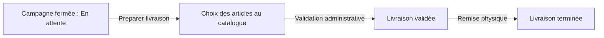

# Guide Utilisateur - Profil Commercial

_Ce document est une compilation de la documentation pour impression._

\newpage

# Guide Commercial

Ce guide présente les parcours de terrain disponibles sur le web et, dans sa dernière partie, sur l’application mobile. Votre interface montre uniquement les actions correspondant à vos droits : l’absence d’un bouton de validation, d’export ou de réaffectation est normale si l’habilitation n’est pas attribuée.

<!-- CAPTURE À INSÉRER : Menu d’un commercial avec Clients, Stock Commercial, Ventes, Tontines et Rapport Journalier. -->

## Votre cycle de travail

| Moment | Module | Objectif |
|---|---|---|
| Préparer le portefeuille | Clients | Créer et mettre à jour les informations client. |
| Obtenir les articles | Stock Commercial | Créer une demande de sortie et suivre sa livraison. |
| Distribuer et suivre | Ventes | Créer une vente, suivre son statut et encaisser les mises. |
| Collecter l’épargne | Tontines | Inscrire, collecter, suivre la progression et préparer la livraison. |
| Rendre compte | Caisse, Rapport Journalier | Contrôler les versements et les opérations de la période. |

Suivez les pages [Clients et comptes](clients_accounts.md), [Stock](stock.md), [Ventes et commandes](sales_orders.md), [Tontines](tontine.md) et [Application mobile](mobile_app.md).

\newpage

---

# Clients et comptes (Répertoire, Enrôlement & Suivi)

Le module **Clients** est le socle de l'ensemble des opérations commerciales et financières d'ELYKIA. Il centralise les données d'identité, les coordonnées géographiques, les pièces justificatives, les affectations commerciales ainsi que l'historique complet des crédits et de la tontine.

---

## 1. Rechercher et consulter la clientèle (`/client/list`)

Accessible via le menu latéral **Clients**, la vue liste fournit un accès direct à l'ensemble du portefeuille.

<!-- CAPTURE À INSÉRER : Liste web des clients avec la barre de recherche, le filtre commercial, les KPI et les boutons d'action. -->

### A. Outils de filtrage et recherche
* **Recherche instantanée** : Saisissez un nom, un prénom, un numéro de téléphone (8 chiffres) ou un nom de localité dans le champ de recherche, puis appuyez sur Entrée ou cliquez sur la loupe.
* **Sélecteur de commercial** : Permet d'isoler en un clic le portefeuille géré par un commercial précis.
* **Persistance de navigation** : La recherche, le commercial sélectionné et la pagination sont conservés dans l'état de l'application lorsque vous ouvrez une fiche client et revenez à la liste.
* **Fiche Client PDF** : Dès qu'un commercial est filtré, le bouton **« Fiche Client PDF »** devient actif pour générer le document imprimable de son portefeuille clients.

### B. Indicateurs du bandeau supérieur
Quatre cartes KPIs résument la dynamique du portefeuille affiché :
1. **Clients enregistrés** : Nombre total de clients actifs (hors dossiers supprimés).
2. **Crédit en cours** : Nombre de clients ayant au moins une vente à crédit active (`INPROGRESS`).
3. **Membres tontine** : Nombre de clients souscripteurs d'un cycle d'épargne tontine.
4. **Sans crédit ni tontine** : Prospects ou clients n'ayant aucun engagement financier actif.

---

## 2. Enrôlement d'un nouveau client (`/client/add`)

Pour créer un nouveau client, cliquez sur le bouton bleu **« + Ajouter »** en haut à droite de la liste. Le formulaire est structuré en 7 sections normées :

<!-- CAPTURE À INSÉRER : Formulaire d'ajout client montrant l'envoi de la photo de profil, la saisie d'identité, la pièce justificative et les commerciaux. -->

### Section 1 : Identité
* **Photo de profil** :
  * Cliquez sur l'icône de l'appareil photo pour téléverser une photo d'identité (format JPG ou PNG, recadrage carré recommandé).
  * La photo est automatiquement convertie et enregistrée en base de données. Un bouton permet de la retirer ou de la remplacer si besoin.
* **Nom & Prénom** *(Obligatoires)* : Identité civile du client.
* **Adresse** *(Obligatoire)* : Adresse physique de résidence ou de commerce.
* **Numéro de téléphone** *(Obligatoire)* : Numéro principal du client (exactement 8 chiffres requis selon la numérotation nationale).

### Section 2 : Pièce d'identité
* **Type de pièce** *(Obligatoire)* : Sélection parmi les formats d'identification légaux autorisés :
  * `Carte d'électeur (CENI)`
  * `Passport`
  * `Carte nationale d'identité (ID Card)`
  * `Carte e-ID / Numéro d'Identification Unique (NIU)`
  * `Permis de conduire (Driver License)`
* **Numéro de pièce** *(Obligatoire)* : Numéro officiel d'enregistrement de la pièce d'identité.
* **Document numérisé (Fichier)** : Téléversement du scan ou de la photo de la pièce d'identité (formats acceptés : PDF, JPEG, PNG).

### Section 3 : Informations personnelles
* **Date de naissance** *(Obligatoire)* :
  * **Contrôle d'âge minimum (16 ans)** : L'application vérifie automatiquement que le client est âgé d'au moins 16 ans révolus à la date du jour. Une date inférieure à 16 ans bloque la validation avec le message d'alerte `Âge minimum 16 ans`.
* **Occupation** *(Obligatoire)* : Profession ou activité génératrice de revenus du client (ex: commerçante, couturière, artisan, etc.).
* **Localité** *(Obligatoire)* : Sélection avec autocomplétion intelligente parmi le référentiel des localités et quartiers enregistrés dans ELYKIA.

### Section 4 : Personne à contacter (Garant / Proche)
* **Nom complet** : Identité de la personne de confiance à contacter en cas d'injoignabilité.
* **Téléphone & Adresse** : Coordonnées de contact du garant.

### Section 5 : Géolocalisation
* **Mode Automatique GPS** : Cliquez sur le bouton **« Obtenir la position GPS »** pour capturer automatiquement les coordonnées géographiques actuelles depuis le navigateur ou l'appareil.
* **Mode Saisie Manuelle** : Activez l'interrupteur à bascule pour saisir directement la `Latitude` et la `Longitude` (utile pour les enregistrements a posteriori au bureau).

### Section 6 : Commerciaux associés
L'application sépare strictement les responsabilités commerciales pour une traçabilité optimale :
* **Commercial crédit** *(Obligatoire)* : Commercial chargé du recouvrement des crédits et de la distribution des articles.
* **Commercial tontine** *(Obligatoire)* : Commercial chargé des collectes de cotisations d'épargne.
* **Commercial agence** : Commercial référent rattaché à l'agence.

### Section 7 : Type & Compte
* **Type de client** *(Obligatoire)* : Choix entre `Client` (client final bénéficiaire) ou `Commercial` (compte interne pour un commercial).
* **Compte associé & Solde initial** :
  * **Numéro de compte** : Généré automatiquement par le système.
  * **Solde initial en FCFA** *(Obligatoire)* : Saisie du montant d'ouverture de compte, soumis à un plancher et un plafond réglementaires :
    * **Montant minimum** : `500 FCFA`.
    * **Montant maximum** : `2 000 000 FCFA`.

Cliquez sur **« Enregistrer »** pour créer le dossier client.

---

## 3. Consultation détaillée du client (`/client/view/:id`)

En cliquant sur le nom d'un client dans la liste, vous accédez à sa **Fiche Client Détaillée**, structurée pour offrir une vue à 360 degrés de sa solvabilité :

<!-- CAPTURE À INSÉRER : Fiche client détaillée avec panneau d'identité, indicateurs financiers d'achats et onglets Achats / Historiques / En Attente. -->

### A. Synthèse d'en-tête
* **Informations de profil** : Nom, téléphone, adresse, profession, numéro de compte et lien vers le commercial référent.
* **Indicateurs financiers en temps réel** :
  * **Achats en cours** : Nombre de crédits actifs.
  * **Montant total de l'achat en cours** (FCFA).
  * **Montant total dû à date** (FCFA) : Montant théorique qui devrait être remboursé selon le calendrier d'échéances.
  * **Montant total payé à date** (FCFA) : Somme réelle des remboursements déjà perçus.
  * **Achats terminés** : Nombre de crédits entièrement soldés avec succès.
  * **Achats en retard** : Nombre de crédits en défaut de paiement.

### B. Les 3 Onglets chronologiques d'opérations
1. **Onglet « Achats »** : Liste détaillée des crédits actuellement en cours (`INPROGRESS`), avec la référence, les articles associés, la mise journalière, le montant total et le reste à payer.
2. **Onglet « Historiques »** : Archives de l'ensemble des crédits soldés (`SETTLED`) ou annulés dans le passé, permettant d'apprécier la ponctualité historique du client.
3. **Onglet « En Attente »** : Dossiers de vente créés (`CREATED`) ou validés (`VALIDATED`) en attente de démarrage ou de livraison de marchandise.

---

## 4. Réaffectation en masse de portefeuille

Lorsque les tournées sont réorganisées, les gestionnaires peuvent transférer un groupe de clients vers un nouveau commercial :

1. Cochez les cases des clients concernés dans la liste.
2. Cliquez sur le bouton d'action **« Changer de commercial (N) »**.
3. Sélectionnez le nouveau **Commercial crédit** et/ou le nouveau **Commercial tontine**.
4. **Transfert automatique des ventes** : Cochez la case *« Transférer automatiquement les ventes du commercial vers le nouveau commercial »* pour que tous les crédits en cours suivent instantanément le client chez le nouvel agent.
5. Validez l'opération.

---

## 5. Gestion des comptes financiers (`/accountlist`)

Le sous-menu **Comptes** offre une vue d'ensemble des comptes de monnaie électronique ou de dépôt rattachés aux clients et aux agents :
* Affiche pour chaque compte : le numéro de compte unique, le titulaire (client ou commercial), le type de compte et le solde actuel disponible en FCFA.
* La fiche de détail d'un compte (`/accountdetails/:id`) permet de tracer l'ensemble des écritures de débit (achats, prélèvements) et de crédit (approvisionnements, remboursements).

\newpage

---

# Stock commercial (Demandes, Suivi Mensuel & Retours)

Le **Stock Commercial** représente la marchandise physique effectivement confiée à un agent commercial pour réaliser ses ventes sur le terrain. L'agent est personnellement et financièrement comptable des articles mis à sa disposition jusqu'à leur vente enregistrée ou leur réintégration au magasin central.

---

## 1. Demander du stock au magasin (`/stock/request`)

Pour s'approvisionner, le commercial ou son responsable initie une **Demande de sortie stock**.

<!-- CAPTURE À INSÉRER : Formulaire Nouvelle demande de sortie stock avec sélection des articles, quantités et bouton d'envoi. -->

### A. Création de la demande (`/stock/request/create`)
1. Ouvrez **Stock Commercial > Demandes Sortie** et cliquez sur le bouton bleu **« + Nouvelle demande »** (si ce bouton n'apparaît pas, vous ne disposez pas des habilitations requises). En tant que commercial, vous visualisez uniquement vos propres demandes ; en tant que gestionnaire, vous avez la visibilité sur l'ensemble des commerciaux de l'agence.
2. Sélectionnez le commercial destinataire (pré-rempli à votre nom pour un commercial).
3. Ajoutez les articles souhaités dans la grille et indiquez pour chacun la quantité requise.
4. Cliquez sur **« Enregistrer »**.

### B. Cycle de vie de la demande
* **Statut `CREATED` (Créée / En attente)** :
  * La demande est enregistrée et transmise pour arbitrage.
  * Tant qu'elle n'est pas validée, le commercial ou le gestionnaire peut la **Modifier** (icône crayon) ou l'**Annuler** (icône croix rouge).
  * Le gestionnaire peut la **Valider** (icône coche verte) ou la **Refuser**.
* **Statut `VALIDATED` (Validée)** :
  * Le gestionnaire a autorisé la sortie. La demande est transmise au magasin dépôt.
  * Les articles sont physiquement préparés par le magasinier.
* **Statut `DELIVERED` (Livrée)** :
  * Le magasinier remet la marchandise au commercial et clique sur **« Livrer »**.
  * **Effet immédiat** : Les articles sont instantanément crédités dans le **Stock Mensuel** du commercial. La date et l'heure de remise physique sont figées.

---

## 2. Tableau de bord « Mon Stock » mensuel (`/stock/my-stock`)

Accessible via **Stock Commercial > Stock**, ce tableau de bord offre une analyse comptable exhaustive de la tournée du commercial, mois par mois.

<!-- CAPTURE À INSÉRER : Tableau de bord Mon Stock montrant l'accordéon mensuel, les 6 cartes de KPI et le tableau des mouvements d'articles. -->

### A. Navigation temporelle et sélection
* **Accordéon par mois** : Chaque mois d'activité fait l'objet d'un volet déroulant intitulé `[Nom Commercial] - [Mois] [Année]`.
* **Bouton « Historique »** : Permet d'afficher ou de masquer les mois civils antérieurs clôturés.
* **Télécharger rapport** : En tête de chaque panneau mensuel, un bouton d'export génère la fiche de stock mensuelle officielle au format PDF.

### B. Les 6 Indicateurs Financiers KPIs du Stock Mensuel
Chaque panneau mensuel calcule automatiquement 6 métriques financières de contrôle :

| KPI Financier | Couleur / Icône | Signification Opérationnelle | Interaction & Règle |
|---|---|---|---|
| **Valeur Stock Restant** | Bleu Cyan (`inventory_2`) | Valeur marchande des articles encore physiquement en possession du commercial. | Calculée sur la base du prix unitaire pondéré des articles non vendus. |
| **Valeur Stock Vendu** | Vert (`monetization_on`) | Montant total des ventes (crédit et comptant) conclues sur le stock du mois. | **Carte Cliquable** : Un clic ouvre instantanément la liste détaillée de l'ensemble des crédits et ventes associés. |
| **Valeur Total Dû** | Orange (`account_balance_wallet`) | Valeur globale totale de l'ensemble des marchandises confiées sur le mois (Stock restant + Stock vendu). | Représente l'engagement financier total initial du commercial. |
| **Montant Recouvré** | Vert Émeraude (`payments`) | Cumul réel des versements et encaissements perçus auprès des clients sur les ventes de ce stock. | Mesure le cash effectif rentré en caisse. |
| **Reste à Recouvrer** | Ambre (`hourglass_empty`) | Montant global restant à percevoir (Valeur du stock physique restant + créances clients non encore soldées). | Reste à recouvrer = Total Dû $-$ Montant Recouvré. |
| **Taux de Recouvrement** | Bleu Marine (`trending_up`) | Pourcentage d'efficacité de remboursement réalisé sur la valeur totale confiée. | Taux (%) = (Montant Recouvré / Valeur Total Dû) $\times$ 100. |

### C. Tableau d'analyse des mouvements par article
Au sein de chaque panneau mensuel, le tableau détaille pour chaque référence produit :
* **Article** : Nom commercial et désignation complète.
* **Pris (Magasin)** : Quantité totale livrée par le magasin central. *(Cellule cliquable pour inspecter le détail des bons de sortie).*
* **Vendu (Clients)** : Quantité totale écoulée auprès de la clientèle. *(Cellule cliquable pour ouvrir la liste des ventes clientes correspondantes).*
* **Retourné** : Quantité réintégrée au magasin central.
* **Restant** : Quantité nette actuellement détenue : $\text{Restant} = \text{Pris} - \text{Vendu} - \text{Retourné}$.
* **Valeur Restante (FCFA)** : Valorisation financière du reliquat au Prix Moyen Pondéré (PMP).

---

## 3. Retours de marchandise au magasin (`/stock/return`)

Lorsqu'un commercial souhaite réintégrer un article invendu, défectueux ou faire une fin de tournée, il crée une opération de retour dans **Stock Commercial > Retours**.

### A. Déclaration du retour (`/stock/return/create`)
1. Cliquez sur **« + Nouveau retour »**.
2. Sélectionnez le commercial, l'article et la quantité à restituer.
3. Renseignez obligatoirement le **motif du retour** (invendu, emballage détérioré, demande du client annulée).
4. Enregistrez. Le retour passe au statut **`PENDING` (En attente)**.

### B. Réception magasin
* Le magasinier vérifie l'état physique de l'article au dépôt.
* Dès que le magasinier clique sur **« Réceptionner »**, le statut bascule à **`RECEIVED`**.
* **Impact comptable immédiat** : Le stock commercial de l'agent est automatiquement déchargé de la quantité retournée, et le stock central du magasin est réapprovisionné.

---

## 4. Retour de stock antérieur (`/stock/return/historique`)

Pour les situations où des articles confiés lors d'un mois civil antérieur doivent être restitués plusieurs semaines après la clôture du mois d'origine :
* Le bouton **« Retour stock antérieur »** (accessible sous réserve de disposer des habilitations requises) permet d'enregistrer un retour rattaché spécifiquement au mois d'origine de la dotation.
* Cela garantit que les bilans mensuels d'ouverture et de clôture ne subissent aucun décalage d'imputation comptable.

\newpage

---

# Guide des Ventes, Crédits, Recouvrements et Commandes

Le module **Ventes** et le module **Commandes** constituent le moteur commercial de la plateforme ELYKIA. Ils permettent d'enregistrer des ventes au comptant ou à crédit, de suivre le remboursement quotidien des contrats, de gérer les retards et les échéances, d'organiser les réaffectations de dossiers entre commerciaux, de régulariser des ventes de rattrapage et de transformer les réservations clients en ventes effectives.

> [!NOTE]
> **Visibilité selon votre profil d'utilisateur** :
> - **En tant que commercial** : vous visualisez exclusivement vos propres ventes, vos clients rattachés et les articles présents dans votre stock commercial.
> - **En tant que gestionnaire ou responsable d'agence** : vous avez accès à l'ensemble des ventes de l'agence avec la possibilité de filtrer sur n'importe quel commercial.
> - **Habilitations** : si certaines fonctionnalités, boutons ou indicateurs décrits dans ce manuel ne s'affichent pas sur votre écran, c'est que vous ne disposez pas des habilitations nécessaires (contactez votre administrateur).

---

## 1. Vue d'ensemble de la navigation commerciale

Le menu latéral gauche vous donne accès aux espaces de vente selon vos attributions :

| Menu / Écran | Ce que vous y trouvez | Utilisation au quotidien |
|---|---|---|
| **Ventes > Liste** | Le tableau de bord principal des ventes, la recherche multicritères, le suivi des statuts, la fusion de crédits et les réaffectations. | Suivre les contrats en cours, valider les dossiers, enregistrer les encaissements ou réassigner des portefeuilles. |
| **Ventes > Retards** | La liste des crédits présentant des impayés (délais dépassés ou échéances dues). | Prioriser les visites de relance, consigner les contrôles terrain et clôturer les dossiers compromis. |
| **Ventes > Échéances** | Le calendrier des montants attendus aujourd'hui, cette semaine ou sur une date précise. | Anticiper les rentrées de fonds et préparer les tournées quotidiennes. |
| **Ventes > Recouvrements** | Le journal chronologique de tous les encaissements perçus. | Contrôler la traçabilité des règlements et rectifier d'éventuelles erreurs de saisie. |
| **Ventes > Transfert Ventes** | Le rapport de passation de portefeuilles entre commerciaux. | Auditer les transferts de contrats entre un commercial cédant et un commercial repreneur. |
| **Ventes > Rattrapages** | L'outil de régularisation de ventes passées. | Enregistrer des ventes historiques adossées à d'anciens stocks résiduels sans toucher au stock central actuel. |
| **Ventes > Articles** | Le tableau récapitulatif des volumes vendus par article et par commercial. | Analyser les performances de vente sur une période donnée (jour, semaine, mois). |
| **Commandes** | Le registre des précommandes et réservations clients. | Traiter les demandes d'achat des clients et les convertir en ventes réelles en un clic. |

---

## 2. Tableau de bord des ventes (`/credit/list`)

L'écran principal rassemble la totalité des opérations de vente de votre périmètre.

### Les indicateurs financiers de vente
En haut de page, les cartes synthétiques vous présentent la situation financière sur la période choisie :
- **Total Ventes** : Nombre d'opérations de vente enregistrées.
- **Montant Total** : Valeur totale cumulée des contrats signés (en FCFA).
- **Montant Encaissé** : Somme des acomptes initiaux et de l'ensemble des mises journalières perçues.
- **Solde Restant** : Montant global qui reste à recouvrer.
- **Taux de Recouvrement** : Pourcentage financier recouvré (`Montant Encaissé / Montant Total`).

### Filtres temporels et recherche avancée
1. **Filtres de période rapides** :
   - `Aujourd'hui` : Ventes du jour.
   - `Cette semaine` : Ventes du lundi au dimanche en cours.
   - `Ce mois` : Ventes depuis le premier jour du mois civil.
   - `Personnalisée` : Choix libre d'une date de début et d'une date de fin.
2. **Recherche rapide** : Tapez directement une référence de contrat ou le nom d'un client.
3. **Recherche avancée multicritères** :
   - Mot-clé général (nom client, référence contrat ou référence de rattrapage).
   - Type de client (particulier, entreprise).
   - Type de vente (Crédit ou Comptant).
   - Statut du contrat (Enregistré, Validé, En cours, Soldé).
   - Commercial (pour un gestionnaire, sélection du commercial à auditer).

### Indicateurs visuels d'échéance (Pastilles colorées)
Chaque ligne de vente affiche une pastille colorée indiquant le nombre de jours restants avant l'échéance :
- 🟢 **Vert** : Plus de 5 jours restants avant la fin du contrat (situation normale).
- 🟡 **Orange** : Moins de 5 jours restants (alerte échéance imminente).
- 🔴 **Rouge** : 0 jour restant ou date d'échéance dépassée (retard contractuel).

### Les étapes de vie d'un contrat de vente
Une vente progresse selon des étapes claires garantissant la sécurité des marchandises et des fonds :

| Statut du contrat | Ce que cela signifie | Actions disponibles |
|---|---|---|
| **Enregistré** (`CREATED`) | La vente vient d'être saisie. La marchandise n'est pas encore sortie du stock. | - **Valider** : Approuve le contrat de vente. - **Modifier** : Corrige les articles, acomptes ou informations client. - **Supprimer** : Annule la saisie erronée. |
| **Validé** (`VALIDATED`) | Le contrat est approuvé administrativement. Les articles sont prêts à être remis au client. | - **Démarrer** : Confirme la remise physique des articles au client et déstocke automatiquement le matériel du stock du commercial. - **Détails** : Ouvre la fiche complète du dossier. |
| **En cours** (`INPROGRESS`) | La marchandise a été livrée, le crédit est actif et en cours de remboursement. | - **Encaisser** : Ouvre directement la fenêtre de paiement pour saisir une mise quotidienne (avec rappel du reliquat disponible). - **Modifier la mise** : Réajuste le montant journalier convenu. - **Détails** : Consultation 360°. |
| **Soldé** (`SETTLED`) | Le client a remboursé la totalité de son crédit. Le solde restant dû est à zéro. | - **Consulter** : Historique complet, date de clôture effective et archivage. Les dossiers soldés ne sont plus modifiables. |

### Actions groupées : Réaffectation et Fusion de crédits
- **Changer de commercial en lot** :
  1. Cochez les cases des ventes en cours que vous souhaitez réaffecter (les dossiers déjà soldés ne sont pas sélectionnables).
  2. Cliquez sur **Changer le commercial**.
  3. Sélectionnez le nouveau commercial dans la liste déroulante.
  4. Validez : l'ensemble des contrats cochés est transféré au nouveau commercial en une seule opération.
- **Fusionner plusieurs crédits** :
  1. Cliquez sur le bouton **Fusionner**.
  2. Sélectionnez le commercial concerné.
  3. Choisissez entre **2 et 10 crédits en cours** appartenant à ce commercial pour un même client.
  4. Cliquez sur **Confirmer la fusion**.
  5. Le système consolide les soldes restants et les articles en un contrat unique avec une nouvelle référence, puis clôture proprement les anciens dossiers.

---

## 3. Enregistrer une nouvelle vente (`/credit/add`)

Pour créer une vente, cliquez sur **Nouvelle vente** (ou ouvrez `/credit/add`).

### Choisir entre Vente à Crédit et Vente au Comptant

| Critère | Vente à Crédit | Vente au Comptant |
|---|---|---|
| **Commercial responsable** | **Obligatoire**. En tant que commercial, votre nom est automatiquement renseigné. En tant que gestionnaire, vous choisissez le commercial qui portera la vente. | Non requis. La vente est une opération directe en boutique. |
| **Choix du client** | La liste propose les clients déjà rattachés au commercial sélectionné. | Recherche universelle parmi l'ensemble des clients de l'agence. |
| **Articles et stock disponible** | Les articles sont déduits du **Stock Commercial** de l'agent. Seuls les articles que le commercial a effectivement en sa possession peuvent être vendus. | Les articles sont recherchés directement dans le stock général du magasin. |
| **Prix appliqué** | Prix de vente à crédit (prix contractuel avec marge tontine/crédit). | Prix de vente au comptant. |
| **Paiement et échéances** | Saisie d'une avance initiale facultative, calcul automatique du solde restant dû, de la mise journalière et de la date de fin prévue. | Règlement intégral immédiat au comptoir. Aucun échéancier journalier. |
| **Usage du crédit** | Choix entre usage **Personnel** ou **Professionnel** si le client bénéficie de l'habilitation crédit professionnel. | Sans objet. |

### Reçu de caisse et impression immédiate
Si l'impression immédiate est activée dans votre agence :
1. Dès que vous enregistrez la vente, une fenêtre affiche l'aperçu du ticket de caisse thermique (format 80 mm).
2. Le reçu détaille : l'en-tête ELYKIA, la référence unique du contrat, le nom et téléphone du client, le nom du commercial, la liste des articles avec prix et quantités, le total, l'acompte versé, le solde restant et la mise journalière convenue.
3. Cliquez sur **Imprimer** pour sortir le ticket destiné au client.

---

## 4. Fiche détaillée 360° d'un crédit (`/credit/details/:id`)

En ouvrant un crédit, vous accédez à un dossier complet regroupant l'ensemble des aspects contractuels, financiers et logistiques :

### 1. Jauge de progression du remboursement
- Barre graphique indiquant le pourcentage remboursé à date.
- Rappel du montant déjà payé par rapport au montant total du contrat.
- Décompte du montant restant dû et du nombre de jours contractuels restants.
- Date de début et date de fin prévue (ou date de fin effective si le crédit est soldé).

### 2. Indicateurs financiers du contrat
- **Montant Total** : Valeur totale de la vente en FCFA.
- **Déjà Payé** : Somme de l'acompte initial et des règlements journaliers perçus.
- **Restant Dû** : Montant net qui reste à percevoir.
- **Mise Journalière** : Somme quotidienne attendue selon le contrat.

### 3. Informations sur le client et reliquat
- Nom, prénom, pièce d'identité, téléphone et adresse.
- Lien direct vers sa fiche client complète.
- **Affichage du Reliquat** : Le solde disponible en reliquat chez ce client apparaît en vert s'il est positif. Cela permet de savoir immédiatement si le client possède un avoir qui peut être utilisé pour régler sa mise.

### 4. Commercial responsable et historique des transferts
- Nom du commercial actuellement en charge du dossier.
- Bouton **Modifier** : Permet à un responsable de réassigner ce crédit à un autre commercial.
- **Lien vers le stock source** : Permet de retrouver en un clic le lot mensuel d'origine duquel proviennent les articles livrés.
- **Historique des transferts** : Frise chronologique retraçant tous les changements de commercial intervenus sur ce contrat (date, ancien commercial, nouveau commercial, solde restant au moment de la passation).

### 5. Consentement numérique et Contrôle terrain
- **Codes de consentement** : Affiche les codes de confirmation générés lors des opérations mobiles pour garantir l'accord du client.
- **Contrôle terrain** : Si un chef de recouvrement a inspecté le carnet du client, cette section affiche le montant système, le montant noté sur le carnet papier, l'écart éventuel, le statut (🟢 **Conforme** ou 🔴 **Disparité**) ainsi que les observations de l'auditeur.

### 6. Articles livrés
Tableau listant chaque article avec sa désignation, sa catégorie, la quantité livrée, son prix unitaire et le montant total de la ligne.

### 7. Situation de recouvrement et compteurs de retard
Un bandeau évalue la ponctualité des règlements du client :
- 🟢 *À jour — aucun retard* (0 jour de retard).
- 🟡 *Léger retard de paiement* (1 à 5 jours de retard).
- 🔴 *Retard significatif* (plus de 5 jours de retard).
- **Les 4 compteurs de contrôle** :
  1. *Jours écoulés* : Nombre de jours passés depuis la signature.
  2. *Jours payés* : Nombre de jours de mise effectivement couverts par les paiements du client.
  3. *Jours de retard* : Différence entre les jours écoulés et les jours payés.
  4. *Jours restants* : Nombre de jours restant avant l'échéance finale.

### 8. Historique des paiements et droit d'annulation
Chaque mise encaissée apparaît dans la liste chronologique avec sa date, son heure, la référence du reçu et le nom du commercial qui a perçu l'argent.
- Un badge indique si le montant correspond à la **Mise normale** ou à une **Mise spéciale** (paiement partiel ou avance de plusieurs jours).
- En cas d'erreur de saisie, un utilisateur habilité peut cliquer sur **Annuler** : le système demande confirmation et corrige immédiatement le solde du crédit ainsi que le journal de caisse.

### 9. Historique des changements de mise
Si la mise quotidienne a été renégociée, un tableau consigne chaque modification : ancienne mise $\rightarrow$ nouvelle mise, solde restant à ce moment-là, auteur et date du changement.

---

## 5. Gestion des impayés et retards (`/credit/late`)

L'écran **Retards** est l'outil principal de pilotage pour le chef de recouvrement et le gestionnaire :
- **Indicateurs clés** : Nombre total de dossiers en retard, nombre de délais dépassés, nombre d'échéances du jour et montants financiers correspondants.
- **Filtres de travail** : Filtrage par commercial, par mois, par quartier/localité et par type de retard (délai expiré ou échéance du jour).
- **Clôture exceptionnelle** : Permet de solder administrativement un crédit irrécouvrable en consignant le motif.
- **Saisie de contrôle terrain** : Permet au chef de recouvrement d'enregistrer directement le montant constaté sur le carnet du client.
- **Export PDF** : Génère une feuille de route pour la tournée de recouvrement avec les adresses, numéros de téléphone et montants exigibles.

---

## 6. Calendrier des échéances (`/credit/echeance`)

Le sous-menu **Échéances** permet d'anticiper les règlements attendus :
- Visualisation des échéances du jour, de la semaine ou d'une date choisie sur calendrier.
- Filtre par commercial pour mesurer la charge d'encaissement de chaque collaborateur.

---

## 7. Journal des recouvrements (`/credit/recouvrements`)

Le sous-menu **Recouvrements** est le registre des encaissements de crédits :
- Il présente la totalité des versements perçus jour après jour.
- Vous pouvez filtrer par plage de dates (*du ... au ...*) et par commercial.
- Pour chaque ligne, vous retrouvez la référence, le client, le commercial, le montant versé et l'heure exacte.
- Les profils autorisés peuvent annuler un encaissement erroné avec recalcul instantané des soldes.

### Encaissements à distance par Mobile Money (`/customer-payments`)
Vos clients ont également la faculté de régler leurs échéances sans attendre votre passage grâce à l'Espace Client ELYKIA :
- Le client effectue son transfert vers le numéro Mobile Money (Mixx by YAS ou Moov Money) attribué à son commercial référent.
- Il déclare son règlement sur son portail en indiquant le numéro de transaction opérateur.
- La soumission parvient instantanément dans le menu **Paiements clients** (`/customer-payments`) où elle est rattachée au commercial responsable du dossier.
- Dès la validation de la déclaration, l'échéance du crédit est automatiquement soldée et le montant s'ajoute à vos recouvrements du jour.

---

## 8. Rapport de transfert des ventes (`/credit/transferts-commerciaux`)

Le rapport de passation permet de suivre avec précision les mouvements de portefeuille :
- Filtres par commercial cédant, commercial repreneur et période.
- Statistiques globales : nombre de dossiers transférés, valeur totale des contrats, montants déjà payés et soldes restants transférés.
- Sélecteur de paires : permet de cliquer sur une passation spécifique (par exemple *Commercial A $\rightarrow$ Commercial B*) pour afficher le détail des dossiers concernés.
- **Règle d'exactitude** : Si un contrat a changé de main plusieurs fois sur la période, il n'est comptabilisé qu'une seule fois, sur son transfert le plus récent, pour éviter tout double comptage.

---

## 9. Rattrapage de ventes antérieures (`/stock/credit/rattrapage`)

Cette procédure exceptionnelle est réservée aux régularisations :
1. Elle permet d'enregistrer une vente réalisée dans le passé sans impacter le stock physique actuel du magasin central.
2. Déroulement en 3 étapes :
   - Sélection du commercial et choix de son **stock résiduel archivé**.
   - Sélection des articles et quantités vendus à l'époque dans ce lot.
   - Sélection du client, saisie de l'acompte éventuel et validation de l'échéancier.
3. Les ventes de rattrapage reçoivent une référence distinctive pour faciliter leur suivi comptable.

---

## 10. Rapport des articles vendus (`/credit/articles-vendus`)

Cet écran synthétise les sorties commerciales de l'agence :
- Regroupement des ventes par **Article** et par **Commercial**.
- Affichage des quantités totales écoulées et des montants générés.
- Filtres temporels rapides (aujourd'hui, semaine, mois, personnalisé) et filtre par commercial.
- Export des données vers Excel ou PDF pour les réunions de bilan commercial.

---

## 11. Gestion des commandes clients (`/orders`)

Le module **Commandes** gère les précommandes et réservations avant leur contractualisation définitive.

### Le tableau de bord des commandes
Les commandes sont réparties dans 6 onglets selon leur avancement :
- **En attente** : Nouvelles demandes enregistrées nécessitant une confirmation.
- **Acceptée** : Commandes validées dont la marchandise et les modalités de paiement sont convenues.
- **Refusée** : Demandes rejetées (stock indisponible, client non éligible).
- **Annulée** : Commandes annulées par le client ou le commercial.
- **Vendue** : Commandes converties avec succès en ventes réelles.
- **Toutes** : Vue d'ensemble du registre.

### Traitement et conversion d'une commande en vente
1. **Créer une commande** : Cliquez sur **Créer une commande**, sélectionnez le client et ajoutez les articles souhaités avec leurs quantités et prix.
2. **Décision** : Les responsables peuvent accepter ou refuser la commande (individuellement ou par lot).
3. **Action « Vendre »** : Dès qu'une commande est acceptée, le bouton **Vendre** bascule directement l'ensemble des articles vers le formulaire de vente (`/credit/add`) pour créer le contrat crédit ou comptant sans aucune ressaisie manuelle, puis marque la commande comme **Vendue**.

\newpage

---

# Guide Tontines

Le module **Tontines** gère l'épargne collective et les cotisations annuelles des clients ELYKIA. Il permet d'inscrire des membres, de suivre leurs versements quotidiens sur un cycle annuel de 10 mois (de février à novembre), de vérifier la conformité de leurs carnets physiques, d'effectuer des contrôles sur le terrain, d'organiser la remise des articles de fin d'année et d'assurer l'archivage propre des campagnes passées.

> [!NOTE]
> **Visibilité selon votre profil d'utilisateur** :
> - **En tant que commercial** : vous accédez exclusivement aux membres, cotisations et livraisons de votre propre portefeuille.
> - **En tant que gestionnaire ou responsable d'agence** : vous bénéficiez d'une vision d'ensemble sur toute l'agence et pouvez filtrer les données pour chaque commercial.
> - **Habilitations** : si certaines actions, boutons ou indicateurs décrits dans ce guide ne s'affichent pas sur votre écran, c'est que vous ne disposez pas des droits d'accès correspondants.

---

## 1. Vue d'ensemble de la navigation

Le menu **Tontines** propose quatre espaces de travail adaptés au déroulement de la campagne :

| Menu / Écran | Ce que vous y trouvez | Utilisation au quotidien |
|---|---|---|
| **Tontines > Liste** | Le tableau de bord de la session active, les indicateurs d'épargne, la liste des membres et les outils de vérification. | Inscrire de nouveaux membres, suivre les adhésions, vérifier les carnets et consulter la progression. |
| **Tontines > Collectes** | Le journal chronologique de l'ensemble des cotisations enregistrées. | Contrôler les versements perçus, rechercher un paiement par période ou par commercial. |
| **Tontines > Livraison** | Le suivi des commandes de marchandises de fin d'année. | Suivre les colis à préparer, valider les livraisons et confirmer la remise aux membres. |
| **Tontines > Archives collectes** | L'historique des campagnes annuelles clôturées. | Consulter et télécharger les récapitulatifs PDF par commercial et par quartier des années antérieures. |

---

## 2. Tableau de bord de la session

L'écran principal de la liste vous donne une vue synthétique sur la campagne en cours.

### Les indicateurs clés de la campagne
En haut de l'écran, les cartes récapitulatives vous informent en temps réel sur la santé de la tontine :
- **Membres Actifs** : Nombre total d'adhérents inscrits cette année.
- **Montant Total Collecté** : Somme globale des cotisations versées par les membres (en FCFA).
- **Revenu Total (Part Société)** : Rémunération statutaire acquise par ELYKIA pour la gestion de la tontine.
- **En Attente de Livraison** : Nombre de membres éligibles qui attendent encore leurs articles de fin d'année (avec le nombre de colis déjà livrés).
- **Contribution Moyenne** : Montant moyen épargné par adhérent.
- **Collectes à la livraison** : Montants perçus lors de la délivrance des articles.

### Session en cours vs Sessions antérieures
- **Session en cours (Active)** : La campagne annuelle est ouverte. Toutes les opérations quotidiennes (inscriptions, cotisations, ajustements de mise, vérifications de carnet) sont accessibles.
- **Sessions passées (Historiques)** : Permet de consulter les campagnes précédentes en mode consultation seule. Un bandeau d'information rappelle que les modifications y sont désactivées. Le bouton **« Session actuelle »** vous ramène immédiatement à l'année en cours.
- **Comparaison pluriannuelle** : Le bouton **Comparer** vous permet de sélectionner de 2 à 5 années pour observer l'évolution du nombre d'adhérents et des montants collectés.

### Trouver rapidement un membre
La barre de recherche et de filtres vous permet de cibler des dossiers précis :
- **Par texte** : Tapez le nom, prénom, numéro de téléphone ou code du client.
- **Par commercial** : Pour un gestionnaire, sélectionnez un commercial dans la liste déroulante pour isoler son secteur. Pour un commercial, votre secteur est pré-sélectionné.
- **Par statut de livraison** : Filtrez les membres en cours de session, ceux dont la livraison est en attente, validée ou déjà terminée.
- **Par état du carnet** : Affichez uniquement les membres dont le carnet est vérifié ou ceux restant à contrôler.

### Téléchargements et exports PDF
La barre d'outils propose des exports prêts à imprimer :
- **Export des membres par commercial** : Génère un document récapitulant les coordonnées, la mise journalière et le total cotisé pour le portefeuille choisi.
- **Export des vérifications de carnets** : Produit la liste des carnets déjà vérifiés ou en attente de vérification, idéal pour organiser les tournées de contrôle.

### Vérifier les carnets en masse
Pour les utilisateurs habilités à viser les carnets physiques :
1. Cochez les cases des membres dont vous avez inspecté les carnets.
2. Cliquez sur le bouton **Vérifier la sélection** dans la barre d'actions groupées.
3. Confirmez l'opération : la date, l'heure et votre nom sont automatiquement enregistrés sur chacun des dossiers cochés.

### Inscrire un nouveau membre
- **Inscription individuelle** : Cliquez sur **Ajouter un Membre**, sélectionnez le client dans la liste, indiquez le montant de sa mise journalière (par exemple 500 ou 1 000 FCFA) et enregistrez.
- **Inscriptions multiples** : En début de campagne, le bouton **Ajout Multiple** permet d'enrôler rapidement plusieurs adhérents à la chaîne.

---

## 3. Fiche détaillée d'un membre

En cliquant sur un membre, vous ouvrez sa fiche complète à 360°, véritable dossier de suivi pour toute la durée de la campagne.

### 1. En-tête du dossier et statut du carnet
- Rappel du nom, du code client et du commercial assigné.
- **Badge d'état du carnet** :
  - 🟢 **Carnet vérifié** : Indique la date, l'heure et le nom de l'agent qui a certifié le carnet.
  - ⚪ **Carnet non vérifié** : Indique que le carnet physique n'a pas encore été visé.
- **Bouton Vérifier / Annuler la vérification** : Permet à un utilisateur habilité d'apposer ou de retirer la certification du carnet en un clic.
- **Bouton Télécharger** : Génère une attestation PDF complète des cotisations du membre.
- **Bouton Contrôle terrain** : Permet au chef de recouvrement de consigner un audit contradictoire.

### 2. Situation financière du membre
Quatre indicateurs résument sa position :
- **Total Contribué** : Montant brut total de ses cotisations depuis le début de la session.
- **Solde Disponible** : Somme réellement utilisable pour choisir les marchandises de fin d'année (après déduction de la part société).
- **Part Société (Payé / Dû)** : Montant de la cotisation société versée par rapport au montant théorique attendu. Le montant dû se calcule selon les mois validés et les jours entamés. Si le montant versé est insuffisant, l'indicateur apparaît en orange.
- **Collectes à la livraison** : Montants additionnels encaissés au moment de la livraison.

### 3. Répartition des cotisations par commercial
Si le membre a cotisé auprès de plusieurs commerciaux au cours de l'année (remplacement de tournée, déménagement de quartier), une grille affiche pour chaque commercial :
- Son nom et ses initiales.
- Le nombre de fois où il a encaissé pour ce membre.
- Le total perçu.
- Un badge **Actuel** met en avant le commercial officiellement affecté au dossier aujourd'hui.

### 4. Contrôle terrain contradictoire
Lorsqu'un chef de recouvrement contrôle le carnet au domicile du client, un volet dédié compare les deux sources :
- **Total système** : Somme enregistrée dans l'application sur les mois audités.
- **Total carnet** : Montant écrit de la main du commercial sur le carnet papier.
- **Écart constaté** : Différence entre le système et le carnet.
- **Statut** : 🟢 **Conforme** (aucun écart) ou 🔴 **Disparité** (différence constatée).
- Date, nom du contrôleur, remarques éventuelles et décomposition mois par mois pour localiser précisément tout écart.

### 5. Progression sur les 10 mois (Février à Novembre)
Le cycle annuel de tontine compte exactement 10 mois d'épargne. Chaque mois nécessite **31 jours de mise** pour être considéré comme validé :
- Une grille présente les 10 mois de l'année (*Février, Mars, Avril, Mai, Juin, Juillet, Août, Septembre, Octobre, Novembre*).
- **Mois validé** : Pastille verte cochée dès que les 31 jours de cotisation sont atteints.
- **Mois en cours** : Jauge animée montrant l'avancement exact (ex. `21/31 j`).
- **Mois à venir** : Mois futurs en attente.

### 6. Synthèse des collectes et pastilles journalières
Un tableau liste chaque mois avec :
- Le nombre de cotisations et le montant total en FCFA.
- **Des pastilles numérotées** : Chaque pastille représente un jour complet de mise acquis par le membre, calculé d'après sa mise journalière en vigueur.

### 7. Historique des changements de mise
Si la mise quotidienne du membre est modifiée en cours d'année (par exemple de 500 à 1 000 FCFA), un tableau retrace chaque période : date de début, date de fin éventuelle, montant de la mise et statut en cours ou clôturé.

### 8. Enregistrer une cotisation
Deux boutons vous permettent d'enregistrer des versements :
- **Enregistrer une Collecte** : Pour un encaissement réalisé le jour même.
- **Collecte de rattrapage** : Si une cotisation d'un jour antérieur n'avait pas pu être saisie à temps. Vous choisissez la date concernée, confirmez la mise applicable à ce moment-là, et visualisez immédiatement l'effet sur le solde et les mois validés avant de confirmer.

### 9. Annulation d'une collecte
En cas d'erreur de saisie, les utilisateurs habilités peuvent annuler une ligne de collecte directement dans l'historique. Après confirmation, l'application recalcule automatiquement le total épargné, le solde disponible, la part société et les compteurs de jours.

### Cotisations à distance par Mobile Money
Les membres peuvent également cotiser en toute autonomie depuis leur Espace Client ELYKIA :
- Le membre effectue son transfert vers le numéro Mobile Money attribué à son commercial tontine référent.
- La déclaration est transmise dans le menu **Paiements clients > Cotisations tontine** (`/customer-payments?tab=tontine`).
- Après validation du paiement, la cotisation s'enregistre sur la session active du membre et son compteur de jours cotisés progresse immédiatement.

---

## 4. Livraisons de fin d'année

En fin de campagne, lorsque la session arrive à son terme, les membres utilisent leur épargne pour retirer des marchandises (appareils, vivres, équipements).

### Le cycle d'une livraison

1. **Préparer la Livraison** :
   - Lorsque la session de collecte est fermée, le bouton **Préparer la Livraison** devient actif sur la fiche du membre.
   - Une fenêtre s'ouvre avec le **Solde Disponible** mobilisable.
   - Choisissez les articles souhaités dans le catalogue en indiquant les quantités.
   - Le système vérifie en direct que le montant total des articles ne dépasse pas le solde disponible du membre.
   - Si les articles choisis coûtent moins que l'épargne, la différence reste conservée comme **Solde non utilisé** au profit du client.
   - Le dossier passe au statut **En attente**.

2. **Valider la Livraison** :
   - Un responsable examine la sélection et clique sur **Valider la Livraison**. Le statut passe à **Validé**.

3. **Marquer comme Livré** :
   - Au moment de la remise en mains propres des articles au membre, le commercial ou le magasinier clique sur **Marquer comme Livré**.
   - Cette action déduit définitivement les articles du stock tontine et clôture le dossier du membre.
   - La fiche conserve la preuve complète : date, commercial ayant servi le client, détail des articles livrés et solde non utilisé éventuel.

### Consulter l'ensemble des livraisons (`/tontine/livraisons`)
Le sous-menu **Livraison** centralise toutes les opérations de distribution de l'agence :
- Indicateurs globaux : nombre de colis livrés, montant total distribué, livraisons restant à honorer, soldes non utilisés.
- Filtres temporels (ce jour, cette semaine, ce mois, plage de dates) et filtre par commercial.
- Recherche instantanée par nom ou référence de client.

---

## 5. Journal des collectes (`/tontine/collectes`)

Le sous-menu **Collectes** est le grand livre de caisse de la tontine :
- Il présente la totalité des encaissements enregistrés jour après jour.
- Vous pouvez filtrer les résultats par période (*du ... au ...*) et par commercial.
- Chaque ligne affiche l'heure exacte, le montant, le commercial encaisseur, le membre concerné et les codes de confirmation client.

---

## 6. Archives et transition annuelle (`/tontine/reset-collectes`)

Cet espace est réservé aux responsables de l'agence pour réaliser la clôture administrative de fin d'année et préparer la plateforme pour la nouvelle campagne.

### Bibliothèque des archives PDF
Toutes les archives générées sont rangées dans une arborescence par année :
- **Par année** : Par exemple `2025`, `2026`.
- **Par exécution** : Horodatage précis de l'opération d'archivage avec le statut.
- **Par fichier** : Les récapitulatifs PDF sont découpés **par commercial et par quartier**. Un bouton de téléchargement permet d'ouvrir chaque document pour impression ou classement.

### Les deux actions disponibles
1. **Archiver uniquement** : Génère l'ensemble des documents PDF de sauvegarde pour tous les commerciaux sans modifier aucune donnée dans l'application. Recommandé pour préparer les bilans de fin d'année.
2. **Archiver et réinitialiser** :
   - Opération majeure réalisée une seule fois par an, au changement de session.
   - L'application sauvegarde d'abord l'intégralité des collectes en PDF.
   - Puis elle remet à zéro les compteurs d'épargne de la session active pour ouvrir la nouvelle année.
   - **Tous les membres, leurs coordonnées et leurs affectations commerciales restent précieusement conservés** : les clients n'ont pas besoin d'être réenrôlés pour la nouvelle campagne.

\newpage

---

# Application mobile de terrain

L’application mobile ELYKIA est l'outil quotidien du commercial sur le terrain. Conçue selon une architecture **hybride et locale-d'abord (Local-First)**, elle permet de réaliser l'intégralité des opérations commerciales, logistiques et financières même en cas de coupure totale de connexion Internet. Les données sont enregistrées instantanément dans la base locale SQLite du smartphone et sont synchronisées de manière sécurisée avec le serveur central dès que le réseau est disponible.

---

## 1. Tableau de bord principal (Dashboard d'accueil)

Dès l'ouverture de session, le commercial accède au **Tableau de Bord**, véritable tour de contrôle de son activité quotidienne.

### A. En-tête et profil commercial
* **Identité du commercial** : affichage du nom complet et du nom d'utilisateur du commercial connecté.
* **Indicateur de connectivité** : pastille d'état dynamique indiquant **En ligne** (vert) lorsque le serveur central est joignable ou **Hors ligne** (gris/orange) lorsque l'application fonctionne sur sa base locale autonome.
* **Bouton de synchronisation** : situé en haut à droite, il déclenche la synchronisation manuelle des données. Une bulle de notification chiffrée (*badge*) signale le nombre exact d'opérations locales en attente d'envoi vers le serveur.
* **Sélecteur de période temporelle** : quatre filtres rapides sous forme de pastilles (*chips*) permettent de recalculer instantanément l'ensemble des indicateurs du tableau de bord :
  * **Jour** : activité de la journée en cours.
  * **Semaine** : cumul de la semaine calendaire.
  * **Mois** : cumul du mois en cours.
  * **Année** : synthèse de l'année d'exercice.

### B. Bandeau des indicateurs clés (6 KPIs financiers)
1. **Ventes (FCFA)** : valeur totale des marchandises distribuées à crédit sur la période sélectionnée.
2. **Recouvrements (FCFA)** : montant total des encaissements de mises perçus en espèces ou mobile money, avec le détail des **Reliquats nets** gérés sur les comptes clients.
3. **Sorties stock (FCFA)** : valeur marchande des articles déstockés pour les ventes et les livraisons directes.
4. **Restant à recouvrer** : solde cumulé des créances en cours restant à percevoir auprès des clients.
5. **Non distribué (FCFA)** : valeur des articles en possession du commercial non encore vendus.
6. **Tontine (FCFA)** : montant total des cotisations d'épargne collective collectées sur la période.

### C. Graphique de tendances interactif
* Un graphique comparatif visuel met en miroir les **Ventes** (courbe marine) et les **Recouvrements** (courbe verte) pour suivre l'équilibre financier de la tournée en un coup d'œil.

### D. Grille des Actions Rapides
Sous les indicateurs, six cartes d'accès rapide permettent de lancer immédiatement les actions prioritaires sans passer par les menus :
* **Nouvelle Distribution** : ouvre le formulaire de vente à crédit directe avec sortie de stock.
* **Recouvrement** : ouvre la saisie rapide des encaissements de mises journalières.
* **Nouveau Client** : ouvre le formulaire d'enrôlement d'une nouvelle cliente avec géolocalisation.
* **Rapport** : génère et affiche le rapport journalier d'activité du commercial.
* **Tontine** : ouvre le tableau de bord complet de gestion de l'épargne collective.
* **Stock** : consulte l'état des articles en dotation dans le véhicule ou la sacoche.

### E. Navigation inférieure globale (Tabs)
En bas de l'écran, une barre de navigation permanente propose 4 onglets majeurs :
* **Tableau de Bord** : retour à l'écran d'accueil général.
* **Clients** : gestion complète du portefeuille clients.
* **Distributions** : suivi des ventes à crédit et des contrats actifs.
* **Plus** : paramètres, synchronisation manuelle et automatique, filtres, historique des versements et outils de diagnostic.

<!-- CAPTURE À INSÉRER : Tableau de bord mobile avec bandeau profil, 6 KPIs, graphique des tendances et grille des actions rapides. -->

---

## 2. Module Clients et gestion du portefeuille (« Mes clientes »)

Le module **Clients** est le point de départ incontournable : il est impossible d'effectuer une distribution ou d'inscrire un membre en tontine sans disposer d'une fiche cliente enregistrée.

### A. L’onglet « Mes clientes » : consultation, recherche et filtres
Accessible depuis l'onglet **Clients** de la barre inférieure :
* **Menu contextuel d'en-tête (trois points)** :
  * Touchez l'icône d'options en haut à droite.
  * Sélectionnez **« Clients à Recouvrer »** : ce raccourci contextuel essentiel bascule instantanément de la liste globale vers la liste ciblée de tournée, regroupant par quartier les clientes ayant un crédit en cours non encore encaissé aujourd'hui.
* **Barre de recherche dynamique** : filtre en temps réel par nom, prénom ou numéro de téléphone.
* **Filtres rapides d'un appui (Chips)** :
  * **Tous** : totalité du portefeuille affecté au commercial.
  * **Crédit en cours** : isole les clientes ayant au moins une vente à crédit active.
  * **Nouveau** : liste les clientes créées localement sur le téléphone en attente de synchronisation.
  * **Par Quartier** : organise le tri par ordre alphabétique des localités.
* **Cartes clientes** :
  * **Avatar** : photo réelle ou initiales.
  * **Coordonnées** : nom complet, téléphone, adresse et quartier.
  * **Solde** : solde comptable du compte.
  * **Badges** : `Crédit` (crédit actif), `Local` (création locale non synchronisée), `Sync` (synchronisé).
* **Bouton flottant (FAB +)** : situé en bas à droite pour enrôler immédiatement une nouvelle cliente.

<!-- CAPTURE À INSÉRER : Écran Mes clientes avec recherche, filtres rapides et menu contextuel Clients à Recouvrer. -->

### B. Fiche détaillée d’un client (3 onglets)
Un appui sur une cliente ouvre son dossier complet :
* **En-tête** : photo agrandie, nom, adresse et **bouton d'appel direct en 1 clic** (icône téléphone) pour joindre la cliente sans quitter l'application.
* **Menu d'options (trois points)** : accès aux actions **Modifier** ou **Supprimer** (pour les fiches locales non synchronisées).
* **Onglet 1 : Informations** :
  * État civil, profession, contact et pièce d'identité avec bouton **« Voir la photo de la pièce »**.
  * Nom et contact du garant (personne à contacter).
  * Numéro de compte et **Reliquat disponible** affiché en vert (avoir en FCFA utilisable pour solder les mises).
  * Coordonnées GPS et bouton **« Voir sur la carte »** ouvrant la carte Leaflet hors ligne avec marqueur précis sur la position enregistrée.
* **Onglet 2 : Crédits** :
  * Contrats de crédit en cours, montants totaux, montants déjà payés, soldes restants et jauges de progression en pourcentage.
  * Clic direct sur un crédit pour basculer en recouvrement avec contrat pré-sélectionné.
* **Onglet 3 : Historique** :
  * Timeline chronologique complète des flux financiers (distributions en bleu, encaissements en vert) avec dates, heures et références de reçus.

<!-- CAPTURE À INSÉRER : Fiche client avec les 3 onglets Informations, Crédits et Historique. -->

### C. Enregistrer un nouveau client sur le terrain
Depuis le bouton **+** ou l'action rapide **Nouveau Client** :
1. **Photo de profil** : capture du visage via l'appareil photo du smartphone.
2. **Identité & Contrôles stricts** :
   * Nom, prénom et profession.
   * **Contrôle d'âge strict (18 ans minimum)** : l'application bloque l'enregistrement si la cliente est mineure.
   * **Contrôle du téléphone** : saisie d'un numéro togolais valide à 8 chiffres avec détection anti-doublon en base locale.
3. **Pièce d'identité numérisée** : choix du type (*CNI*, *Passeport*, *Carte d'électeur*, *Carte e-ID*), saisie du numéro officiel et capture photo du document.
4. **Adresse et Géolocalisation GPS native** :
   * Adresse complète et sélection de la localité/quartier.
   * Bouton **« Obtenir la position GPS »** : acquisition automatique des coordonnées de latitude et longitude du commerce ou du domicile.
5. **Garant & Compte** : coordonnées de la personne ressource et solde initial (0 FCFA).
6. **Enregistrement Local-First** : la fiche est stockée immédiatement dans SQLite avec un identifiant temporaire UUID. Elle est instantanément utilisable pour des ventes ou cotisations hors ligne.

---

## 3. Module Distribution (Ventes à crédit)

Une fois la cliente enregistrée dans le portefeuille, le commercial peut procéder à la vente à crédit de marchandises depuis sa dotation physique.

### A. L’onglet Distributions : suivi et historique
Accessible depuis l'onglet **Distributions** de la barre inférieure :
* **Bandeau de KPIs** : Total des ventes, Nombre de crédits en cours (`INPROGRESS`), Montant global distribué en FCFA.
* **Barre de recherche** : par nom de cliente ou référence contrat (`DIST-...`).
* **Cartes de distribution** : date d'octroi, référence, nom cliente, articles remis, mise journalière (ex. *2 articles · 1 200 FCFA/jour*), montant total, badge d'état (*En cours*, *Terminé*, *En retard*) et badge de synchronisation (*Local* ou *Sync*).

### B. Fiche détaillée d’une distribution
Affiche la synthèse du contrat, la jauge visuelle de progression, la ventilation financière (mise journalière, avance versée, montant payé, restant dû, total), la liste détaillée des articles remis avec prix unitaire, et l'historique complet des recouvrements déjà perçus sur ce contrat.

### C. Droit à l’erreur : Modification ou Annulation locale
Tant qu'une distribution porte le badge **Local** (non synchronisée) :
* **Bouton Modifier** : réajuste les articles, quantités ou avances saisies.
* **Bouton Supprimer** : annule la vente, supprime la dette cliente et **réintègre immédiatement et automatiquement les articles dans le stock commercial du vendeur**.
* *Dès que la distribution porte le badge Sync, toute modification ou suppression sur le mobile est définitivement verrouillée.*

### D. Enregistrer une nouvelle distribution
Depuis **Nouvelle Distribution** :
1. **Sélection et vérification de la cliente** :
   * **Règle anti-surendettement** : un client ne peut cumuler plusieurs crédits standard. Si un crédit est déjà actif, la saisie est bloquée.
   * **Option Crédit Professionnel** : permet de distinguer un contrat *Personnel* d'un contrat *Professionnel* pour les clientes autorisées.
2. **Choix des articles et contrôle du stock** :
   * Seuls les articles avec stock disponible > 0 dans la dotation du vendeur sont sélectionnables.
   * Sélection des quantités avec les touches **+** et **-** (interdiction de dépasser le stock physique embarqué).
3. **Calcul financier automatique de la mise (Règles AMENOUVEVE-YAVEH)** :
   * **Durée de référence** : calculée sur 30 jours (`Total / 30`).
   * **Arrondi supérieur** : arrondi automatique au multiple de 50 FCFA supérieur (ex. 833 FCFA devient 850 FCFA).
   * **Plancher minimum strict** : la mise ne peut jamais être inférieure à **200 FCFA/jour**.
   * **Avance résiduelle automatique** : le solde non couvert par les jours entiers constitue l'avance initiale exigée.
4. **Personnalisation de l’avance** : saisie facultative d'un acompte en espèces supérieur avec recalcul immédiat de la durée.
5. **Contrôle Stock Snapshot** : vérification que les ventes du jour ne dépassent pas la dotation autorisée le matin.
6. **Validation et impression Bluetooth** :
   * Confirmation du récapitulatif.
   * Écriture locale instantanée et décrémentation du stock.
   * Affichage du contrat complet avec **QR Code sécurisé**.
   * Impression papier immédiate sur l'imprimante thermique portable Bluetooth de ceinture (ESC/POS).

<!-- CAPTURE À INSÉRER : Écran de confirmation de distribution et ticket de vente avec QR code. -->

---

## 4. Module Recouvrement des ventes à crédit (Mises journalières)

Dès lors que des ventes à crédit sont actives, le commercial entame sa tournée de recouvrement des mises quotidiennes.

### A. Préparer la tournée : « Clients à recouvrer »
* Accessible depuis **Clients → Options (trois points) → Clients à Recouvrer** ou via l'action rapide **Recouvrement**.
* Affiche exclusivement les clientes ayant des crédits en cours (`INPROGRESS`).
* **Masquage automatique** : les clientes ayant déjà payé leur mise du jour disparaissent automatiquement de la liste pour fluidifier la tournée.
* **Organisation par quartier** : regroupement géographique des clientes avec affichage du montant restant dû en rouge.
* Touchez une cliente pour ouvrir directement son formulaire de paiement.

### B. Saisie de l'encaissement et sélection des mises par pastilles
1. **Sélection du crédit** : rappel de la référence, de la mise journalière et de la jauge de progression.
2. **Grille de pastilles numériques** : pas besoin de saisir un chiffre au clavier. Touchez simplement le numéro de mise souhaité (ex. pastille 3) : l'application sélectionne automatiquement les 3 mises et calcule le montant exact dû.

### C. Gestion financière du Reliquat (Avoirs et monnaie)
* **Reliquat existant** : si la cliente a un avoir, activez **Utiliser ce reliquat pour payer** pour le déduire immédiatement de la mise. Si le reliquat couvre la totalité, la saisie espèces passe à 0 FCFA et le bouton devient **CLÔTURER AVEC LE RELIQUAT**.
* **Nouveau reliquat généré** : si la cliente remet un billet supérieur à la mise (ex. 2 000 FCFA pour 1 500 FCFA dus), activez **Conserver ce reliquat pour le client** pour créditer automatiquement son compte de l'excédent (+ 500 FCFA).

### D. Sécurités & Consentement
* **Consentement journalier** : vérification du code de sécurité de la journée (`operationConsentCode`).
* **Anti-doublon** : alerte de confirmation explicite si un recouvrement a déjà été perçu le jour même.
* **Double confirmation** : modale de vérification du montant saisi avant écriture locale.

### E. Reçu thermique Bluetooth et Droit à l'erreur
* **Ticket de caisse avec QR Code** : affichage immédiat des mentions officielles, montants, reliquats et solde restant avec QR Code d'authentification.
* **Impression Bluetooth** : sortie papier instantanée sur l'imprimante portable. Duplicata PDF stocké sur l'appareil.
* **Suppression locale** : dans la liste d'historique des recouvrements, touchez l'icône corbeille sur un encaissement **Local** pour l'annuler en cas d'erreur de saisie (le solde client et les reliquats sont instantanément rétablis).

<!-- CAPTURE À INSÉRER : Reçu de recouvrement thermique avec QR code et bouton Imprimer. -->

---

## 5. Module Tontine (Épargne collective)

Le module **Tontine** permet aux clientes d'épargner régulièrement pour acquérir des marchandises ou des lots d'équipements en fin de cycle. Il s'articule dans un ordre rigoureux : **Adhésion du membre**, **Collecte des cotisations**, puis **Livraison (Commande ou Livraison directe)**.

### A. Tableau de bord Tontine (`/tontine/dashboard`)
Accessible via l'action rapide **Tontine** du tableau de bord ou depuis le menu :
* **Bandeau de 4 KPIs** :
  1. **Membres actifs** : nombre de clientes souscrivant à la session en cours.
  2. **Total collecté** : somme globale des cotisations en FCFA épargnées sur la session.
  3. **Session** : millésime de l'exercice en cours (ex. 2026).
  4. **En attente livraison** : nombre de membres ayant terminé leur cycle ou en attente de remise des marchandises.
* **Filtres rapides d'un appui (Chips)** :
  * **Tous** : liste globale paginée de tous les adhérents.
  * **Actifs** : membres en cours d'épargne active.
  * **En attente** : membres ayant une commande de livraison en attente (`PENDING`).
  * **À faire (`todo`) — Outil stratégique de tournée** : ce filtre regroupe automatiquement les adhérents **par quartier** et n'affiche que les membres **n'ayant pas encore cotisé aujourd'hui**. Le commercial suit ainsi sa tournée rue par rue sans risque d'oubli.
* **Cartes membres** : initiale, nom complet, téléphone, périodicité, montant total cumulé, badges de livraison (*ACTIF*, *Commande*, *Validée*, *Livré*) et badges de synchronisation (*Local* / *Sync*).
* **Bouton flottant (FAB +)** : présent uniquement si la session est `ACTIVE` pour inscrire un nouvel adhérent.
* **Menu d'options (trois points)** : permet de consulter les rapports de session ou de forcer la synchronisation.

<!-- CAPTURE À INSÉRER : Tableau de bord Tontine avec les 4 KPIs et la vue groupée par quartier du filtre À faire. -->

### B. Adhésion et inscription d'un membre (`/tontine/member-registration`)
Depuis le bouton **+** du tableau de bord tontine :
1. **Sélection de la cliente** :
   * Appuyez sur **Sélectionner un client** pour ouvrir la modale de recherche.
   * La liste est automatiquement filtrée sur les clientes affectées au commercial connecté (en tant que commercial, vous visualisez uniquement votre propre portefeuille).
   * La cliente sélectionnée apparaît avec son avatar, son quartier et son numéro de téléphone.
2. **Fréquence de cotisation** :
   * Choisissez la cadence convenue : **Quotidien** (`DAILY`), **Hebdomadaire** (`WEEKLY`), ou **Mensuel** (`MONTHLY`).
3. **Montant par échéance** :
   * Renseignez le montant de la mise périodique en FCFA (minimum 100 FCFA, pas de 100 FCFA).
4. **Contrôle d'unicité strict** :
   * Un client ne peut être inscrit qu'une seule fois par session de tontine. Si le client existe déjà, l'application bloque l'inscription avec une alerte explicite.
5. **Consentement journalier obligatoire** :
   * L'application exige la validation du consentement journalier avant l'enregistrement.
6. **Mode Modification & Portée du changement (`updateScope`)** :
   * Lors de la modification d'un membre existant, si le montant de la cotisation est modifié, une section obligatoire **« Portée de la modification »** apparaît pour choisir l'impact financier :
     * **Mois en cours et futurs** : applique le nouveau montant à partir du mois courant.
     * **Mois futurs uniquement** : ne modifie le montant qu'à compter du mois prochain.
     * **Rétroactif (Tout recalculer)** : recalcule l'intégralité des échéances de la session avec ce nouveau montant.
7. **Notes / Observations** : champ libre facultatif pour consigner des instructions particulières.
8. **Enregistrement Local-First** : le membre est sauvegardé immédiatement avec un statut `PENDING` et un badge `Local` en attente de synchronisation.

<!-- CAPTURE À INSÉRER : Formulaire d'inscription d'un membre tontine avec choix de fréquence et sélecteur de portée de modification. -->

### C. Fiche détaillée du membre tontine (`/tontine/member-detail/:id`)
En touchant un membre depuis la liste :
* **En-tête** : avatar, nom complet, date d'adhésion et badge de statut de livraison coloré (*ACTIF*, *Commande*, *Validée*, *Livré*).
* **Carte Informations Tontine** : fréquence de cotisation, montant par échéance, total cotisé cumulé à ce jour (en vert) et total attendu.
* **Carte Informations Client** : téléphone, adresse, quartier et profession.
* **Carte Livraison (si existante)** : affiche le statut de la commande de biens, la date de demande, la liste des articles choisis avec quantités et prix totaux.
* **Historique des cotisations** : liste chronologique numérotée de tous les versements perçus avec dates, montants et indicateurs `Local` ou `Sync`.
* **Droit à l'erreur (Suppression d'une cotisation locale)** : sur une cotisation portant le badge `Local`, touchez l'icône corbeille rouge pour la supprimer immédiatement en cas de faute de saisie. Le total cotisé est instantanément recalculé.
* **Menu contextuel d'actions (trois points)** :
  * **Enregistrer une cotisation** : ouvre directement la collecte pour ce membre.
  * **Voir le client** : bascule vers la fiche cliente globale du module Clients.
  * **Livraison Fin d'Année** : ouvre le catalogue pour préparer la remise des articles (disponible si aucune livraison n'est en cours).
  * **Marquer comme livré** : confirme la remise physique des articles au client pour une commande validée.
  * **Modifier** : ouvre la fiche d'inscription pour ajuster le montant ou la fréquence.
  * **Supprimer** : retire le membre de la session (si aucune cotisation synchronisée ne s'y oppose).

### D. Enregistrement d'une cotisation tontine (`/tontine/collection-recording`)
Accessible via le bouton **Cotiser** de la fiche membre ou depuis le raccourci du menu :
1. **Sélection du membre** : pré-sélectionné automatiquement si lancé depuis la fiche membre, ou accessible via la barre de recherche textuelle par nom ou quartier.
2. **Montant de la cotisation** :
   * Le montant attendu est pré-rempli d'office selon la mise paramétrée du membre.
   * Le commercial peut ajuster la somme perçue (minimum 100 FCFA).
3. **Sécurités et contrôles financiers** :
   * **Contrôle de session** : si la session est fermée (`CLOSED`), toute collecte est bloquée.
   * **Code de consentement journalier** : validation obligatoire du consentement opérateur.
   * **Double confirmation du montant** : une boîte de dialogue demande confirmation de la somme physique encaissée.
4. **Attribution automatique** : calcul du mois de cotisation (`contributionMonth`) et affectation des avances éventuelles sur les mois suivants.
5. **Reçu thermique Bluetooth immédiat** :
   * Une modale présente le reçu officiel : référence de collecte, nom du membre, téléphone, montant versé, année de session, nom du commercial et **Total cotisé à ce jour** (`totalToDate`).
   * Si l'opération est réalisée hors connexion, la mention explicite **« Budget estimé hors-ligne »** est apposée.
   * Touchez **Imprimer** pour sortir le ticket thermique Bluetooth ou le partager au client.

<!-- CAPTURE À INSÉRER : Reçu thermique de cotisation tontine avec total cotisé cumulé et bouton Imprimer Bluetooth. -->

### E. Livraison de fin d'année tontine (`/tontine/delivery-creation`)
La livraison représente la concrétisation de l'épargne : le membre utilise son capital cotisé pour choisir des articles du catalogue. Accessible depuis la fiche membre via **Livraison Fin d'Année** :

#### 1. Contrôle préalable d'unicité
* Un membre ne peut bénéficier que d'une seule livraison par session. Si une livraison existe déjà pour ce membre, l'accès est strictement verrouillé.

#### 2. Calcul du budget épargné et de la « Part Société »
* Le système additionne l'ensemble des cotisations perçues pour établir le **Total épargné**.
* En fonction des paramètres de l'agence (moteur de calcul V1 ou V2), la **Part Société** (frais de gestion de la tontine prévus au contrat) est automatiquement déduite pour dégager le **Budget disponible net** dédié aux achats.
* Si des cotisations locales non synchronisées existent, un bandeau d'avertissement indique : *« Budget estimé hors-ligne — des collectes ne sont pas encore synchronisées »*.

#### 3. Bandeau de contrôle budgétaire
Trois compteurs guident la sélection en temps réel :
* **Total épargné** : budget net total du membre.
* **Sélectionné** : valeur cumulée des articles ajoutés au panier.
* **Restant** : solde d'épargne résiduel (`Budget disponible - Sélectionné`).

#### 4. Bouton intelligent « Compléter le solde »
* Le commercial peut sélectionner des articles dont la valeur dépasse légèrement le budget disponible.
* Lorsque le restant devient négatif (`remainingBudget < 0`), un bouton dédié apparaît en haut de page : **« Compléter le solde (X FCFA) »**.
* En touchant ce bouton, l'application bascule automatiquement sur l'écran d'enregistrement de cotisation avec le membre et **le montant manquant exact pré-remplis**. Dès la cotisation validée, le commercial est automatiquement ramené sur son panier de livraison avec un budget parfaitement équilibré.

#### 5. Sélection des articles en stock
* Catalogue interactif des stocks disponibles avec recherche textuelle.
* Pour chaque article : désignation, prix unitaire en FCFA et stock disponible chez le commercial.
* Ajustement des quantités avec les touches **+** et **-** (impossible de sélectionner au-delà du stock réel disponible).

#### 6. Validation : Choix du Mode d'Opération
Au moment de valider le panier, un menu d'action propose deux modes opérationnels :
* **Mode Commande (Pré-commande / `ORDER`)** :
  * Utilisé lorsque la marchandise n'est pas remise immédiatement au client (ex. préparation des colis de Noël au magasin central).
  * Enregistre le dossier avec le statut `PENDING`.
  * **Le stock commercial n'est pas décompté immédiatement.**
* **Mode Livraison directe (`DIRECT`)** :
  * Utilisé lorsque le commercial remet immédiatement les articles au client depuis son stock physique.
  * Enregistre le dossier avec le statut `DELIVERED`.
  * **Le stock commercial local est décrémenté immédiatement.**
  * Un reçu thermique officiel de livraison avec détail complet des articles remis, totaux et solde restant est immédiatement imprimé via Bluetooth.

#### 7. Clôture ultérieure : « Marquer comme livré »
* Pour les dossiers enregistrés en mode *Commande*, le commercial ou le gestionnaire retourne sur la fiche détaillée du membre une fois le colis remis physiquement.
* Il touche le bouton **« Marquer comme livré »** : l'application exige le consentement journalier, bascule le statut en `DELIVERED`, déduit définitivement les quantités du stock commercial et clôture le cycle de tontine.

<!-- CAPTURE À INSÉRER : Écran de sélection des articles de livraison tontine avec bandeau de budget et modalité Commande vs Livraison directe. -->

---

## 6. Articles, commandes clients et gestion des stocks

Ce domaine regroupe trois fonctionnalités complémentaires : la consultation du catalogue de marchandises, la prise de commandes clients à crédit, et les échanges logistiques de réapprovisionnement ou de retour avec le magasin central.

### A. Consultation des articles et du catalogue (`/tabs/article-list`)
Accessible depuis **Plus → Articles** :
* **Double segment commutable** :
  * **« Mon Stock »** : affiche exclusivement les articles physiquement disponibles dans la dotation mobile du vendeur (sacoche ou véhicule). Chaque carte indique la désignation, le type, la marque, le **Stock disponible en unités** et le prix de vente à crédit en FCFA. Ce stock diminue lors des distributions et livraisons directes tontine, et augmente lors des réapprovisionnements validés par le magasinier.
  * **« Catalogue »** : présente l'intégralité des articles actifs commercialisés par l'organisation, avec leur prix de vente à crédit officiel. Cet onglet permet au commercial de présenter les nouveautés aux clientes et de vérifier les tarifs même pour des articles qu'il ne transporte pas sur lui.
* **Recherche et fonctionnement hors ligne** :
  * La barre de recherche filtre instantanément par désignation commerciale, marque ou référence.
  * Les données sont synchronisées et mises en cache dans la base SQLite locale, garantissant une consultation rapide même sans réseau Internet.

<!-- CAPTURE À INSÉRER : Écran Articles avec le segment commutable Mon Stock (avec quantités disponibles) et Catalogue. -->

### B. Commandes clients à crédit (`/tabs/orders`)
Le module **Commandes** (accessible sous réserve d'activation sur le compte commercial) offre un parcours distinct de la distribution directe :
* **Différence clé entre Distribution et Commande** :
  * *La Distribution directe* implique que le commercial possède physiquement la marchandise en sacoche et la remet immédiatement à la cliente (déduction immédiate de stock et calcul imposé de la mise journalière).
  * *La Commande client* permet d'enregistrer une réservation ou un souhait d'achat d'une cliente sur l'ensemble du catalogue de l'agence, **sans que le commercial n'ait besoin d'avoir l'article en stock sur lui**, sans avance obligatoire exigée et sans calcul de mise imposé à cette étape. La marchandise sera approvisionnée ou livrée ultérieurement.
* **Liste et historique des commandes** :
  * Recherche par référence de commande ou par nom de cliente.
  * Compteur total des commandes et geste de tirage vers le bas (*pull-to-refresh*) pour actualiser.
* **Créer une nouvelle commande (`/orders/new`)** :
  1. Touchez le bouton **+** ou l'action **Créer une commande**.
  2. Sélectionnez la cliente via la modale de recherche de clientes.
  3. Choisissez les articles souhaités dans le catalogue général et définissez les quantités commandées.
  4. Touchez **Créer la commande** : la commande est enregistrée localement avec le statut `PENDING` et porte le badge `Local` en attente de synchronisation.
* **Fiche détaillée d'une commande (`/orders/detail/:id`)** :
  * Affiche la date, la référence officielle, les coordonnées de la cliente, le statut, le badge de synchronisation, le montant total en FCFA et la liste détaillée des articles avec quantités et prix unitaires.
* **Droit à l'erreur (Modification & Annulation)** :
  * Tant qu'une commande est à l'état modifiable (`canModify`), le commercial peut toucher **Modifier** pour ajuster les articles et quantités, ou toucher l'icône corbeille rouge en haut pour **Supprimer définitivement la commande**.

<!-- CAPTURE À INSÉRER : Liste des commandes clients et formulaire de nouvelle commande sur catalogue. -->

### C. Gestion des stocks et opérations avec le magasin central (`/tabs/stock`)
Accessible depuis l'action rapide **Stock** du tableau de bord d'accueil ou depuis l'onglet **Plus** :

Le module de stock mobile adopte une ergonomie avancée à double dimension : **le contexte métier** en haut et **le type d'opération** en bas.

#### 1. Sélecteur de contexte en en-tête (Context Pills)
Deux pilules permettent de basculer instantanément l'environnement de gestion :
* **Standard** : opérations de stock liées aux ventes à crédit ordinaires du commercial.
* **Tontine** : opérations de stock dédiées à l'approvisionnement des marchandises pour les livraisons d'épargne collective.

#### 2. Double flux logistique (Barre d'onglets inférieure)
* **Onglet Demandes (Sorties de stock)** :
  * Liste l'ensemble des demandes de réapprovisionnement transmises au magasin central.
  * Permet au vendeur de demander une dotation de marchandises au magasinier avant d'entamer sa tournée.
* **Onglet Retours (Restitutions au magasinier)** :
  * Liste les opérations de retour de marchandises vers le dépôt central.
  * Utilisé en fin de tournée ou lors des inventaires pour restituer des invendus, des articles défectueux ou des produits retournés par des clientes.

#### 3. Filtres de suivi par statut (Status Pills)
Une barre horizontale de filtres permet de suivre l'avancement logistique de chaque demande ou retour :
* **Tous** : historique complet des opérations.
* **En attente (`PENDING`)** : opération créée par le commercial, en attente de prise en charge par le magasinier.
* **Validé (`VALIDATED`)** : demande approuvée par le magasinier, colis en préparation.
* **Livré (`DELIVERED`)** : marchandise physiquement remise ou réintégrée au dépôt ; le stock commercial mobile du vendeur est automatiquement crédité ou débité.
* **Annulé (`CANCELLED`)** : opération annulée par le commercial ou rejetée par le magasinier.

#### 4. Enregistrer une nouvelle opération de stock (Bouton flottant FAB +)
Le bouton flottant s'adapte automatiquement au contexte et à l'onglet sélectionné :
* **Nouvelle Sortie Standard** : sélection des articles du magasinier et des quantités désirées pour la tournée de vente.
* **Nouveau Retour Standard** : sélection des articles à restituer avec saisie d'un **commentaire/motif obligatoire** (ex. *Invendus fin de semaine*, *Emballage abîmé*).
* **Nouvelle Sortie Tontine** : sélection des articles avec champ de **date de livraison demandée** pour synchroniser la dotation avec les remises prévues aux membres épargnants.
* **Nouveau Retour Tontine** : restitution d'articles tontine excédentaires avec motif explicatif.

#### 5. Consultation détaillée et Droit d'annulation
* Touchez n'importe quelle opération dans la liste pour ouvrir sa fiche détaillée : référence, date, statut du magasinier, motif et détail complet des articles et quantités.
* **Annulation d'une demande erronée** : tant qu'une demande ou un retour porte le statut **En attente** (`PENDING`), un bouton rouge **« Annuler la demande »** ou **« Annuler le retour »** permet au commercial de révoquer immédiatement l'opération avant que le magasinier ne commence à préparer le colis.

<!-- CAPTURE À INSÉRER : Tableau de bord Stock avec les pilules de contexte Standard/Tontine et les onglets Demandes/Retours. -->

---

## 7. Synchronisation hybride et fonctionnement hors-ligne

L'application mobile ELYKIA repose sur un moteur de synchronisation bidirectionnel hautement résilient (`SyncMasterService`), conçu pour garantir une autonomie totale sur le terrain tout en assurant l'intégrité comptable et financière des données centrales.

### A. Architecture Locale-d'abord (Local-First) & Autonomie terrain
* **Fonctionnement hors ligne permanent** : toutes les opérations (création de client, vente à crédit, encaissement de mise, cotisation tontine, remise de lot) s'écrivent d'abord de manière synchrone et sécurisée dans la base de données locale SQLite du terminal mobile.
* **Repères visuels de statut** :
  * Badge **Local** (orange) : l'opération a été enregistrée sur le smartphone mais n'a pas encore été transmise au serveur central. Les opérations locales bénéficient d'un droit à l'erreur (possibilité de modification ou d'annulation sur place).
  * Badge **Sync** (bleu) : la transaction a été réceptionnée, validée et scellée sur le serveur central. Elle ne peut plus être altérée ou supprimée depuis le smartphone.
* **Bulle de notification dans l'en-tête** : sur le tableau de bord, une bulle chiffrée sur l'icône de synchronisation indique en permanence le nombre exact d'opérations locales en attente d'envoi vers le serveur.

### B. Protocole de Sécurité & Consentement de Synchronisation
Transférer des encaissements financiers et des mouvements de stocks engage la responsabilité formelle du commercial. Avant d'exécuter la synchronisation des flux d'argent, l'application déclenche une modale de sécurité obligatoire en 3 étapes :

1. **Étape 1 : Confirmation par mot de passe** :
   * Le commercial doit saisir son mot de passe de session personnelle afin de certifier son identité et d'éviter tout envoi non consenti en cas d'accès au téléphone par un tiers.
2. **Étape 2 : Challenge de sécurité (Code à recopier)** :
   * L'application affiche un code alphanumérique unique généré aléatoirement. Le commercial doit obligatoirement le recopier dans le champ de vérification pour confirmer qu'il s'agit d'une démarche volontaire et réfléchie.
3. **Étape 3 : Engagement et responsabilité légale** :
   * Une case à cocher obligatoire atteste que le vendeur a vérifié l'exactitude des fonds perçus et assume la responsabilité comptable des montants transmis.
4. **Contrôle automatique de Caisse** :
   * Dès le consentement validé, le système interroge le serveur pour s'assurer que la caisse financière journalière de l'agence est ouverte (`cash-check`). Si la caisse est fermée, le système tente une ouverture automatique autorisée ou alerte le vendeur afin d'éviter tout rejet des encaissements.

<!-- CAPTURE À INSÉRER : Modale de consentement de synchronisation avec saisie de mot de passe, code challenge et case d'engagement. -->

### C. Écran de Synchronisation Manuelle (`/sync/manual`)
Accessible depuis l'icône de synchronisation du tableau de bord ou via **Plus → Synchronisation manuelle** :

Cet écran offre un contrôle granulaire sur l'ensemble des données locales en attente :

* **Navigation par onglets d'entités** :
  * Une barre de segments à défilement horizontal permet d'isoler les éléments en attente par catégorie métier :
    * **Clients** : nouvelles fiches, modifications, coordonnées GPS et photos.
    * **Distributions** : contrats de vente à crédit.
    * **Recouvrements** : encaissements de mises journalières.
    * **Membres** : adhésions à la tontine.
    * **Collectes** : versements d'épargne tontine.
    * **Livraisons** : remises de commandes ou de lots tontine.
* **Sélection personnalisée & Envoi en masse** :
  * Le commercial peut cocher individuellement les lignes de son choix ou utiliser l'action **« Tout sélectionner »**.
  * Le bouton flottant **FAB** en bas à droite affiche une pastille avec le nombre d'éléments sélectionnés (`selectedCount`) et permet de déclencher le téléversement du lot sélectionné d'un seul appui.
* **Synchronisation unitaire prioritaire** :
  * Sur chaque carte d'entité, un bouton de synchronisation individuel permet de téléverser immédiatement une opération urgente sans attendre les autres.
* **Résolution des blocages de dépendances (« Éditer le Parent »)** :
  * Si une opération (ex. un contrat de distribution ou un recouvrement) ne peut être synchronisée parce que la fiche cliente associée comporte une erreur, un bouton **« Éditer le parent »** ouvre directement le dossier de la cliente pour corriger l'anomalie sans avoir à chercher manuellement dans les menus.

<!-- CAPTURE À INSÉRER : Écran de synchronisation manuelle avec onglets d'entités, cases à cocher et bouton flottant de synchronisation de la sélection. -->

### D. Suivi des Erreurs et Résolution des Conflits (`/sync-errors`)
Accessible depuis l'icône d'alerte en haut de la synchronisation manuelle ou depuis **Plus → Erreurs de synchronisation** :

Lorsqu'une opération locale est rejetée par le serveur (ex. règle métier non respectée au bureau, problème d'attribution de zone), elle n'est jamais supprimée : elle est mise en quarantaine dans la boîte des erreurs.

* **Liste des erreurs de synchronisation** :
  * Présente chaque transaction en échec avec le nom de l'entité concernée, le type d'opération (`CREATE` ou `UPDATE`), la date de tentative et le motif explicite du rejet.
* **Fiche détaillée de diagnostic technique (`/sync-errors/:id`)** :
  * **Synthèse de l'incident** : nom de l'entité, type, date précise, libellé de l'erreur, code d'erreur officiel et nombre de tentatives automatiques effectuées (`retryCount`).
  * **Données de la requête (*Request Data*)** : affiche le flux JSON exact envoyé au serveur pour contrôle des champs transmis.
  * **Données de la réponse (*Response Data*)** : présente la réponse technique renvoyée par l'API pour faciliter l'assistance avec le support technique ou l'administrateur.
  * **Détails de l'entité locale (*Entity Details*)** : état actuel de la donnée stockée dans la base SQLite du téléphone.

<!-- CAPTURE À INSÉRER : Liste des erreurs de synchronisation et fiche détaillée avec visualiseur technique des données JSON. -->

### E. Paramètres et Optimisation des Données (Onglet Plus)
Depuis l'onglet **Plus**, le commercial configure le comportement réseau selon ses conditions de travail et la qualité de son forfait Internet mobile :

* **Synchronisation automatique** :
  * Interrupteur permettant d'autoriser l'application à synchroniser automatiquement les opérations en arrière-plan lorsque l'application est ouverte et qu'une connexion Internet stable est établie.
* **Économie de données cellulaires (Forfaits Data)** :
  * **Synchronisation des photos de profil** (Interrupteur) : permet de suspendre le téléchargement des photos de clientes sur le réseau mobile pour préserver le forfait data.
  * **Synchronisation des pièces d'identité** (Interrupteur) : permet de différer le téléversement des images lourdes de cartes d'identité et de passeports pour les effectuer au bureau sous connexion Wi-Fi.
* **Fréquence de synchronisation automatique** :
  * Sélecteur de cadence au choix : **30 minutes**, **1 heure**, **2 heures** ou **4 heures**.
* **Filtre de date de synchronisation** :
  * Permet de choisir la profondeur d'historique synchronisée pour alléger la bande passante : **Aujourd'hui**, **2 derniers jours**, **3 derniers jours**, **1 semaine**, **2 semaines** ou **1 mois**.

---

## 8. Clôture journalière, rapport d'activité et versement de caisse

En fin de tournée, avant de remettre les fonds à la caisse de l'agence et d'exécuter la synchronisation finale, le commercial établit son bilan journalier grâce au module **Rapport Journalier** (`/features/rapport-journalier`).

### A. Accéder au rapport d'activité
* Accessible directement depuis l'action rapide **Rapport** du tableau de bord d'accueil ou via l'onglet **Plus**.
* **En-tête du rapport** : affiche la date de la journée concernée. Lorsque l'option de consultation d'antériorité est activée (`allowPastDailyReports`), un sélecteur de date permet de rééditer les rapports de tournées passées.

### B. Synthèse d'activité : les 6 indicateurs de la journée
Le haut de l'écran présente six cartes synthétiques qui dressent le compte-rendu exhaustif des opérations réalisées :
1. **Distributions** : nombre de ventes à crédit octroyées et montant total distribué en FCFA.
2. **Recouvrements** : nombre de clients encaissés et montant total des mises collectées.
3. **Nouveaux clients** : nombre de nouvelles clientes enrôlées dans la journée et cumul des soldes initiaux.
4. **Avances encaissées** : nombre et montant total des acomptes initiaux perçus en espèces lors des distributions.
5. **Tontine** : nombre de versements et montant total des cotisations d'épargne collective collectées.
6. **Reliquats nets** : solde net des monnaies et avoirs gérés sur la journée (`Reliquats générés - Reliquats consommés`).

### C. La règle financière centrale : « Montant total à verser »
Une carte mise en évidence en grand au centre de l'écran calcule automatiquement la somme physique exacte en espèces que le commercial doit verser entre les mains du caissier de l'agence :

$$\text{Montant total à verser} = \text{Recouvrements} + \text{Avances perçues} + \text{Cotisations Tontine} + \text{Reliquats conservés (monnaie)} - \text{Reliquats utilisés (avoirs)}$$

Cette formule rigoureuse garantit un contrôle sans faille entre les écritures saisies sur le terminal et les espèces physiques rapportées de la tournée.

### D. Contrôle du détail chronologique des opérations (6 onglets)
Sous les indicateurs, six onglets permettent au vendeur de pointer chaque transaction enregistrée au cours de la journée avec son heure, le nom de la cliente, les détails du contrat ou de l'article, le montant, et son état de synchronisation :
* **Distributions** : liste des crédits accordés avec badge `Local` ou `Sync`.
* **Recouvrements** : détail de chaque reçu de mise perçu.
* **Clients** : fiches des clientes créées avec numéro de compte attribué.
* **Membres** : nouvelles adhésions tontine validées.
* **Collectes** : historique unitaire des versements d'épargne.
* **Livraisons** : remises de commandes ou lots tontine effectuées.

### E. Impression thermique Bluetooth et Export PDF de décharge
* **Impression thermique Bluetooth (Ticket récapitulatif)** : touchez le bouton **Imprimer le Rapport** en bas de l'écran ou l'icône imprimante en en-tête. Le smartphone transmet l'ordre à l'imprimante thermique de ceinture (ESC/POS) qui édite un ticket officiel de clôture détaillant la date, le nom du commercial, les totaux par catégorie, le montant net à verser et les zones de signature pour le commercial et le caissier.
* **Export PDF officiel** : touchez l'icône de téléchargement en en-tête pour générer et archiver un fichier PDF propre dans la mémoire du téléphone, partageable par messagerie ou imprimable sur feuille A4 au secrétariat.

<!-- CAPTURE À INSÉRER : Écran du Rapport Journalier avec les 6 KPIs de synthèse, la carte Montant total à verser et le bouton d'impression. -->

---

## 9. Sécurité, conformité et profil Chef de recouvrement

### A. Sécurités opérationnelles sur le terminal
* **Code de consentement journalier** : chaque matin, avant d'effectuer son premier acte commercial, encaissement ou mouvement de stock, le commercial doit valider son code de consentement journalier (`DailyConsentGuard`). Ce code sécurise la traçabilité de l'ensemble des transactions de la journée.
* **Protection par mot de passe & Renouvellement obligatoire** : après toute réinitialisation de compte effectuée par l'administrateur, le changement immédiat du mot de passe est obligatoire dès l'écran de connexion pour sécuriser l'accès aux données financières de l'agence.
* **Identification de l'appareil (Device ID)** : si la politique de gestion d'appareils de l'organisation est active, seuls les smartphones préalablement autorisés et identifiés par leur empreinte numérique peuvent se connecter au serveur ELYKIA, empêchant toute connexion depuis un appareil non homologué.
* **Mises à jour applicatives intégrées** : l'écran **Plus** affiche en permanence la version courante de l'application (ex. `v2.30.1`) et permet de vérifier la disponibilité d'une nouvelle version distribuée par l'organisation pour garantir la compatibilité des protocoles de synchronisation.

### B. Délimitation avec le parcours Chef de recouvrement
L'application mobile ELYKIA adapte dynamiquement son interface selon le profil de l'utilisateur connecté :
* **Profil Commercial** : accès à l'espace documenté dans ce guide (Dashboard commercial, Portefeuille clientes, Distributions de crédit, Recouvrement des mises, Tontine collective, Gestion du stock personnel et Rapport journalier).
* **Profil Chef de recouvrement** : si le compte connecté possède le rôle de supervision de recouvrement, l'application le dirige automatiquement vers un espace terrain distinct composé de ses propres outils : *Plan du jour par commercial et localité*, *Téléchargement du pack hors ligne*, *Traitement prioritaire des retards*, *Contrôle physique des carnets crédit et tontine*, *Clôtures totales ou partielles* et *Réaffectation des portefeuilles*. Ce parcours spécialisé fait l'objet d'un manuel dédié : [Guide mobile Chef de recouvrement](../recovery-manager/mobile.md).

\newpage

---

