# Guide Utilisateur - Profil Manager

_Ce document est une compilation de la documentation pour impression._

\newpage

# Guide Gestionnaire - Introduction

Ce guide est destiné aux utilisateurs ayant le profil **Gestionnaire (Admin)**. Il détaille l'utilisation de l'application **Gestion Elykia** pour la supervision complète des opérations.

## 1. Connexion

Pour accéder à l'application, vous devez vous authentifier avec vos identifiants.

1.  Rendez-vous sur la page de connexion.
2.  Saisissez votre **Identifiant** (ex: `username`).
3.  Saisissez votre **Mot de passe** (ex: `Password`).
4.  Cliquez sur le bouton **SE CONNECTER**.

## 2. Présentation de l'interface

Une fois connecté, vous accédez à l'interface principale. Celle-ci est composée de deux zones majeures :

1.  **Le Menu Latéral (Sidebar)** : Situé à gauche, il permet de naviguer entre les différentes fonctionnalités.
2.  **La Zone Principale** : Située au centre, elle affiche le contenu de la fonctionnalité sélectionnée.

### Structure du Menu Gestionnaire

Le menu est organisé comme suit (ordre d'apparition) :

*   **Dashboard** : Vue d'ensemble des indicateurs clés.
*   **Dashboard BI** : Analyses graphiques avancées.
*   **Journée comptable** : Gestion de l'ouverture et fermeture des journées.
*   **Clients** : Gestion du portefeuille client (Création, Modification, Détails).
*   **Comptes** : Gestion des comptes financiers.
*   **Articles** : Catalogue des produits et services.
*   **Stock Commercial** : Suivi des stocks par commercial.
*   **Stock Tontine** : Suivi des stocks liés aux tontines.
*   **Ventes** : Historique et gestion des ventes.
*   **Tontines** : Gestion des carnets de tontine.
*   **Commandes** : Suivi des commandes fournisseurs/clients.
*   **Dépenses** : Enregistrement et suivi des charges.
*   **Configuration** : Paramètres globaux de l'application.
*   **Rapport Journalier** : Bilan quotidien de l'activité.
*   **Inventaires** : Gestion des inventaires physiques de stock.

\newpage

---

# Tableaux de Bord

Cette section décrit les outils de pilotage mis à disposition du gestionnaire pour superviser l'activité de l'agence.

## 1. Dashboard Principal (Opérationnel)

Dès votre connexion, ce tableau de bord vous donne une vue immédiate sur les métriques clés et les urgences logistiques.

### a. Vue d'ensemble (Cartes)
Quatre indicateurs clés s'affichent en haut de page pour suivre la croissance :
*   **Total Clients** : Nombre de clients enregistrés (avec tendance, ex: "+10% depuis hier").
*   **Total Accounts** (Comptes) : Nombre de comptes actifs.
*   **Total Localities** : Zones couvertes.
*   **Total Articles** : Références produits au catalogue.

### b. Alertes de Stock (Magasinier)
Pour les utilisateurs ayant le rôle *Magasinier*, deux tableaux critiques s'affichent pour la gestion des stocks :

1.  **Liste des articles en rupture de stock** : Affiche les produits dont la quantité est à 0. Action requise : Réapprovisionnement urgent.
2.  **Article en rupture imminente** : Affiche les produits dont le stock est faible (Code couleur : Rouge = 0, Orange <= 5, Vert > 5).

---

## 2. Dashboard BI (Décisionnel)

Le Dashboard BI offre une analyse financière et commerciale approfondie pour la prise de décision stratégique.

### a. Filtres Périodiques
Vous pouvez analyser les performances sur différentes plages de temps :
*   **Aujourd'hui** : Performance temps réel.
*   **Cette semaine** / **Ce mois** / **Cette année**.
*   **Personnalisé** : Permet de définir une date de début et de fin spécifique.

### b. KPIs Financiers
Quatre cartes synthétisent la santé économique sur la période choisie :
1.  **Chiffre d'Affaires** : Total des ventes (avec courbe d'évolution).
2.  **Marge Brute** : Profit réalisé (avec % de marge).
3.  **Encaissements** : Total recouvré (avec taux de recouvrement).
4.  **Stock Total** : Valeur financière du stock actuel.

### c. Centre d'Alertes et Notifications
Cette section met en avant les points d'attention critiques :
*   **Articles en rupture** : Nombre d'articles épuisés (Rouge).
*   **Stock faible** : Nombre d'articles à commander (Orange).
*   **Crédits en retard** : Montant total des impayés (Rouge).
*   **Taux de recouvrement** : Indicateur de performance de collecte (Vert > 75%, Orange > 50%, Rouge < 50%).

### d. Liens Rapides
Accédez directement aux, rapports détaillés via les boutons :
*   *Analyse des Ventes*
*   *Analyse des Recouvrements*
*   *Analyse du Stock*

\newpage

---

# Opérations Quotidiennes

## 1. Journée Comptable

Le menu **Journée comptable** permet de gérer le cycle de vie financier de l'activité. Il est impératif d'avoir une journée ouverte pour effectuer des transactions.

### Liste des Journées
*   **Aperçu** : Affiche l'historique des journées comptables.
*   **Actions** : Ouvrir une nouvelle journée ou fermer la journée en cours.

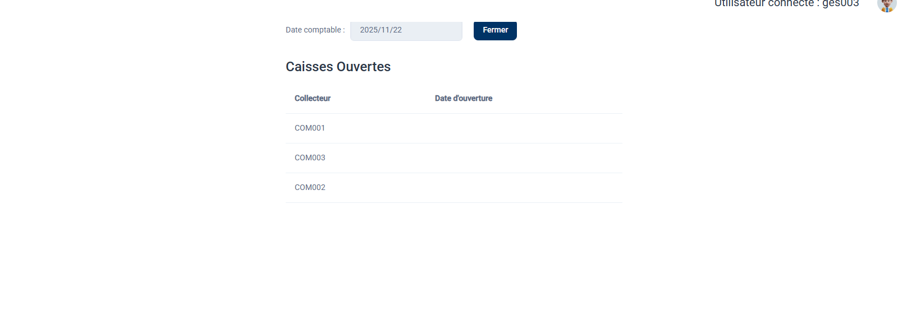

## 2. Clients

Le module **Clients** est le cœur de votre gestion commerciale. Vous y enregistrez toutes les personnes avec qui vous faites affaire.

### a. Rechercher un Client
Avant de créer un nouveau dossier, vérifiez toujours si le client n'existe pas déjà.
1.  Accédez au menu **Clients**.
2.  Utilisez le champ de recherche au dessus du tableau.
3.  Vous pouvez filtrer par Nom ou Numéro de téléphone.

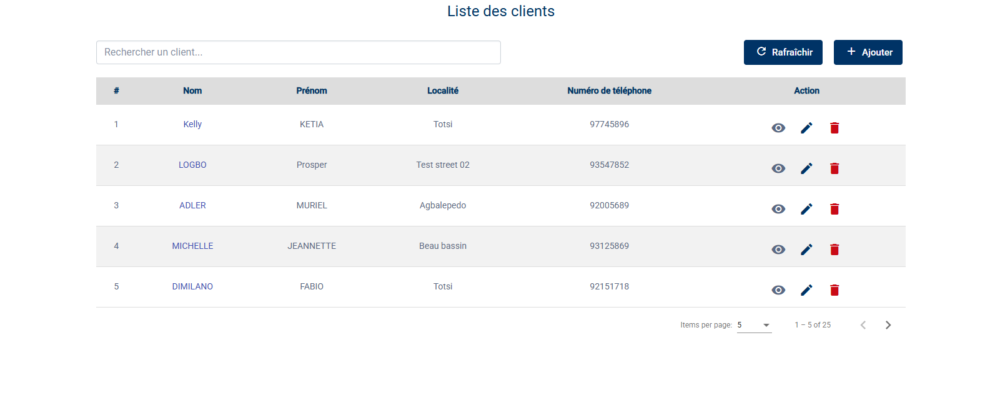

### b. Créer un Nouveau Client
Si le client est nouveau, suivez cette procédure pour créer son dossier :

1.  Cliquez sur le bouton **Ajouter** en haut à droite.
2.  **Remplissez le formulaire** avec soin (les champs marqués d'une étoile * sont obligatoires) :
    *   **Identité** : Chargez une photo si possible, complétez Nom et Prénom.
    *   **Localisation** : Saisissez l'adresse et utilisez le bouton de géolocalisation si vous êtes sur place.
    *   **Finance** : Définissez un **Solde Initial** (souvent 0 FCFA pour un début) et assignez les **Commerciaux** responsables (Crédit, Tontine).
3.  Cliquez sur **Enregistrer**.

### c. Gérer un Dossier Client
Une fois le client créé, vous pouvez effectuer plusieurs actions depuis la liste (colonne Actions) :
*   **Voir Détails** (Bouton Œil) : Ouvre la fiche complète (achats, solde, infos perso).
*   **Modifier** (Bouton Crayon) : Permet de mettre à jour une adresse ou un téléphone.
*   **Supprimer** (Bouton Corbeille) : *Attention, cette action est irréversible.*

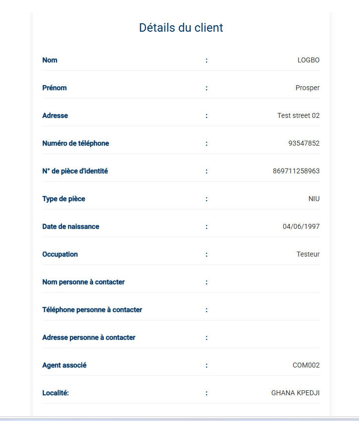

## 3. Comptes

Le menu **Comptes** est l'espace de suivi de la santé financière de vos clients. Il vous permet de répondre à des questions telles que : *"Combien ce client me doit-il ?"* ou *"Ce compte est-il bloqué ?"*.

### a. Consulter les Soldes (Vue Liste)
En accédant au menu, vous voyez instantanément la liste de tous les comptes.
*   **Recherche** : Utilisez la barre de recherche pour trouver un client par son nom.
*   **Vérification Rapide** : La colonne **Solde du compte** vous indique immédiatement l'argent disponible ou la dette.
*   **Statut** : La colonne **Statut** vous alerte si un compte est suspendu.

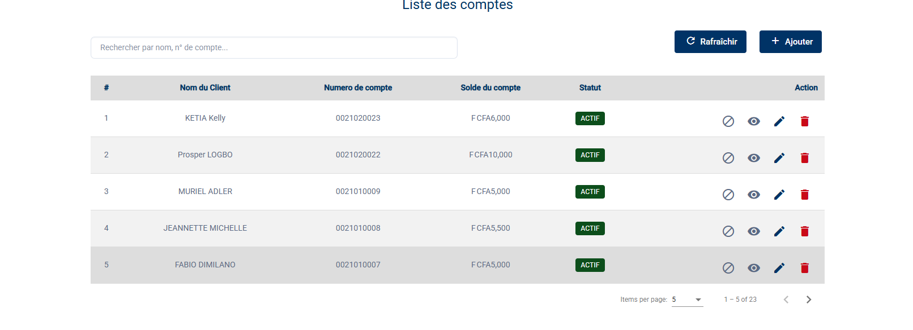

### b. Analyser un Compte (Vue Détails)
Pour aller plus loin, cliquez sur l'icône **Détails** (l'œil) située à droite de chaque ligne.

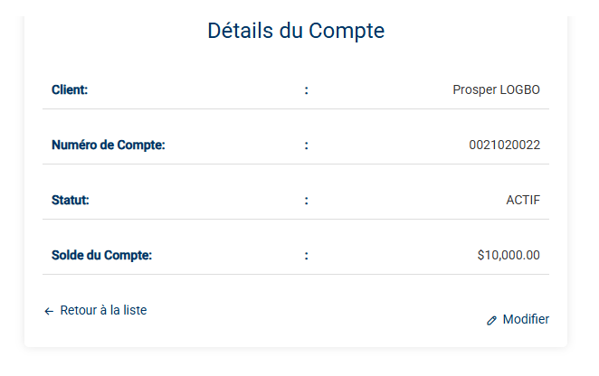

Sur cette page, vous accédez à la fiche synthétique du compte :
1.  **Identité** : Vérifiez qu'il s'agit bien du bon client.
2.  **Situation Financière** : Le **Solde du Compte** est affiché en évidence.
3.  **Actions** :
    *   **Modifier** : Permet de corriger des informations erronées (si vous avez les droits).
    *   **Retour** : Lien pour revenir à la liste globale.

*Note : Cette vue est actuellement synthétique. Pour consulter l'historique précis des transactions (dépôts/retraits), veuillez vous référer aux rapports ou relevés spécifiques dans le module Reporting.*

\newpage

---

# Stocks & Ventes

Cette section couvre la gestion du catalogue produits, des stocks et du cycle de vente.

## 1. Articles

Le menu **Articles** gère le catalogue des produits disponibles à la vente.

### Liste des Articles (Tableau)
Vue d'ensemble des produits référencés.

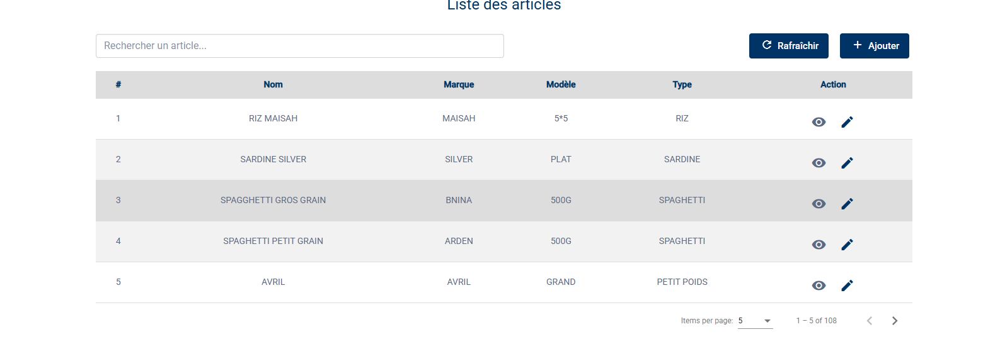

**Colonnes affichées :**
*   **#** : Index.
*   **Nom** : Désignation de l'article.
*   **Marque** : Fabricant ou marque.
*   **Modèle** : Référence modèle.
*   **Type** : Catégorie du produit.
*   **Action** : Modifier ou Voir les détails.

### Création d'Article (Formulaire)
Pour ajouter un produit au catalogue, cliquez sur **Ajouter**.

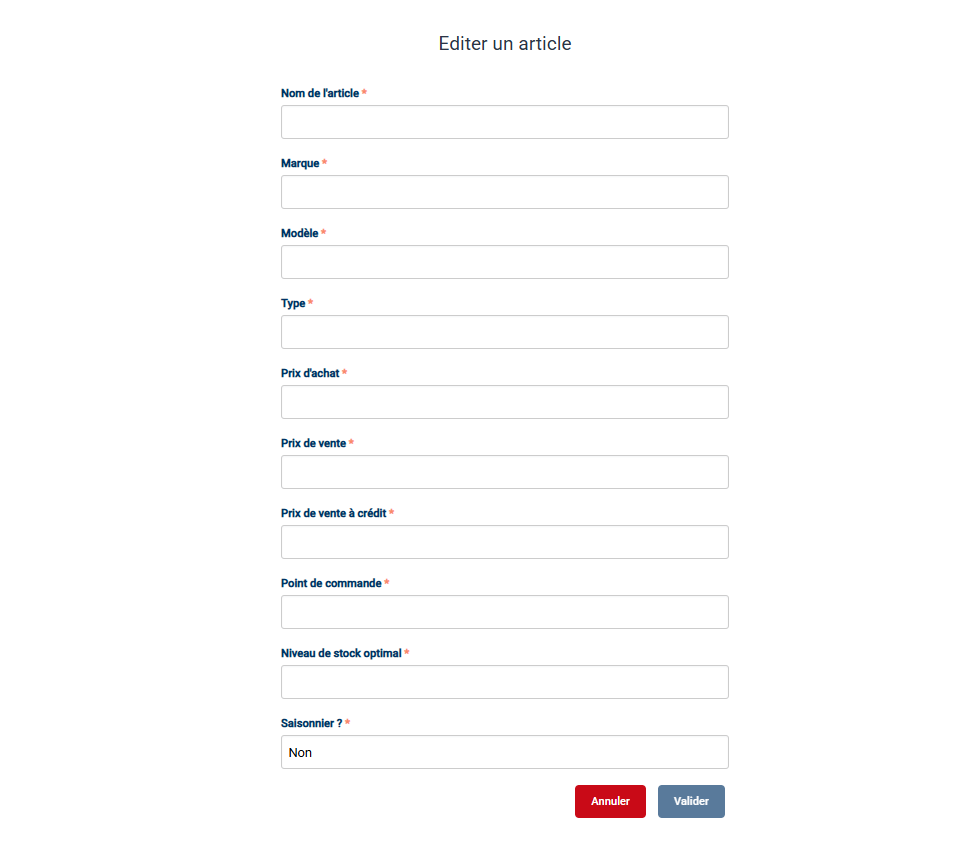

**Champs à renseigner :**
*   **Identification** : Nom de l'article, Marque, Modèle.
*   **Classification** : Type d'article (Menu déroulant).
*   **Tarification** :
    *   Prix d'achat (Coût revient).
    *   Prix de vente (Comptant).
    *   Prix de vente à crédit (Si applicable).
*   **Gestion de Stock** :
    *   Point de commande (Seuil de réapprovisionnement).
    *   Niveau de stock optimal.

## 2. Stock Commercial

Ce module vous permet de piloter les stocks confiés à vos agents commerciaux. Le flux de travail se décompose en trois étapes clés : Approvisionner, Suivre, et Réceptionner les retours.

### a. Approvisionner un Commercial (Demandes Sortie)
Pour qu'un commercial puisse vendre, il faut d'abord lui transférer du stock depuis le magasin central.

**Procédure :**
1.  Allez dans **Stock Commercial > Demandes Sortie**.
2.  Cliquez sur **Nouvelle Demande**.
3.  **Formulaire de création** :
    *   Sélectionnez le **Commercial**.
    *   Ajoutez les **Articles** et les quantités désirées.
4.  **Enregistrez**.

*Important : À ce stade, la demande est un **BROUILLON**. Le magasinier ne la voit pas encore.*

**Validation (Étape Critique) :**
Pour que le magasinier puisse préparer et livrer la marchandise, vous devez **VALIDER** la demande.
*   Ouvrez la demande créée (statut "Créé").
*   Cliquez sur le bouton **Valider** (Coche verte).
*   *Résultat : Le statut passe à "Validé" et la demande devient visible pour le magasinier.*

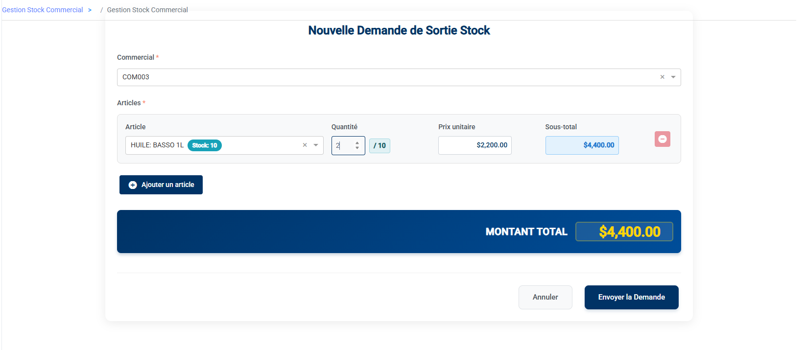

### b. Suivre les Stocks Agents (Tableau de Bord)
A tout moment, vous devez savoir qui détient quoi.
1.  Allez dans **Stock Commercial > Stock**.
2.  Ce tableau de bord vous montre **Commercial par Commercial** :
    *   La valeur totale de marchandises emportées.
    *   Ce qui a été vendu.
    *   Ce qui reste dans leurs mains (Stock Restant).

*Astuce : Utilisez ce tableau en fin de journée pour vérifier la cohérence des ventes déclarées par vos agents.*

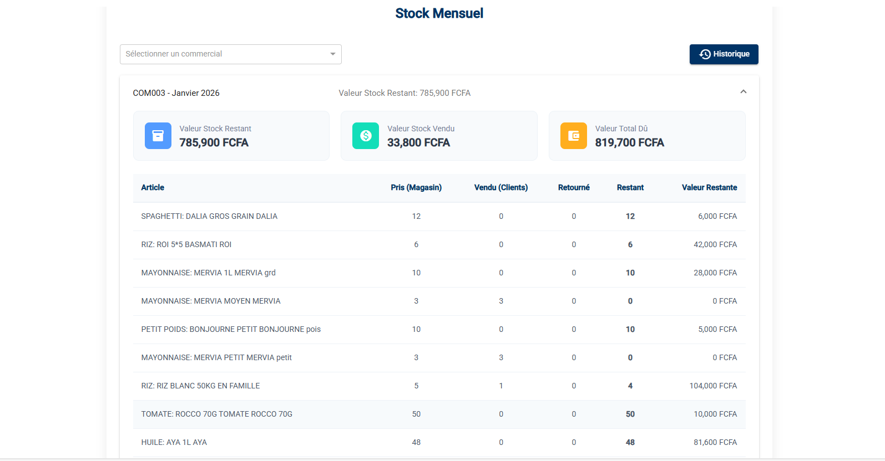

### c. Consulter les Retours (Invendus)
La gestion opérationnelle des retours est effectuée par les Commerciaux et les Magisiniers. En tant que Manager, votre rôle est de **surveiller** ces mouvements pour analyser les taux de retours.

**Ce que vous pouvez faire :**
1.  Allez dans **Stock Commercial > Retours**.
2.  **Consultez la liste** pour voir qui a ramené quoi.
3.  Vérifiez les statuts :
    *   *Créé* : Le commercial a signalé un retour, en attente de réception par le magasin.
    *   *Validé* : Le magasinier a confirmé la réintégration des articles en stock.

*Note : Vous n'avez pas d'action de validation à faire ici, c'est la responsabilité du magasinier.*

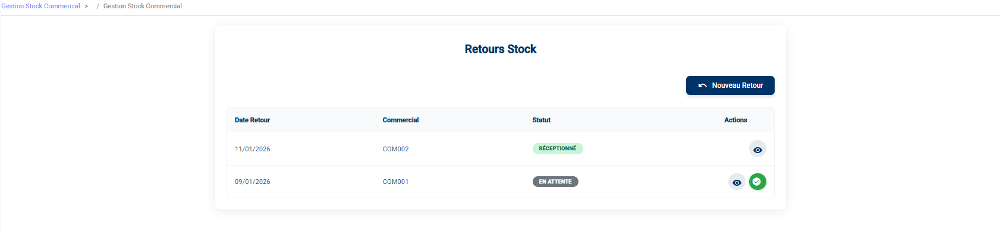

## 3. Stock Tontine

Le principe est identique au Stock Commercial, mais concerne exclusivement les marchandises destinées aux **Tontines**.

1.  **Approvisionner** : Utilisez **Stock Tontine > Demandes Sortie** pour donner des articles tontine à un agent.
2.  **Suivre** : Utilisez **Stock Tontine > Stock** pour voir l'état des stocks tontine dispatchés.
3.  **Récupérer** : Utilisez **Stock Tontine > Retours** pour les produits non distribués.

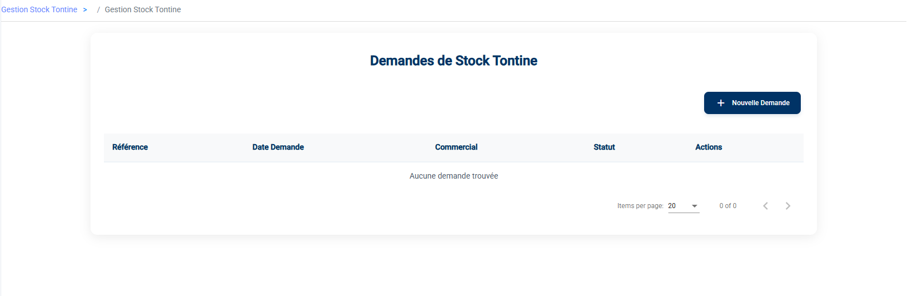

## 4. Commandes

Ce menu centralise les intentions d'achat avant qu'elles ne deviennent des ventes fermes. C'est votre sas de validation.

### a. Indicateurs Clés de Performance (KPIs)
En haut de la page, cinq indicateurs vous donnent une vue d'ensemble instantanée :
*   **Commandes en Attente** : Le volume de demandes nécessitant votre attention immédiate (Statut "À traiter").
*   **Valeur Potentielle** : Le chiffre d'affaires total qui attend votre validation.
*   **Taux d'Acceptation** : Votre ratio de validation (Commandes validées / Total des demandes).
*   **Bénéfice Potentiel** : La marge estimée sur les commandes en attente.
*   **Pipeline Accepté** : La valeur des commandes validées, prêtes à être converties en ventes.

### b. Gérer les Commandes (Vue Liste)
Le tableau principal vous permet de suivre l'état de toutes les commandes en cours.
*   **Onglets** : Naviguez entre *En Attente*, *Acceptées*, *Vendues* et *Autres* pour filtrer par étape.
*   **Colonnes Clés** :
    *   *N° Commande* : Référence unique pour le suivi.
    *   **Statut** : L'indicateur le plus important (En Attente = Action requise).

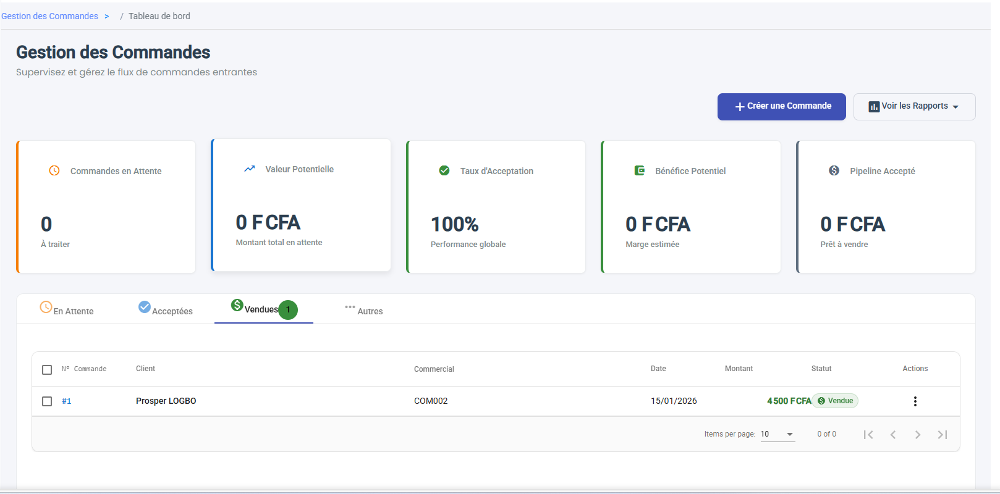

### c. Créer une Commande
Pour initier une nouvelle demande client :
1.  Cliquez sur **Ajouter**.
2.  **Client** : Recherchez le client. Son solde actuel s'affiche pour info.
3.  **Panier** : Ajoutez les articles. Le total se calcule automatiquement.
4.  **Enregistrer** : La commande passe au statut *"En Attente"*.

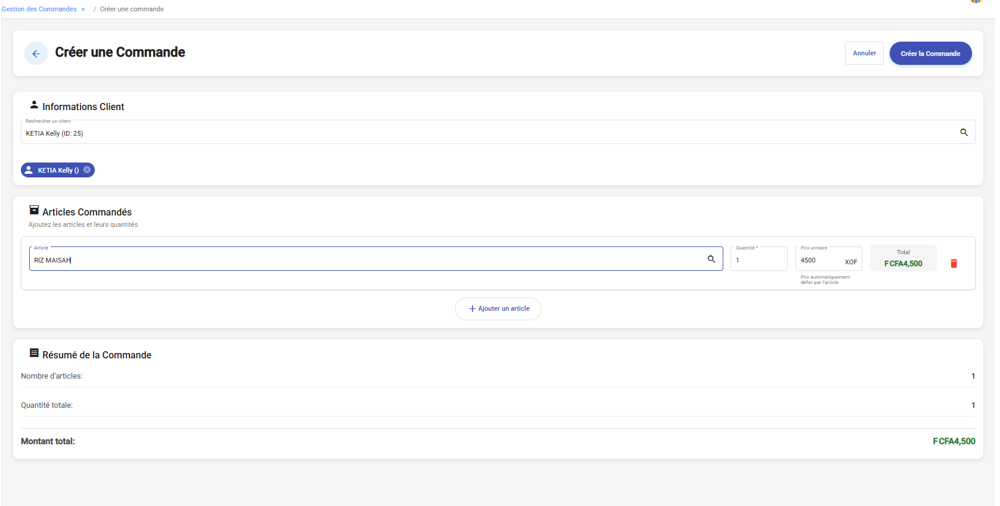

### d. Valider et Transformer en Vente
C'est ici que se joue votre rôle de contrôle.
1.  Ouvrez une commande (clic sur l'œil **Détails**).
2.  **Vérifiez le contenu** : Articles, prix total, identité du client.
3.  **Approuver (Validation)** :
    *   Si tout est correct, cliquez sur le bouton **Valider** (visible uniquement pour les commandes "En Attente").
    *   *Le statut passe à "Acceptée".*
4.  **Conclure (Vente)** :
    *   Pour finaliser, cliquez sur **Transformer en Vente**.
    *   *Action irréversible : Le stock est déduit du commercial et la dette est ajoutée au client.*

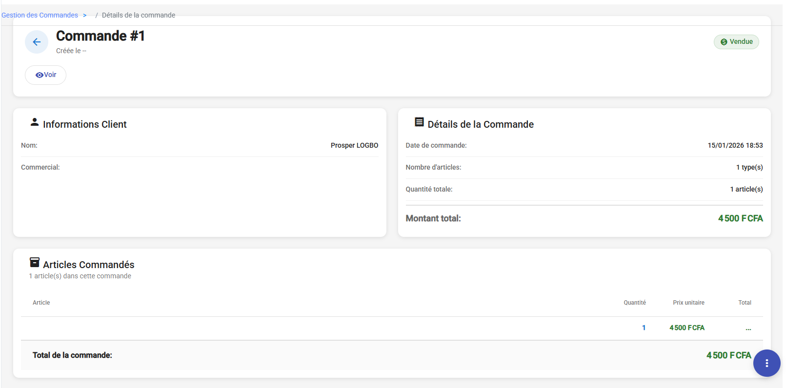

## 5. Inventaires (Cycle de contrôle)

La gestion des inventaires chez ELYKIA suit un cycle rigoureux pour garantir que le stock système correspond à la réalité physique.

### Le Cycle d'Inventaire en 5 Étapes

1.  **Démarrage (Création)** :
    *   Cliquez sur **+ Créer un inventaire**.
    *   *Le système fige une "image" théorique de votre stock à cet instant.*
    *   Statut : *BROUILLON*.

2.  **Contrôle Physique (Terrain)** :
    *   Cliquez sur **Télécharger PDF**.
    *   Imprimez cette fiche et allez dans l'entrepôt pour compter physiquement chaque article.
    *   *Ne regardez pas les quantités système pour ne pas être influencé.*

3.  **Saisie des Résultats** :
    *   Cliquez sur **Saisir quantités physiques**.
    *   Reportez les chiffres de votre comptage dans le tableau.
    *   Enregistrez.

4.  **Analyse et Réconciliation (Gestionnaire)** :
    *   Le système calcule automatiquement les écarts.
    *   Cliquez sur **Réconcilier les écarts** pour traiter les anomalies :
        *   *Surplus* : Stock physique > Stock système. Validez pour ajouter l'excédent.
        *   *Manquant (Dette)* : Stock physique < Stock système. Vous devez justifier l'écart ou le marquer comme une **Dette Magasinier**.

5.  **Clôture (Fin de mois)** :
    *   Une fois tous les écarts justifiés, cliquez sur **Clôturer l'inventaire**.
    *   *Le stock système est officiellement mis à jour et devient la nouvelle référence.*

### Gestion des Entrées (Approvisionnement Fournisseur)
En dehors des inventaires, pour ajouter du stock venant d'un fournisseur :
1.  Cliquez sur **+ Entrées**.
2.  Ajoutez les articles reçus.
3.  Validez pour augmenter le stock immédiatement.

## 6. Ventes (Création & Suivi)

Ce module est le cœur de votre activité commerciale. Il permet non seulement de suivre l'historique, mais aussi d'enregistrer des **ventes directes**.

### a. Créer une Vente (Directe)
Si le client est présent et que vous avez du stock (ou que vous vendez à crédit), passez par ici.
1.  Cliquez sur **Nouvelle Vente** (Bouton **+**).
2.  **Type de Vente** : Choisissez immédiatement entre **Crédit** (nécessite un Commercial) ou **Comptant**.
3.  **Remplissez le formulaire** :
    *   *Client* : Obligatoire.
    *   *Articles* : Sélectionnez les produits.
    *   *Avance* : Optionnel.
4.  **Validez**.

### b. Suivre l'Activité Commerciale (Vue Liste)
Le tableau de bord des ventes vous donne la santé financière de vos crédits en cours.
*   **Colonnes Réelles** :
    *   *Nom du Client* : L'acheteur.
    *   *Commercial* : L'agent responsable du recouvrement.
    *   *Date de début* : Date de la transaction.
    *   *Montant* : Total de la vente.
    *   *Mise journalière* : Montant attendu chaque jour.
    *   *Statut* : État du crédit (ex: En Cours, Validé).
    *   *Jours restants* : Compte à rebours avant l'échéance.

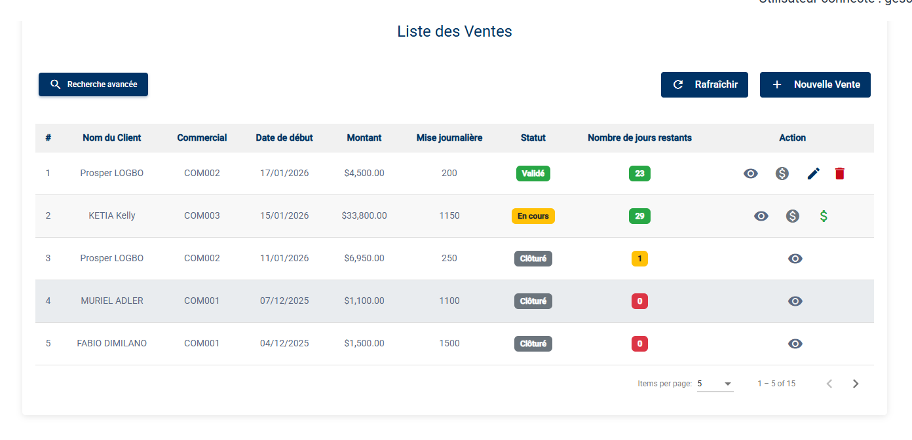

### c. Recherche Avancée (Filtres)
Pour retrouver une transaction précise, cliquez sur le bouton **Recherche Avancée** (Loupe) pour ouvrir le panneau de filtres.
Vous pouvez combiner 5 critères :
1.  **Mot-clé** : Recherche textuelle (Nom, Référence, etc.).
2.  **Type de client** : Filtrez par *Client* ou *Commercial* (Promoteur).
3.  **Type de vente** : *Vente à crédit* ou *Tontine*.
4.  **Statut** : État actuel du dossier (Créé, Validé, En cours, Livré, Terminé, etc.).
5.  **Commercial** : Sélectionnez un agent spécifique pour voir son portefeuille.

### d. Analyser les Détails
En cliquant sur l'icône **Détails** (œil), vous accédez à la fiche complète structurée en 4 blocs :
1.  **Informations du Client** : Identité et contact.
2.  **Information des Articles** : Liste détaillée des produits vendus (Quantité, Prix unitaire, Total).
3.  **Informations sur le Crédit/Vente** :
    *   *Finances* : Montant payé vs Restant, Mise journalière.
    *   *Suivi* : Date de début/fin, Jours restants.
    *   *Responsable* : L'agent collecteur associé.

\newpage

---

# Gestion Financière & Tontines

Ce module couvre la gestion de la trésorerie (Dépenses) et le suivi complet des Tontines (Épargne).

## 1. Gestion des Dépenses

Le module Dépenses permet de tracer toutes les sorties de caisse pour assurer une comptabilité juste.

### a. Tableau de Bord
À l'ouverture du module, le tableau de bord présente une vue synthétique.

**Indicateurs Clés (KPIs) :**
*   **Total Semaine** : Montant cumulé des dépenses de la semaine en cours.
*   **Total Mois** : Montant cumulé des dépenses du mois en cours.

**Actions Principales :**
*   **Liste** : Accéder à l'historique détaillé.
*   **Ajouter** : Enregistrer une nouvelle sortie de caisse.

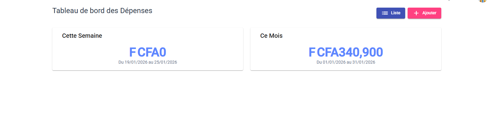

### b. Créer une Dépense
Pour justifier une sortie d'argent :
1.  Cliquez sur le bouton **Ajouter**.
2.  Remplissez le formulaire :
    *   **Type de Dépense** : Sélectionnez la catégorie (ex: Loyer, Electricité). *Configurable dans les paramètres.*
    *   **Montant** : La somme exacte en XOF.
    *   **Date** : Date de la dépense (par défaut aujourd'hui).
    *   **Description** : Détails explicatifs.
    *   **Référence** : Numéro de reçu ou de facture justificative.
3.  Cliquez sur **Enregistrer**.

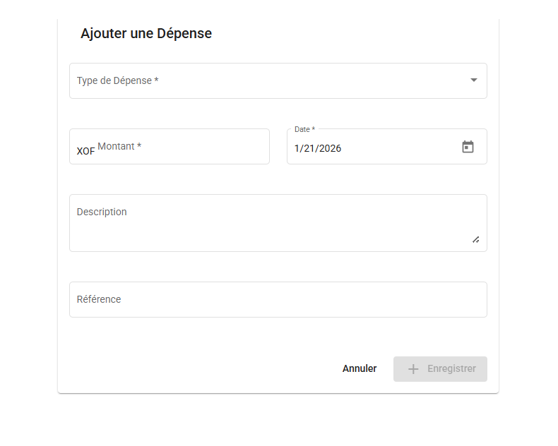

### c. Suivi des Dépenses (Liste)
L'écran **Liste** affiche l'historique complet.

**Colonnes du tableau :**
*   **Date** : Jour de la dépense.
*   **Type** : Catégorie.
*   **Montant** : Valeur en XOF.
*   **Description** : Libellé court.
*   **Actions** :
    *   **Modifier** (Crayon) : Pour corriger une erreur.
    *   **Supprimer** (Corbeille) : Pour annuler une écriture.

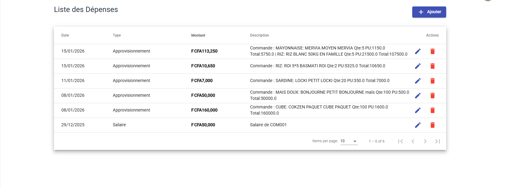

---

## 2. Gestion des Tontines

Le module Tontines est le cœur de l'activité d'épargne. Le tableau de bord supervise les sessions de collecte.

### a. Tableau de Bord Tontine
L'écran principal offre une vue d'ensemble de la session en cours.

**En-tête & Actions :**
*   **Sélecteur de Session** : Permet de naviguer entre les sessions (actives ou passées).
*   **Comparer les Sessions** : Analyser l'évolution des performances.
*   **Paramètres de Session** : Configurer la session active.
*   **Ajouter un Membre** : Inscription individuelle.
*   **Ajout Multiple** : Inscription en masse par commercial.

**Indicateurs de Performance (KPIs) :**
Des cartes colorées résument l'état de la tontine :
*   **Membres Actifs** : Nombre total d'inscrits.
*   **Montant Total Collecté** : Épargne cumulée (Vert).
*   **Revenu Total** : Part société générée (Accentué).
*   **En Attente de Livraison** : Livraisons non effectuées (Orange).
*   **Contribution Moyenne** : Panier moyen par membre.

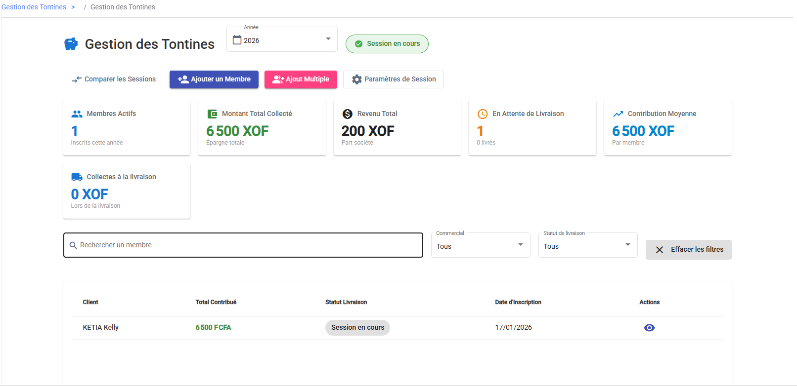

### b. Ajouter un Membre (Individuel)
Pour inscrire un nouveau client à la tontine :
1.  Cliquez sur **Ajouter un Membre**.
2.  Dans la fenêtre modale :
    *   **Rechercher un client** : Saisissez le nom ou code.
    *   **Sélectionner un client** : Choisissez le client dans la liste.
    *   **Fréquence de cotisation** : Journalier, Hebdomadaire ou Mensuel.
    *   **Montant souhaité** : Mise définie par le client.
    *   **Notes** : Observations éventuelles.
3.  Cliquez sur **Ajouter**.

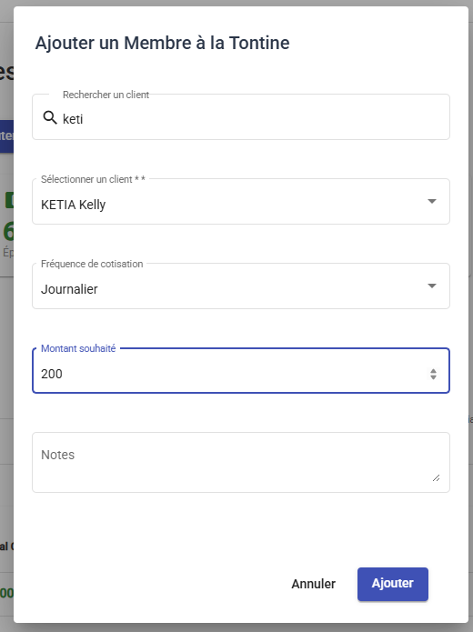

### c. Ajout Multiple (Par Commercial)
Pour configurer rapidement une liste de clients gérés par un commercial :
1.  Cliquez sur **Ajout Multiple**.
2.  **Choisir le commercial** : Sélectionnez l'agent responsable.
3.  **Configuration Globale** :
    *   Définissez un *Montant global* et une *Fréquence globale* par défaut pour ce groupe.
4.  **Sélection des Clients** :
    *   Cochez les clients à intégrer.
    *   *Ajustement* : Vous pouvez modifier le montant ou la fréquence individuellement pour chaque client dans le tableau.
5.  Cliquez sur **Valider**.

### d. Liste des Membres
Le tableau principal permet de gérer les adhérents au quotidien.

**Filtres disponibles :**
*   **Barre de recherche** : Par nom ou numéro.
*   **Filtres** : Par statut de livraison ou par commercial.

Le tableau permet de cliquer sur un membre pour voir ses détails (Historique, Versements).

\newpage

---

# Rapports & Configuration

Cette section vous aide à clôturer vos journées et à gérer les paramètres fondamentaux de l'application.

## 1. Clôturer la Journée (Rapport Journalier)

Le **Rapport Journalier** est votre outil de contrôle quotidien. Il centralise toutes les opérations (Ventes, Recouvrements, Tontines) et permet de valider la caisse.

### a. Filtres et Recherche
En haut de page, utilisez la barre d'outils pour cibler les données :
*   **Périodes** : Cliquez sur *Aujourd'hui*, *Cette Semaine*, *Ce Mois* ou *Personnaliser* (pour choisir des dates précises).
*   **Sélection Commercial** : (Admin) Permet de filtrer tout le rapport pour un agent spécifique.
*   **Marges** : Un bouton œil permet d'afficher ou masquer les marges bénéficiaires (visible selon vos droits).

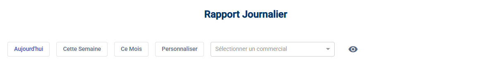

### b. Vue d'Ensemble (Onglet 1)
Cet onglet présente la synthèse financière globale et détaillée.

**Total Général (Panneau du haut)**
Un bloc récapitulatif affiche les performances cumulées de toute l'équipe :
*   **Sortie Stock** : Valeur des marchandises sorties du magasin.
*   **Ventes à Crédit** : Montant total des dettes créées.
*   **Nouveaux Clients** & **Solde Nx Comptes**.
*   **Recouvrements** : Montant total des dettes récupérées.
*   **Tontine** : Synthèse complète (Adhésions, Collectes, Livraisons).
*   **Caisse (A Verser / Versé / Reste)** : KPI critique.
    *   **A Verser** : L'argent théorique que les commerciaux ont encaissé.
    *   **Versé** : L'argent qu'ils vous ont déjà remis.
    *   **Reste** : L'écart à combler. Si positif (Rouge), l'argent est encore dehors.

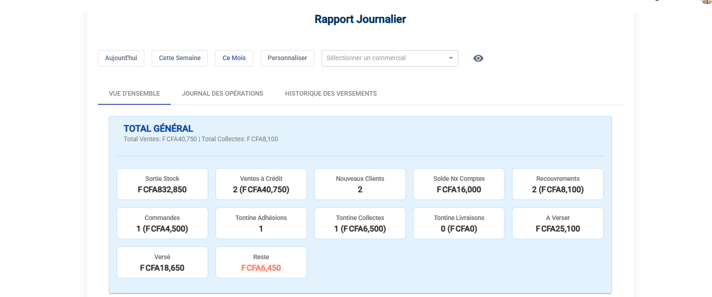

**Détail par Commercial**
Une liste déroulante détaille la performance individuelle de chaque agent.
*   **Statut Caisse** : Le cadre de l'agent change de couleur.
    *   *Rouge* : Doit de l'argent.
    *   *Vert* : A jour (Tout versé).
    *   *Orange* : Situation intermédiaire.
*   **Action "FAIRE UN VERSEMENT"** : Si un agent a de l'argent à rendre, ce bouton apparaît dans son détail. Cliquez dessus pour enregistrer la remise d'espèces physique.

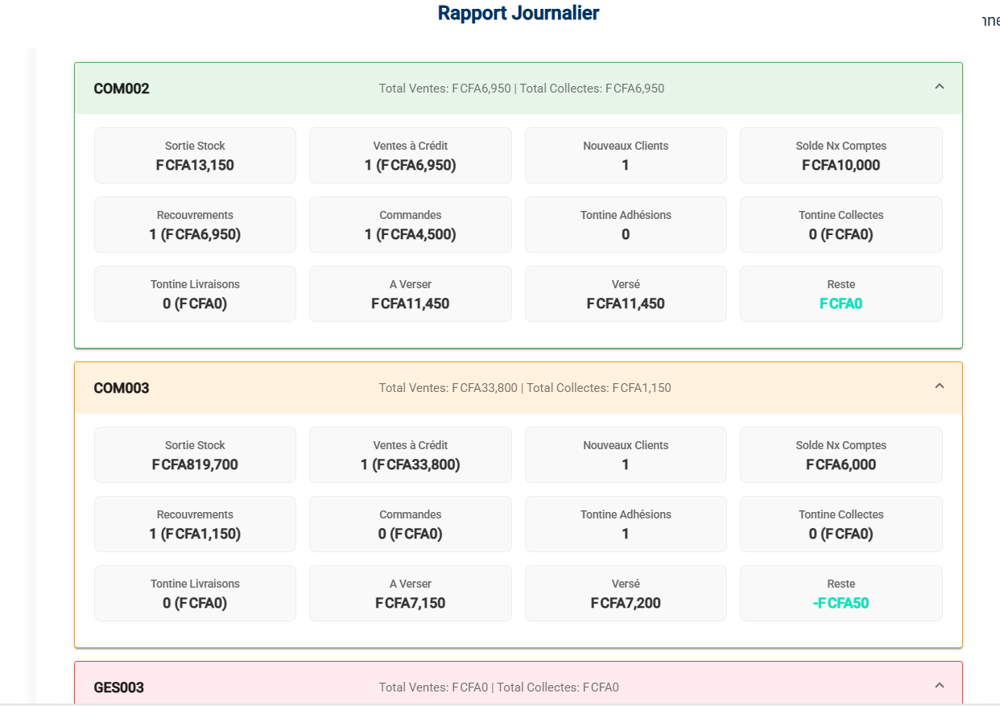

### c. Journal des Opérations (Onglet 2)
Ce tableau offre une traçabilité totale (Audit). Il liste chronologiquement chaque action :
*   **Heure** : Moment précis de l'action.
*   **Commercial** : L'auteur de l'opération.
*   **Type** : Nature de l'opération (Vente, Paiement, Collecte...).
*   **Montant** : Impact financier.

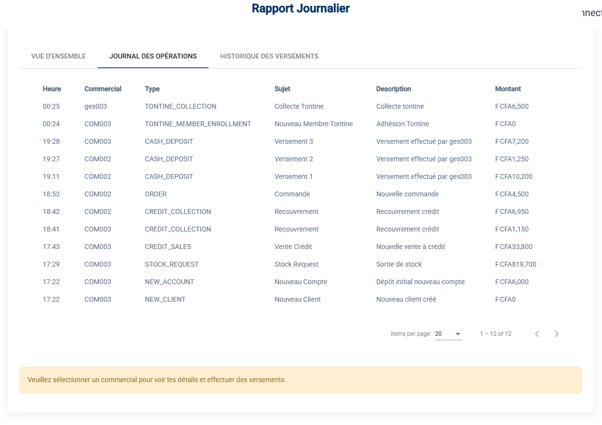

### d. Historique des Versements (Onglet 3)
Liste des remises d'espèces validées entre les commerciaux et le gestionnaire :
*   **Heure** et **Date**.
*   **Commercial** (Celui qui verse).
*   **Reçu par** (Le gestionnaire qui valide).
*   **Montant** encaissé.

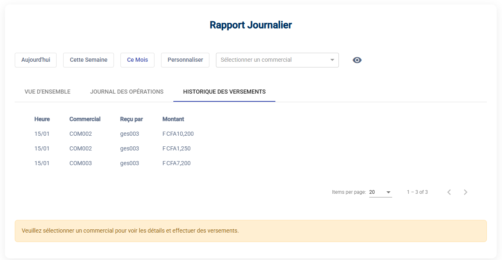

## 2. Gestion des Localités (Zones)

Pour géolocaliser vos clients, vous devez définir les zones géographiques (Villes, Quartiers).

### a. Ajouter une Localité
1.  Allez dans le menu **Configuration > Localités**.
2.  Cliquez sur le bouton **Ajouter** (+).
3.  Remplissez le formulaire :
    *   **Nom** : Le nom de la ville ou du quartier (ex: "Lomé - Adidogomé").
4.  Cliquez sur **Enregistrer**.

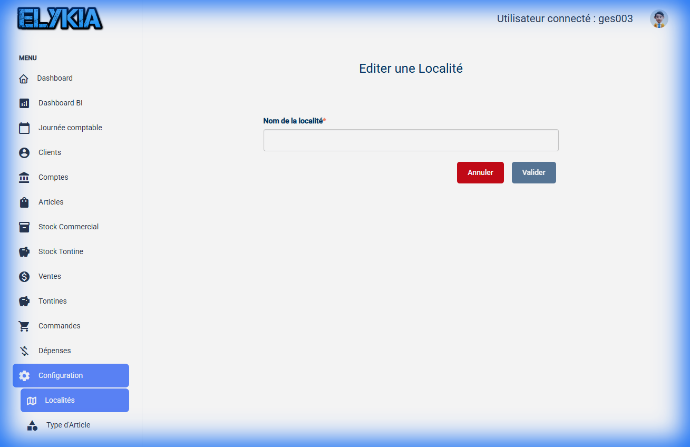

### b. Consulter la liste
La liste affiche toutes les zones configurées avec :
*   **#** : Numéro d'ordre.
*   **Nom** : Libellé de la localité.
*   **Action** : Boutons pour voir, modifier ou supprimer.

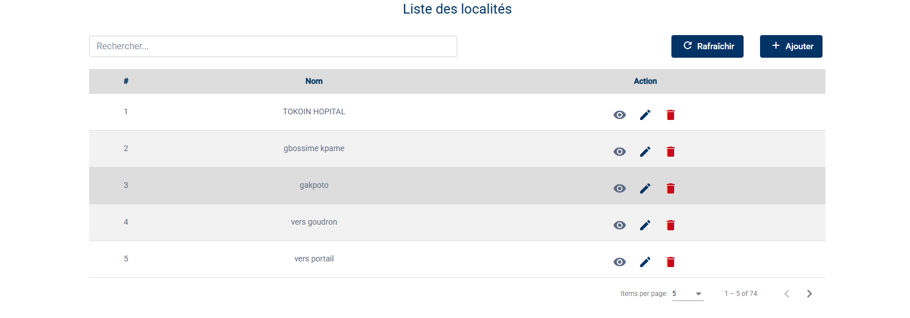

## 3. Gestion des Types d'Article (Catégories)

Organisez votre catalogue produit en familles (ex: "Moto", "Appareil Électroménager").

### a. Créer un Type
1.  Allez dans **Configuration > Type d'Article**.
2.  Cliquez sur **Ajouter** (+).
3.  Saisissez les informations :
    *   **Nom** (Requis) : Libellé de la catégorie.
    *   **Code** (Requis) : Abréviation unique (ex: "MOTO").
    *   **Description** : Détails optionnels.
4.  Validez par **Enregistrer**.

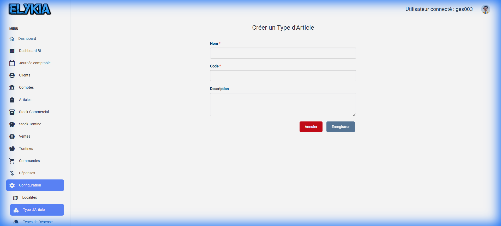

### b. Suivre les Catégories
Le tableau présente :
*   **ID** : Identifiant système.
*   **Nom** & **Code**.
*   **Description**.
*   **Actions** : Modifier (Crayon) ou Supprimer (Corbeille).

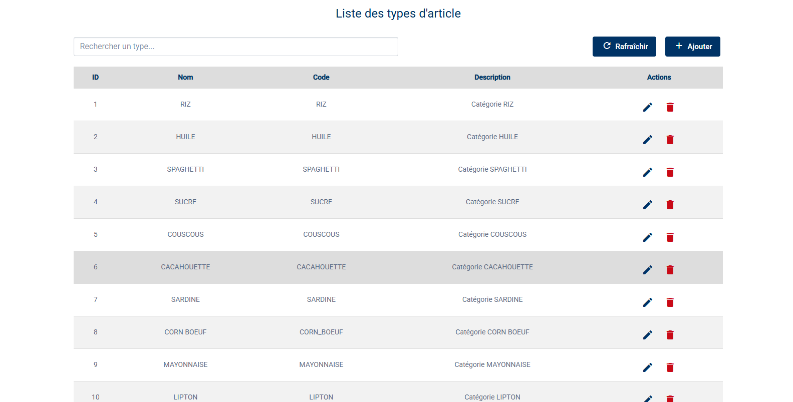

## 4. Gestion des Types de Dépense

Catégorisez vos sorties de caisse pour une comptabilité précise.

### a. Définir une Catégorie de Dépense
1.  Accédez à **Configuration > Types de Dépense**.
2.  Cliquez sur **Nouveau Type**.
3.  Indiquez le **Nom** de la charge (ex: "Transport", "Loyer", "Électricité").
4.  Sauvegardez.

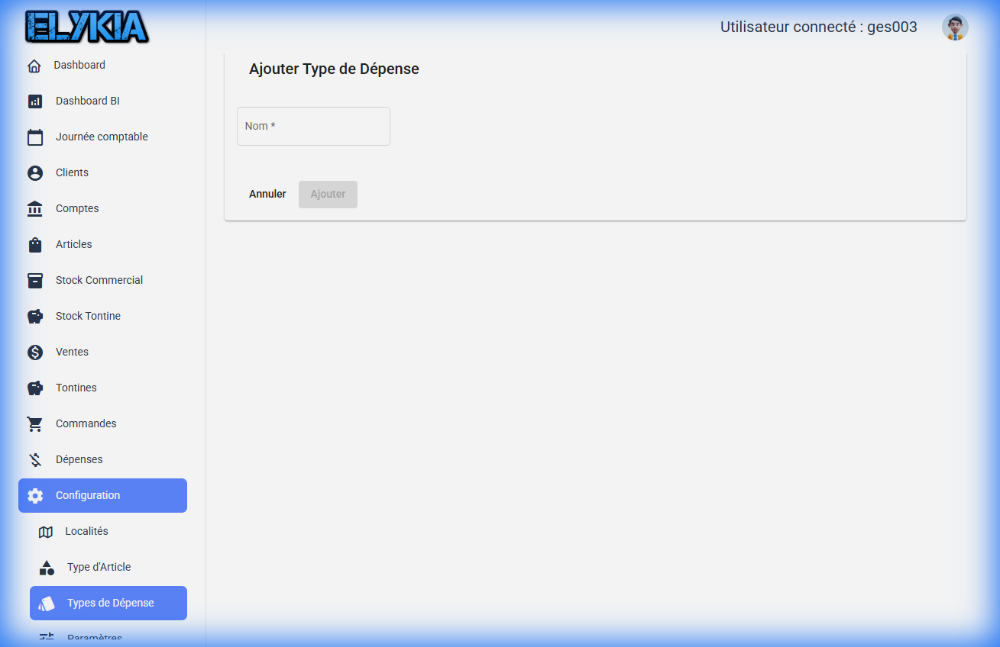

### b. Liste des Charges
Visualisez les catégories disponibles :
*   **Nom** : Intitulé de la dépense.
*   **Actions** : Modifier, Supprimer.

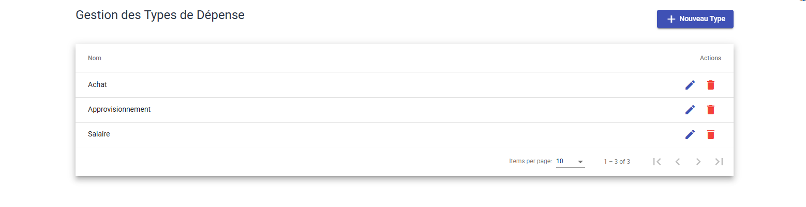

## 5. Paramètres Globaux

Ce menu permet de modifier des constantes clés de l'application (ex: Taux de change, Activation de fonctionnalités).

### a. Ajouter/Modifier un Paramètre
1.  Menu **Configuration > Paramètres**.
2.  Cliquez sur **Ajouter un paramètre** ou sur l'icône **Éditer**.
3.  Configuration :
    *   **Clé** : Identifiant technique (ex: `APP_CURRENCY`).
    *   **Valeur Booléenne** : Cochez pour un choix OUI/NON.
    *   **Valeur** : La donnée (ex: "FCFA" ou "Select OUI").
    *   **Description** : Explication de l'impact de ce paramètre.

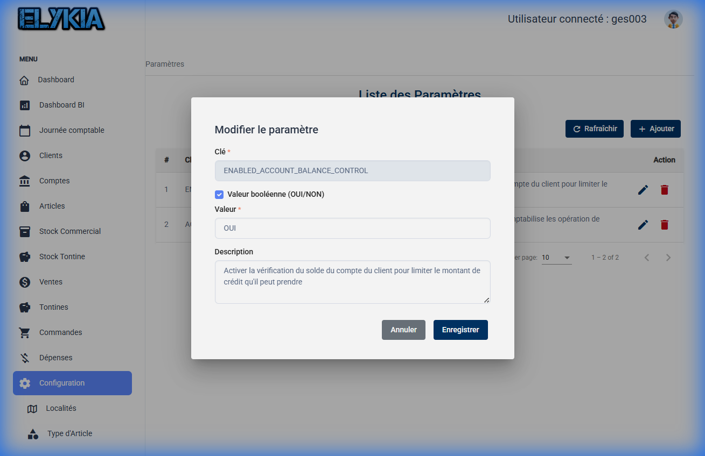

*Attention : Ne modifiez ces valeurs que si vous maîtrisez leur impact.*

### b. Consulter la liste
La table des paramètres affiche :
*   **Clé** : Le nom technique du paramètre.
*   **Valeur** : La configuration actuelle.
*   **Description** : Information sur l'usage.
*   **Action** : Modifier (Crayon) ou Supprimer (Corbeille).

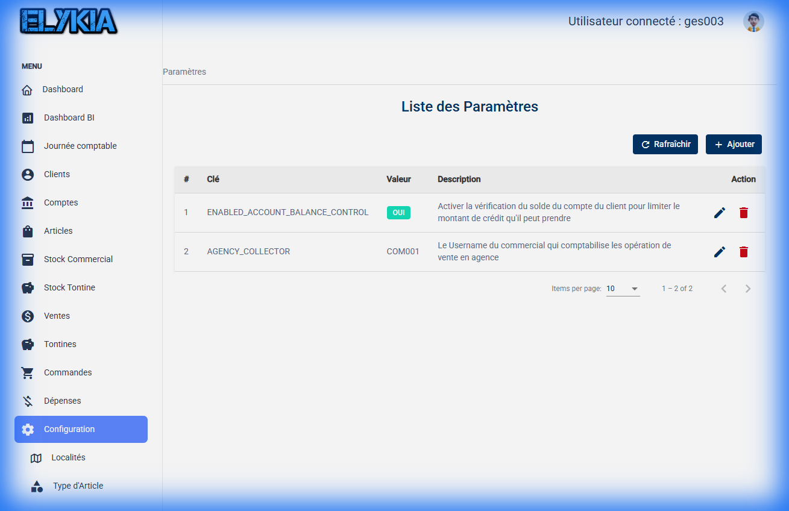

\newpage

---

