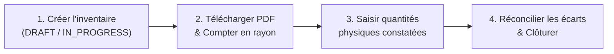

# Guide Utilisateur - Profil Manager

_Ce document est une compilation de la documentation pour impression._

\newpage

# Guide Gestionnaire

Ce guide accompagne les gestionnaires, secrétaires et administrateurs dans les tâches de pilotage. Les responsabilités exactes restent déterminées par les permissions attribuées au compte : la présence d’un menu ou d’un bouton confirme qu’il est autorisé pour votre session.

<!-- CAPTURE À INSÉRER : Accueil web d’un gestionnaire avec le menu développé et les indicateurs du tableau de bord. -->

## Votre espace de pilotage

Le menu peut notamment donner accès au **Dashboard**, aux **Clients**, aux **Articles**, aux modules **Stock Commercial** et **Stock Tontine**, aux **Ventes**, aux **Tontines**, aux **Dépenses**, à la **Configuration**, au **Rapport Journalier**, aux **Inventaires**, aux **Utilisateurs** et à la **Sécurité**. Certains éléments, comme les rapports mensuels, le recrutement ou ELYKIA IA, ne s’affichent que si la permission et le paramétrage nécessaires sont actifs.

| Priorité | Où intervenir | Finalité |
|---|---|---|
| Démarrer et contrôler l’activité | Caisse, Clients, Ventes | Sécuriser les opérations du jour et les portefeuilles. |
| Garantir la disponibilité des articles | Articles, Inventaires, Stock Commercial | Suivre les réceptions, sorties, retours et écarts. |
| Contrôler l’argent et la performance | Rapport Journalier, Dépenses | Lire les indicateurs, les versements et les remises. |
| Gouverner l’application | Configuration, Utilisateurs, Sécurité | Maintenir les référentiels, paramètres et habilitations. |

## Règles de travail

La gestion d’une opération doit toujours suivre son statut. Une demande de sortie créée n’est pas encore livrable ; une réception de stock en attente n’a pas encore augmenté le stock ; une vente validée n’est pas encore démarrée. Les boutons disponibles sur une ligne correspondent à l’étape atteinte et à vos droits.

Consultez les pages suivantes selon la tâche à accomplir :

- [Tableaux de bord](dashboard.md) pour lire les KPI sans confondre les périodes.
- [Opérations quotidiennes](operations.md) pour les caisses, clients, comptes et versements.
- [Stocks, ventes et commandes](stock_sales.md) pour les flux de marchandises et de crédits.
- [Finances et tontines](finance.md) pour les dépenses, remises et contrôles tontine.
- [Rapports et configuration](reporting_config.md) pour l’analyse et les référentiels.

\newpage

---

# Tableaux de bord et Pilotage (Dashboard V2 & BI)

Le module **Tableaux de bord** constitue le centre de contrôle opérationnel et stratégique d'ELYKIA. Il offre aux gestionnaires, secrétaires, chefs d'agence et magasiniers une visibilité immédiate et en temps réel sur la santé financière, le recouvrement des créances, la mobilisation de l'épargne tontine, l'activité commerciale et la gestion des stocks.

L'application web propose deux niveaux de pilotage complémentaires :
1. **Le Tableau de bord opérationnel V2 (`/home`)** : Suivi au mois le mois des flux d'exploitation, des crédits en cours, des cotisations tontine, des alertes de rupture et des transactions récentes.
2. **Le Dashboard décisionnel BI (`/bi`)** : Plateforme de Business Intelligence offrant une analyse multi-périodique des tendances de vente, de la rentabilité commerciale, de la solvabilité du portefeuille et de la rotation des stocks.

---

## 1. Tableau de bord opérationnel V2 (`/home`)

Accessible dès la connexion via l'icône d'accueil de la barre latérale, le **Dashboard V2** consolide l'ensemble des données d'exploitation en temps réel.

<!-- CAPTURE À INSÉRER : Vue d'ensemble du Dashboard V2 montrant le sélecteur de mois, la grille des 5 KPIs, les graphiques d'évolution et les alertes stock. -->

### A. Bandeau de contrôle temporel et actualisation
En tête de page, la barre de navigation et le bandeau de pilotage affichent :
* **Horloge temps réel** : Affichage permanent de la date et de l'heure à la seconde près (`dd/MM/yyyy - HH:mm:ss`).
* **Horodatage de synchronisation** : Indication de la dernière actualisation des données (`Actualisation : HH:mm:ss`).
* **Sélecteur de mois civil** : Un contrôle interactif muni d'un calendrier annuel (`startView="year"`) permettant de sélectionner n'importe quel mois de l'exercice en cours ou passé. Dès la sélection, l'ensemble des indicateurs, graphiques et listes se recalculent instantanément sur le mois cible.
* **Bouton « Actualiser »** : Permet de recharger immédiatement l'ensemble des métriques sans recharger la page entière du navigateur.

---

### B. La grille supérieure regroupe 5 indicateurs clés synthétiques. Ces indicateurs financiers s'affichent si vous disposez des habilitations de consultation financière.

| Carte KPI | Visuel & Teinte | Métrique principale affichée | Sous-indicateurs & Détails | Particularités métier |
|---|---|---|---|---|

#### 1. Évolution des Ventes et Recouvrements
* **Courbes comparatives** : Affiche sur le même axe la courbe des **Ventes à crédit** (bleu marine) et la courbe des **Recouvrements / Encaissements** (bleu cyan).
* **Bascule de granularité** : Trois boutons en haut à droite du graphique permettent de changer immédiatement l'échelle temporelle d'analyse :
  * **Mois** : Découpage journalier précis sur les jours du mois sélectionné.
  * **Trimestre** : Agrégation trimestrielle (T1, T2, T3, T4) de l'exercice.
  * **Année** : Cumul annuel global.
* **Formatage intelligent** : Les montants sur l'axe vertical sont automatiquement abrégés pour une clarté optimale (ex : `500 k`, `1,2 M`).

#### 2. Statut & Disponibilité du Stock (Graphique Donut)
* Diagramme circulaire ventilé en 3 segments de couleurs normées :
  * **En stock (Vert)** : Articles disposant d'une quantité suffisante pour honorer les demandes.
  * **Stock faible (Orange)** : Articles ayant atteint ou franchi le seuil d'alerte de réapprovisionnement.
  * **Rupture de stock (Rouge)** : Articles indisponibles (quantité égale à 0).
* Au centre du diagramme, le **pourcentage de disponibilité globale** du magasin est indiqué en grand.

---

### D. Panneaux de traçabilité des transactions récentes

Deux panneaux situés sous les graphiques permettent un audit visuel direct des flux :

#### 1. Dernières Ventes (`app-recent-sales-panel`)
* Liste les 5 dernières ventes à crédit conclues dans l'application.
* Présente pour chaque ligne :
  * L'avatar et le nom complet du client avec sa référence de dossier (`#REF`).
  * Le montant total de la vente en FCFA.
  * Le badge de statut coloré : `CREATED` (Gris - en attente de validation), `VALIDATED` (Bleu - validée par la gestion), `INPROGRESS` (Vert - marchandise livrée, crédit en cours de remboursement) ou `SETTLED` (Pourpre - crédit intégralement soldé).
  * La date de démarrage de la vente.
* Un lien direct **« Voir tout »** redirige vers la liste complète des ventes (`/credit/list`).

#### 2. Activité Récente (`app-recent-activity-panel`)
* Fil chronologique des 5 dernières opérations administratives et financières (ouvertures/fermetures de caisse, versements bancaires, modifications de portefeuille).
* Affiche un message explicatif, une icône thématique et le temps écoulé en langage naturel (`il y a 10 min`, `il y a 2 h`).
* Un lien direct **« Voir tout l'historique »** redirige vers le [Rapport Journalier](reporting_config.md) (`/report/daily`).

---

### E. Section Alertes Stock Magasin
Cette section s'affiche au bas du tableau de bord pour les profils en charge du stock (si vous ne voyez pas cette section, vous ne disposez pas des habilitations requises) afin de prévenir tout arrêt de distribution :
* **Tableau Rupture de Stock (Rouge)** : Liste paginée des articles dont le stock physique est tombé à zéro (numéro d'ordre, nom de l'article, catégorie/type).
* **Tableau Rupture Imminente (Orange)** : Liste paginée des articles dont le niveau de stock est critique, avec affichage d'une pastille numérique d'alerte.
* **Lien direct** : Le bouton **« Voir le catalogue »** permet de basculer immédiatement sur la gestion des articles (`/article/list`).

---

## 2. Tableau de bord décisionnel BI (`/bi`)

Accessible via le menu **Dashboard BI** pour les profils d'analyse, directeurs et gestionnaires, ce module est conçu pour l'analyse stratégique approfondie et le pilotage de la performance.

<!-- CAPTURE À INSÉRER : Page Dashboard BI avec filtres Aujourd'hui/Semaine/Mois/Année/Personnalisé, cartes de rentabilité et centre d'alertes. -->

### A. Filtres de période multi-dimensionnels
Le Dashboard BI propose une barre de sélection temporelle rapide à 5 options :
1. **Aujourd'hui** : Analyse de la journée en cours.
2. **Cette semaine** : Synthèse hebdomadaire glissante.
3. **Ce mois** : Vue consolidée du mois civil.
4. **Cette année** : Bilan annuel cumulé.
5. **Personnalisé** : Déploiement de deux sélecteurs de calendrier permettant de définir une plage de dates libre (`Date début` et `Date fin`).

### B. Indicateurs stratégiques de rentabilité
Le bandeau BI présente 4 cartes de performance avancée :
* **Chiffre d'Affaires Ventes** : Volume total des ventes conclues sur la période et taux de variation par rapport à la période précédente.
* **Marge Brute Dégagée** : Marge commerciale nette réalisée en FCFA et pourcentage de marge sur coût d'achat.
* **Encaissements & Recouvrement** : Cumul des liquidités réellement collectées et taux de recouvrement effectif par rapport au prévisionnel.
* **Valeur Globale du Stock** : Montant immobilisé en magasin et taux de rotation des marchandises.

### C. Liens rapides d'analyse spécialisée
Trois raccourcis permettent de plonger dans les sous-modules de Business Intelligence :
* **Analyse des Ventes (`/bi/sales`)** : Analyse détaillée du chiffre d'affaires ventilé par commercial, par article et par catégorie.
* **Analyse des Recouvrements (`/bi/collections`)** : Analyse fine des créances en souffrance, pyramide des retards de paiement et distribution de solvabilité des clients.
* **Analyse du Stock (`/bi/stock`)** : Matrice de rotation des stocks, détection des articles dormants et suivi des alertes d'approvisionnement.

### D. Centre d'Alertes et Notifications BI
Le module BI analyse automatiquement les risques opérationnels et génère des cartes d'avertissement en temps réel :
* **Alerte Ruptures** : Notification rouge dès qu'un article passe en rupture avec lien vers le détail.
* **Alerte Stock Faible** : Notification jaune listant les articles sous le seuil critique.
* **Alerte Créances en Souffrance** : Avertissement rouge indiquant le montant cumulé des échéances impayées (`totalOverdue`) nécessitant une relance du chef de recouvrement.
* **Indicateur d'Efficacité de Recouvrement** : Pastille de notation automatique (Excellente, Bonne, Vigilance) selon le ratio montant collecté / montant attendu.

---

## 3. Bonnes pratiques de lecture et réflexes de gestion

1. **Toujours vérifier la période active** : Avant d'analyser un montant ou de tirer une conclusion sur le chiffre d'affaires, vérifiez systématiquement le mois sélectionné dans le sélecteur temporel.
2. **Différencier stock magasin et stock commercial** : Ne confondez pas la valorisation globale du stock magasin (articles physiques en réserve) avec le stock commercial attribué aux équipes terrain.
3. **Contrôler les créances avant d'octroyer de nouvelles ventes** : Utilisez le ratio *Recouvrement encours / Crédits en cours* pour apprécier la liquidité globale avant d'approuver de nouveaux dossiers de vente à crédit.
4. **Bouton d'actualisation** : Après la clôture d'une caisse, la réception d'un arrivage ou la validation d'une série de ventes, cliquez sur **« Actualiser »** pour rafraîchir instantanément les agrégats financiers.

\newpage

---

# Opérations quotidiennes (Journée comptable, Caisse, Billetage & Clients)

Ce guide décrit l'ensemble des procédures opérationnelles et des gestes de contrôle quotidiens : ouverture et fermeture de la journée comptable, gestion des caisses agents, décompte physique par billetage, suivi de l'opération journalière et réaffectation stratégique des portefeuilles clients.

---

## 1. Gestion de la journée comptable (`/accounting-day`)

La **Journée comptable** est le verrou d'intégrité central d'ELYKIA. Aucune opération financière (décaissement, encaissement, vente, collecte) ne peut être initiée sans qu'une journée comptable ne soit préalablement ouverte.

<!-- CAPTURE À INSÉRER : Écran de gestion de la journée comptable avec date comptable, bouton Ouvrir/Fermer et liste des caisses ouvertes. -->

### A. Cycle d'ouverture et de fermeture
* **Date comptable proposée** : La date affichée correspond à la date du jour système. Elle est verrouillée en lecture seule pour interdire toute antidatation artificielle.
* **Ouverture de la journée** :
  * Si la journée est fermée, le gestionnaire clique sur le bouton bleu **« Ouvrir »**.
  * Le système enregistre l'ouverture et autorise l'initialisation des caisses individuelles.
* **Fermeture de la journée** :
  * En fin de journée d'exploitation, le bouton rouge **« Fermer »** permet de clôturer la journée comptable.
  * **Contrôle préventif bloquant** : L'écran affiche en temps réel la liste des **Caisses Ouvertes** (nom du commercial et heure d'ouverture). Toutes les caisses des agents doivent impérativement être fermées avant de pouvoir clore la journée générale.

| Statut Journée | Bouton Disponible | Condition d'Exécution | Conséquence Système |
|---|---|---|---|
| **Fermée** | **Ouvrir** | Date comptable du jour valide. | Active la possibilité d'ouvrir les caisses individuelles. |
| **Ouverte** | **Fermer** | Aucune caisse agent ne doit rester ouverte dans la table de monitoring. | Fige les écritures comptables du jour. |

---

## 2. Gestion de la caisse agent (`/open-cashDesk`)

Chaque commercial ou caissier au siège doit disposer d'une caisse ouverte pour enregistrer ses opérations de vente et d'encaissement.

* **Accès au module** : Menu latéral **Caisse > Ouverture / Fermeture** (selon vos habilitations de caisse).
* **Fonctionnement unitaire** :
  * L'écran affiche automatiquement l'identifiant de l'agent connecté : `Ouvrir la caisse de l'utilisateur : [username]`.
  * Un clic sur **« Ouvrir Caisse »** attribue un numéro de caisse actif pour la journée en cours.
  * En fin de tournée ou de journée guichet, l'utilisateur revient sur cet écran pour cliquer sur **« Fermer Caisse »**.

---

## 3. Billetage physique des espèces (`/billetage`)

Le **Billetage** permet de réaliser le comptage contradictoire et rigoureux des espèces physiques (billets et pièces de monnaie en Francs CFA) avant tout versement ou clôture.

<!-- CAPTURE À INSÉRER : Grille de billetage avec visuels des coupures de billets et pièces, sous-totaux par ligne et total global. -->

### A. Grille de décomposition des coupures
L'interface présente deux colonnes distinctes avec les reproductions visuelles officielles des billets et pièces de la zone UMOA / BCEAO :

1. **Colonne Billets (Badge B)** :
   * `10 000 FCFA`
   * `5 000 FCFA`
   * `2 000 FCFA`
   * `1 000 FCFA`
   * `500 FCFA`
2. **Colonne Pièces (Badge P)** :
   * `500 FCFA`
   * `250 FCFA`
   * `200 FCFA`
   * `100 FCFA`
   * `50 FCFA`
   * `25 FCFA`
   * `20 FCFA`
   * `10 FCFA`
   * `5 FCFA`

### B. Saisie et calcul instantané
* L'utilisateur saisit uniquement le **nombre d'unités physiques** constatées dans le champ `qté`.
* **Sous-total par ligne** : Dès la frappe, la ligne affiche le montant monétaire calculé (ex : 15 billets de 10 000 FCFA = `150 000 F`).
* **Total Billetage en pied de page** : Un encadré met en évidence la somme totale en FCFA en temps réel.
* Cliquez sur **« Suivant »** pour valider et transmettre le bordereau de billetage aux états financiers.

> **Règle d'or.** Le billetage doit refléter exactement les espèces contenues dans la sacoche ou le tiroir-caisse. Il ne doit jamais être ajusté arbitrairement pour compenser un écart avec les montants du système.

---

## 4. Opération journalière et feuille de route (`/daily-operation`)

Accessible via **Caisse > Opération Journalière**, cette interface permet de superviser l'ensemble des crédits actifs dont les mises sont attendues sur la journée.

* **Indicateurs par ligne** :
  * Nom et prénom du client.
  * Localité / Quartier.
  * **Mise journalière** contractuelle en FCFA.
  * **Reste à payer** global sur le crédit.
* **Actions et documents** :
  * **Détails (`visibility`)** : Ouverture de la fiche complète du crédit ciblé.
  * **Bouton TFJ (`payment`)** : Accès direct à la Table Financière Journalière.
  * **Télécharger PDF (`picture_as_pdf`)** : Génération immédiate de la fiche de tournée et de contrôle journalier pour les agents de recouvrement.

---

## 5. Portefeuille Clients & Réaffectation de masse (`/client/list`)

Le module **Clients** regroupe l'annuaire centralisé des clients et prospects, enrichi de contrôles de gestion de portefeuille.

### A. Bandeau KPI du portefeuille
En haut de page, 4 cartes synthétiques donnent une photographie immédiate du portefeuille :
* **Clients enregistrés** : Nombre total de clients actifs enregistrés dans la base (hors fiches supprimées).
* **Crédit en cours** : Nombre de clients détenant actuellement au moins une vente à crédit non soldée.
* **Membres tontine** : Nombre de clients inscrits à au moins un cycle de tontine.
* **Sans crédit ni tontine** : Clients inactifs ou prospects n'ayant aucun engagement financier en cours.

### B. Outils de recherche et filtres
* **Recherche universelle** : Recherche en texte libre par nom, prénom, numéro de téléphone (8 chiffres) ou quartier/localité.
* **Filtre Commercial** : Permet d'isoler en un clic le portefeuille attribué à un commercial spécifique.
* **Export Fiche Client PDF** : Dès qu'un commercial est sélectionné, un bouton de téléchargement permet d'éditer la liste complète de ses clients au format PDF.

---

### C. Réaffectation en masse de portefeuille

Lorsqu'un commercial quitte l'entreprise, change de zone ou qu'un rééquilibrage de tournée est nécessaire, les gestionnaires autorisés peuvent réaffecter plusieurs clients en un seul geste :

<!-- CAPTURE À INSÉRER : Fenêtre modale Changer de commercial avec sélection commercial crédit, commercial tontine et case de transfert des ventes. -->

1. **Sélection des clients** :
   * Cochez les cases individuelles devant les noms des clients souhaités, ou utilisez la case d'en-tête pour sélectionner l'ensemble des lignes de la page.
   * Le bouton d'action contextuelle **« Changer de commercial (N) »** apparaît automatiquement.
2. **Configuration dans la fenêtre modale** :
   * **Commercial crédit** : Choisissez le nouveau commercial responsable du suivi des crédits.
   * **Commercial tontine** : Choisissez le nouveau commercial chargé des collectes de tontine (peut être identique ou différent du commercial crédit).
3. **Option stratégique : Transfert automatique des ventes** :
   * La case à cocher **« Transférer automatiquement les ventes du commercial vers le nouveau commercial »** s'active dès qu'un commercial crédit est sélectionné.
   * **Effet opérationnel** : Si cette case est cochée, l'ensemble des crédits actifs (`INPROGRESS`) des clients sélectionnés sont automatiquement transférés au nouveau commercial, garantissant la continuité des tournées et la justesse des bilans de passation.
4. **Validation** : Cliquez sur **« Valider »** pour appliquer les réaffectations. L'historique des changements de commercial est intégralement archivé pour audit.

---

### D. Autorisation de Crédit Business (Gestion du double crédit)
Sur chaque ligne client, le gestionnaire habilité dispose d'un bouton d'approbation dédié :
* **Badge vert « B »** : Indique que le client est habilité à contracter un **crédit business/professionnel** en plus de son crédit personnel usuel.
* **Action « Autoriser / Retirer crédit business »** : Permet au gestionnaire d'octroyer ou de révoquer ce privilège après examen de la solvabilité du client.

---

## 6. Traitement des déclarations de paiements clients Mobile Money (`/customer-payments`)

Le module **Paiements clients** permet d'arbitrer les déclarations d'encaissement effectuées par les clients depuis l'Espace Client ELYKIA via **Mobile Money** (Mixx by YAS ou Moov Money).

<!-- CAPTURE À INSÉRER : Écran de gestion des déclarations de paiement Mobile Money avec onglets Recouvrement crédit et Cotisations tontine, et boutons Valider/Rejeter. -->

### A. Présentation générale et indicateurs
* **Accès au module** : Menu latéral **Paiements clients** (icône carte bancaire). Si vous ne voyez pas ce menu, vous ne disposez pas des habilitations requises.
* **Barre d'état** : Heure d'actualisation en direct et bouton **« Actualiser »** pour vérifier l'arrivée de nouveaux versements.
* **Compteur dynamique** : Affiche le nombre de déclarations actuellement en attente d'instruction.
* **Visibilité des données** :
  * **Pour un gestionnaire** : Visualisation globale de toutes les déclarations de l'agence, avec affichage du commercial affecté.
  * **Pour un commercial** : Consultation restreinte aux seules déclarations de paiement de son portefeuille clients.

---

### B. Traitement des remboursements de crédit (`Onglet Recouvrement crédit`)
Cet onglet centralise les règlements d'échéances de vente à crédit :

| Information affichée | Description fonctionnelle |
|---|---|
| **Client** | Nom et prénom du client ou son numéro d'identifiant. |
| **Commercial** | Commercial gestionnaire du dossier de crédit. |
| **Crédit** | Numéro du crédit. Cliquer sur le lien bleu `#ID` ouvre directement la fiche 360° du crédit (`/credit/details/:id`). |
| **Échéance** | Numéro de l'échéance réglée par le client. |
| **Montant** | Somme versée en Francs CFA (affichée en gras). |
| **Téléphone** | Numéro de téléphone Mobile Money utilisé pour le transfert. |
| **Référence** | Numéro de transaction officiel fourni par l'opérateur (Mixx ou Moov). |
| **Date** | Date et heure de déclaration du paiement par le client. |

#### Actions de validation ou de rejet :
1. **Valider (`btn-success-solid`)** :
   * Après vérification de la réception effective des fonds sur le compte récepteur de l'agence, cliquez sur **« Valider »**.
   * **Conséquences automatiques** : Le paiement est instantanément imputé sur le crédit du client, son solde restant dû diminue, le versement est enregistré dans le journal des recouvrements du commercial et comptabilisé dans les encaissements du jour.
2. **Rejeter (`btn-danger-outline`)** :
   * Si la transaction est introuvable, incorrecte ou frauduleuse, cliquez sur **« Rejeter »**.
   * Une boîte de dialogue vous demande confirmation avant d'annuler définitivement la déclaration.

---

### C. Traitement des cotisations tontine (`Onglet Cotisations tontine`)
Cet onglet regroupe les cotisations d'épargne rotative versées en ligne par les adhérents de la tontine :

| Information affichée | Description fonctionnelle |
|---|---|
| **Client** | Nom et identifiant du membre souscripteur. |
| **Commercial tontine** | Commercial responsable du suivi de la tontine pour ce secteur. |
| **Membre** | Numéro d'adhésion officiel tontine (`#ID`). |
| **Montant** | Montant cotisé en Francs CFA. |
| **Téléphone & Référence** | Coordonnées de l'émetteur et identifiant de transaction opérateur. |
| **Date** | Date et heure de l'opération. |

#### Décision gestionnaire :
* **Valider** : Valide l'encaissement, crédite la cagnotte du membre dans la session active, applique la règle de déduction de la part société selon le barème paramétré et met à jour l'état d'avancement de son carnet d'épargne.
* **Rejeter** : Rejette la déclaration après confirmation et alerte le client.

---

## 7. Centre de notifications et suivi des alertes (`/notifications`)

ELYKIA intègre un système d'alerte multicanal pour avertir immédiatement les équipes des événements requérant une attention rapide.

<!-- CAPTURE À INSÉRER : Centre de notifications avec cloche dans la barre supérieure, badge de notifications non lues et liste chronologique des événements. -->

### A. Cloche de notification (Barre de navigation supérieure)
* **Pastille numérique rouge** : Indique en temps réel le nombre exact de notifications en attente de traitement.
* **Menu déroulant instantané** : Un clic sur la cloche ouvre une fenêtre contextuelle présentant les dernières alertes groupées par date.
* **Raccourci direct** : Cliquer sur une notification la marque automatiquement comme lue et vous redirige directement sur l'écran opérationnel concerné (ex: détail d'une commande client, déclaration de paiement correspondante avec mise en surbrillance de la ligne).
* **Lien complet** : Le lien en bas de volet **« Voir toutes les notifications »** ouvre la page dédiée (`/notifications`).

### B. Page dédiée du centre de notifications (`/notifications`)
* **Bouton « Tout lire »** : Permet de basculer l'ensemble des notifications affichées à l'état lu en un seul clic.
* **Bouton « Actualiser »** : Recharge immédiatement les flux d'alertes sans recharger la page entière.
* **Classification fonctionnelle des alertes** :
  * **Paiement** : Déclaration de remboursement de crédit initiée en ligne par un client.
  * **Cotisation tontine** : Déclaration de cotisation d'épargne par un membre.
  * **Commande** : Nouvelle réservation ou précommande d'article soumise par un client.
  * **Rattrapage** : Demande ou régularisation de versement de rattrapage sur un mois antérieur.

\newpage

---

# Gestion des stocks, réceptions et inventaires (Vision Gestionnaire)

Dans l'architecture ELYKIA, la marchandise suit un circuit d'approvisionnement et de distribution hautement sécurisé. Chaque mouvement physique est tracé par un statut informatique strict, interdisant toute entrée ou sortie non autorisée.

L'organisation repose sur **trois niveaux étanches de stock** :
1. **Stock Central Magasin** : Stock physique détenu au dépôt principal, administré par le magasinier et audité par les inventaires.
2. **Stock Commercial (`/stock`)** : Stock opérationnel attribué aux commerciaux pour les ventes directes au comptant et à crédit.
3. **Stock Tontine (`/stock-tontine`)** : Stock tampon strictement réservé aux livraisons de fin d'année des membres épargnants de la tontine, interdisant tout mélange avec le flux commercial standard.

---

## 1. Référentiel Articles et Valorisation du Stock (`/article/list`)

Le catalogue centralise les articles commercialisables, leurs grilles tarifaires et leurs seuils d'alerte logistique.

<!-- CAPTURE À INSÉRER : Liste du catalogue d'articles avec filtres de type, prix d'achat/vente et seuils de réapprovisionnement. -->

### A. Données obligatoires de la fiche article (`/article/add`)
* **Identification produit** : Nom de l'article, Marque, Modèle et Catégorie/Type (`/article-type`).
* **Grille tarifaire à 3 niveaux** :
  * **Prix d'achat fournisseur** : Coût d'acquisition servant de base au calcul de valorisation du stock et aux marges brutes.
  * **Prix de vente comptant** : Montant appliqué lors des règlements immédiats en espèces.
  * **Prix de vente à crédit** : Montant contractuel pour les paiements échelonnés sur 30 jours (incluant la marge financière).
* **Paramètres de réapprovisionnement** :
  * **Point de commande (Seuil d'alerte)** : Quantité minimale en deçà de laquelle l'article bascule en alerte orange *Rupture imminente*.
  * **Niveau de stock optimal** : Quantité cible recommandée en magasin.

---

## 2. Entrées Fournisseurs & Historique des Réceptions (`/stock/receptions`)

Toute livraison de marchandise par un fournisseur doit faire l'objet d'une saisie d'entrée, soumise à une **validation préalable obligatoire** du gestionnaire avant d'impacter le stock disponible.

<!-- CAPTURE À INSÉRER : Page Historique des réceptions avec les filtres de recherche, les statuts et les boutons Valider / Refuser / Abandonner. -->

### A. Circuit d'approbation d'une réception
1. **Saisie de l'entrée** : Le magasinier saisit les articles et quantités reçus via le bouton **« Entrées stock »** d'Inventaires (`/inventory/list`).
2. **Statut `PENDING` (En attente)** : Une référence de réception unique est générée. Les articles ne sont **pas encore intégrés** au stock vendable.
3. **Contrôle et Validation gestionnaire** :
   * Ouvrez **Historique Entrée** (`/stock/receptions`).
   * Cliquez sur **« Voir »** pour contrôler la concordance entre le bon de livraison fournisseur et les quantités saisies.
   * **Valider** : Confirme la conformité de la réception. Le stock magasin est **instantanément augmenté**.
   * **Refuser** : Rejette la réception en cas de non-conformité majeure (marchandise abîmée, erreur de produit). Le statut passe à `REFUSED`.
   * **Abandonner** : Permet au créateur de la réception en attente de supprimer sa saisie avant validation (`canAbandonPending`).
   * **Annuler** : Réservé aux gestionnaires pour annuler une réception déjà validée suite à une régularisation comptable (`canCancelValidated`), décrémentant le stock du magasin.

| Statut Réception | Badge Couleur | Impact sur le Stock Magasin | Actions Disponibles |
|---|---|---|---|
| `PENDING` | Jaune | **Aucun impact** (en cours de contrôle) | Valider, Refuser, Abandonner |
| `VALIDATED` | Vert | **Stock magasin augmenté** | Voir, Annuler (si habilité) |
| `REFUSED` | Rouge | Aucun impact (rejeté) | Voir |
| `CANCELLED` | Gris | Stock préalablement ajouté est **retiré** | Voir |

---

## 3. Demandes de Sortie de Stock Commercial (`/stock/request`)

Le réapprovisionnement des commerciaux suit un flux rigoureux en 3 étapes : **Création $\rightarrow$ Validation $\rightarrow$ Livraison**.

<!-- CAPTURE À INSÉRER : Liste des demandes de sortie de stock commercial avec statuts CREATED, VALIDATED, DELIVERED et boutons d'action. -->

### A. Les étapes de traitement
1. **Étape 1 : Création (`CREATED`)** :
   * Le commercial (ou le gestionnaire) soumet une demande via **« Nouvelle demande »** en sélectionnant le commercial destinataire, les articles et les quantités voulues.
   * La demande est en attente d'approbation hiérarchique. Le commercial ou le gestionnaire peut encore la **Modifier** ou l'**Annuler**.
2. **Étape 2 : Validation gestionnaire (`VALIDATED`)** :
   * Le gestionnaire contrôle la disponibilité physique en magasin et les encours du commercial, puis clique sur le bouton vert **« Valider »** (`data-testid="e2e-stock-request-validate"`).
   * La demande passe au statut `VALIDATED`. La marchandise est alors réservée au magasin.
3. **Étape 3 : Livraison magasinier (`DELIVERED`)** :
   * Le magasinier physique remet les articles au commercial et clique sur le bouton **« Livrer »** (`data-testid="e2e-stock-request-deliver"`).
   * **Conséquence instantanée** : Le stock magasin est débité et le stock personnel du commercial est crédité. La date de livraison est horodatée.

### B. Téléchargements et exports PDF
* **Fiche de sortie unitaire** : Téléchargement du bon de sortie physique signé pour une demande précise.
* **Télécharger sélection (N)** : Sélection multiple de demandes par cases à cocher et génération groupée d'un PDF d'approvisionnement consolidé.
* **Fiche sortie PDF globale** : Export synthétique sur la période active (*Aujourd'hui, Cette semaine, Ce mois, Mois précédents*).

---

## 4. Module Stock Tontine (`/stock-tontine`)

Le **Stock Tontine** dispose de son propre sous-menu indépendant (**Stock Tontine > Demandes Sortie**, **Stock** et **Retours**).

* **Étanche et dédié** : Les articles sortis sous ce module ne peuvent en aucun cas être vendus à crédit dans le circuit commercial régulier.
* **Finalité opérationnelle** : Ce stock est constitué en fin d'année pour préparer les paniers de distribution de fin d'exercice des membres de la tontine ayant cotisé régulièrement.
* Le cycle d'approbation (**Créée $\rightarrow$ Validée $\rightarrow$ Livrée**) et de retour est rigoureusement identique à celui du stock commercial.

---

## 5. Inventaires physiques et réconciliation des écarts (`/inventory/list`)

Accessible via le menu **Inventaires**, ce module permet de confronter le stock théorique calculé par l'informatique au stock physique réel compté sur les étagères du magasin dépôt.

<!-- CAPTURE À INSÉRER : Panneau d'actions inventaire avec boutons Créer un inventaire, Saisir quantités physiques, Réconcilier les écarts et Clôturer. -->

### A. Indicateurs de valorisation du stock magasin
Pour les gestionnaires, le bandeau supérieur présente 5 métriques financières stratégiques :
1. **Valeur d'achat FIFO / Total achat** : Valeur monétaire du stock au coût d'acquisition fournisseur.
2. **Prix total vente crédit** : Valeur projetée de réalisation du stock si l'ensemble des articles est distribué à crédit.
3. **Marge estimée (crédit)** : Marge brute prévisionnelle dégagée sur le stock (Vente crédit $-$ Coût d'achat).
4. **Prix total vente comptant** : Valeur du stock au prix de vente comptant.
5. **Marge estimée (comptant)** : Marge brute projetée au comptant.

### B. Déroulement méthodique d'une session d'inventaire
Une session d'inventaire se déroule en 4 étapes séquentielles :

1. **Création de session** : Cliquez sur **« Créer un inventaire »**. La session passe à l'état `IN_PROGRESS` et affiche la date, le statut et l'auteur.
2. **Impression de la feuille de comptage** : Cliquez sur **« Télécharger PDF »** pour éditer le document de comptage vierge destiné aux équipes de magasin.
3. **Saisie des quantités réelles** : Cliquez sur **« Saisir quantités physiques »**. Dans la fenêtre modale, saisissez les quantités effectivement dénombrées pour chaque référence d'article.
4. **Réconciliation des écarts** :
   * Cliquez sur **« Réconcilier les écarts »** pour afficher la balance comparative : `Quantité Théorique Système` vs `Quantité Physique Constatée` = `Écart (Surplus ou Manquant)`.
   * Enregistrez les motifs d'écart (casse, avarie, vol, erreur de saisie).
5. **Clôture définitive** : Cliquez sur **« Clôturer l'inventaire »**. Les stocks théoriques sont automatiquement réalignés sur le comptage physique approuvé et la session est archivée dans l'**Historique inventaires** (`/inventory/history`).

\newpage

---

# Gestion financière, Dépenses & Remises de trésorerie (Guide Gestionnaire)

Ce guide détaille l'ensemble des mécanismes de gestion financière, de suivi des dépenses d'exploitation et de validation des remises de trésorerie d'agence.

---

## 1. Tableau de bord des dépenses (`/expense/dashboard`)

Le tableau de bord des dépenses offre une vision synthétique et immédiate des flux de décaissement engagés pour le fonctionnement de l'agence.

<!-- CAPTURE À INSÉRER : Tableau de bord des dépenses avec horloge temps réel, KPIs comparatifs par période et tableau des dernières dépenses. -->

### A. Présentation et outils rapides
* **Horloge en temps réel** : Affiche la date et l'heure système en direct.
* **Heure d'actualisation** : Indique l'horodatage exact de la dernière synchronisation avec le serveur.
* **Bouton « Actualiser »** : Recharge instantanément les indicateurs et les listes sans recharger la page.
* **Bouton « Types »** : Raccourci vers la gestion du catalogue des types de dépense (`/expense/types`).
* **Bouton « Nouvelle dépense »** : Ouvre immédiatement le formulaire de saisie d'un nouveau décaissement (`/expense/add`).

### B. Bandeau des indicateurs comparatifs de dépenses
Sous réserve de disposer des habilitations financières requises (si ce bandeau ne s'affiche pas, vous ne disposez pas des autorisations nécessaires) :
* Une série de cartes d'indicateurs met en regard les montants décaissés sur plusieurs périodes de référence (mois en cours, mois précédent, etc.).
* Chaque carte précise l'intervalle calendaire exact (*du JJ/MM au JJ/MM/AAAA*) et le montant cumulé en Francs CFA.

### C. Tableau des dernières dépenses
* Liste chronologique paginée des 10 dernières opérations enregistrées.
* Colonnes : Date, Type de dépense, Montant formaté en FCFA, et bouton d'action.
* Un clic sur une ligne ouvre une modale récapitulative présentant le détail complet de la pièce justificative.

---

## 2. Registre et gestion des dépenses (`/expense/list`)

L'écran **Liste des dépenses** centralise la totalité des décaissements de l'agence et permet leur filtrage multicritères.

<!-- CAPTURE À INSÉRER : Liste complète des dépenses avec sélecteurs de mois et de type, badge Comptabilisée et actions Éditer/Supprimer. -->

### A. Barre de filtres et recherche
1. **Filtre par Mois** : Menu déroulant listant les mois civils de l'année en cours pour isoler rapidement les charges d'une période précise.
2. **Filtre par Type** : Liste déroulante des catégories de dépense (ex: Loyer, Carburant, Fournitures, Électricité, Maintenance, etc.).
3. **Compteur de résultats** : Affiche en direct le nombre de dépenses correspondant aux critères sélectionnés.

### B. Informations détaillées par dépense
| Colonne | Description fonctionnelle |
|---|---|
| **Date** | Date calendaire à laquelle la charge a été engagée. |
| **Type & Statut** | Intitulé de la catégorie et présence éventuelle du badge vert **« Comptabilisée »**. |
| **Montant** | Montant décaissé en Francs CFA. |
| **Description** | Motif explicatif et justification opérationnelle de la dépense. |
| **Référence** | Numéro de pièce justificative (facture, reçu de caisse, bon de carburant). |
| **Actions** | Boutons **Éditer** (icône crayon) et **Supprimer** (icône corbeille). |

### C. La règle d'intégrité : Dépense Comptabilisée
> **Verrou d'intégrité comptable.** Lorsqu'une dépense porte le badge vert **« Comptabilisée »**, elle a été intégrée dans une remise de trésorerie validée par le gestionnaire :
> - Les boutons **Éditer** et **Supprimer** sont **strictement désactivés**.
> - Une infobulle précise : *« Dépense comptabilisée — modification/suppression impossible »*.
> - Ce verrou interdit toute altération rétroactive des comptes une fois la trésorerie actée.

---

## 3. Enregistrement d'une dépense (`/expense/add`)

Accessible via le bouton **« + Nouvelle dépense »** :

1. **Type de dépense** *(Obligatoire)* : Sélectionnez la nature de la charge dans la liste paramétrée.
2. **Montant en FCFA** *(Obligatoire)* : Saisissez la somme exacte déboursée (montant strictement positif).
3. **Date de dépense** *(Obligatoire)* : Date d'engagement de la charge.
4. **Référence de pièce** : Numéro officiel de la facture ou du bon de caisse pour audit.
5. **Description** : Commentaire libre détaillant le contexte du décaissement.
6. Cliquez sur **« Enregistrer »** pour acter la dépense.

---

## 4. Remise de trésorerie au gestionnaire (`Rapport Journalier > Remise`)

La **Remise** est le processus formel par lequel le caissier ou la secrétaire verse au gestionnaire de l'agence les espèces collectées sur une période, en déduisant les dépenses d'exploitation autorisées.

<!-- CAPTURE À INSÉRER : Écran de Remise au gestionnaire avec bandeau des 6 KPIs, liste à cocher des dépenses à déduire et boutons Soumettre/Accuser réception. -->

### A. Paramétrage de la période de remise
La remise s'effectue au sein d'un mois civil, avec la possibilité d'isoler un intervalle de dates grâce aux champs **« Du »** et **« Au »** :
* Permet d'effectuer des remises intermédiaires (hebdomadaires, décadaires ou de mi-mois).
* N'affiche et ne prend en compte que les encaissements qui n'ont **pas encore été remis** au gestionnaire.

---

### B. Le bandeau des 6 indicateurs de trésorerie
Dès la sélection de la période, l'application calcule instantanément les masses financières :

1. **Reste à remettre (ou Montant en attente)** : Total brut des versements enregistrés sur la plage de dates qui n'ont pas encore fait l'objet d'une remise acceptée. Si des remises partielles antérieures ont déjà eu lieu sur le mois, la mention *« Déjà remis : X FCFA »* s'affiche en sous-titre.
2. **Crédit** : Part des versements provenant des acomptes et des remboursements de crédit.
3. **Tontine** : Part des versements provenant des cotisations d'épargne tontine.
4. **Solde Nouveaux comptes** : Dépôts initiaux versés par les nouveaux clients lors de l'ouverture de leur compte.
5. **Dépenses** : Cumul des dépenses cochées pour déduction sur cette remise.
6. **Montant net** : `Versements bruts - Dépenses à déduire`. C'est le montant physique en espèces que la secrétaire doit remettre en main propre au gestionnaire.

> **Contrôle bloquant : Montant net négatif.** Si le total des dépenses cochées dépasse le montant des versements collectés, la carte du Montant net vire au rouge et le message d'alerte apparaît : *« Le total des dépenses dépasse le montant versé. Retirez des dépenses pour continuer. »* Toute soumission est bloquée tant que l'équilibre financier n'est pas rétabli.

---

### C. Sélection des dépenses à déduire
* La section **Dépenses associées** présente la liste de toutes les dépenses de la période non encore rattachées à une remise.
* La secrétaire coche les cases des dépenses correspondant aux justificatifs physiques présentés.
* Chaque coche met à jour en direct le montant net à remettre.
* **Règle de gestion** : Les dépenses de type *Approvisionnement* ne peuvent jamais être déduites d'une remise d'exploitation.

---

### D. Cycle de validation entre Secrétaire et Gestionnaire

| Étape | Rôle opérationnel | Action dans l'application | Conséquence système |
|---|---|---|---|
| **1. Préparation** | Secrétaire / Caissier | Sélectionne les dates et coche les dépenses justificatives. | Le montant net se calcule automatiquement. |
| **2. Soumission** | Secrétaire / Caissier | Clique sur le bouton bleu **« Soumettre la remise »**. | La remise passe au statut **`PENDING` (En attente)**. Les dates de la remise sont verrouillées. |
| **3. Contrôle contradictoire** | Gestionnaire | Reçoit les espèces et les pièces justificatives au bureau. | Le gestionnaire examine les dépenses associées. Tant que la remise est en attente, il peut décocher une dépense non admise. |
| **4. Accusé de réception** | Gestionnaire | Clique sur le bouton vert **« Accuser réception »**. | La remise passe au statut **`SETTLED` (Réceptionnée)**. Les dépenses cochées deviennent définitivement **Comptabilisées**. |
| **Option directe** | Gestionnaire | Clique sur **« Initier la réception »**. | Permet au gestionnaire de préparer et d'acter la remise en une seule étape sans attendre la soumission secrétaire. |

---

### E. Historique des remises et audit
Le bas de page conserve le journal exhaustif de toutes les remises passées :
* **Période** : Mois et année concernés.
* **Ventilation financière** : Total brut, Crédit, Tontine, Nouveaux comptes, Dépenses, Montant net remis.
* **Statut** : Badge coloré `PENDING` (En attente) ou `SETTLED` (Réceptionné).
* **Traçabilité** : Nom de la personne ayant soumis la remise et nom du gestionnaire ayant accusé réception avec horodatage.
* **Déploiement accordéon (flèche)** : Permet d'ouvrir le détail de tous les versements individuels inclus dans la remise pour un contrôle pièce par pièce.

\newpage

---

# Rapports et configuration

Le **Rapport Journalier** et le menu **Configuration** sont les deux points de contrôle les plus utiles pour un gestionnaire. Le premier explique ce qui s’est passé ; le second maîtrise les référentiels et règles appliqués aux futurs dossiers.

## Rapport Journalier

Ouvrez **Rapport Journalier**. La barre de filtres commune propose **Aujourd’hui**, **Cette semaine**, **Ce mois** ou **Personnalisé**, avec une plage de dates. Les comptes non commerciaux peuvent sélectionner un commercial. Ces filtres s’appliquent à tous les segments.

<!-- CAPTURE À INSÉRER : Rapport Journalier — barre de période, sélection de commercial et segments. -->

| Segment | Usage | Accès courant |
|---|---|---|
| Vue d’ensemble | Totaux de période, bilans annuels crédit et tontine, indicateurs globaux et par commercial. | Permission KPI financier du rapport. |
| Journal | Liste paginée des opérations, filtre par type et export PDF. | Permission KPI financier du rapport. |
| Recouvrement | Contrôle opérationnel du recouvrement terrain. | Chef de recouvrement ou gestionnaire. |
| Versements | Historique ventilé par crédit, tontine, solde de nouveaux comptes, surplus et total. | Permission KPI financier du rapport. |
| Remise | Préparation, réception et historique des remises de période. | Gestionnaire ou secrétaire avec les permissions requises. |

Le bilan annuel crédit s’affiche après sélection d’un commercial. Il distingue stock d’ouverture, ventes, créances reçues ou cédées, portefeuille confié, versements crédit, reste chez le commercial et reste chez le client. Le KPI **Reste chez le client** ouvre le détail des crédits encore dus et permet un export PDF. Ne confondez pas le portefeuille confié avec le solde live des clients.

## Référentiels et paramètres

| Sous-menu Configuration | Usage |
|---|---|
| Localités | Gérer les zones et quartiers proposés dans la fiche client. |
| Type d’Article | Gérer les catégories utilisées pour classer et rechercher les articles. |
| Types de Dépense | Définir les catégories proposées à la saisie des dépenses. |
| Paramètres | Gérer les clés fonctionnelles autorisées, leurs valeurs et descriptions. |
| Mobile Money | Définir les numéros Mixx by YAS et Moov Money par commercial. |

Les listes de localités et de types d’article proposent recherche, pagination, ajout, modification et suppression selon les permissions. Le type de dépense est un référentiel plus simple, centré sur son nom ; créez-le avant la première dépense de cette catégorie.

Les paramètres sont sensibles. Modifiez une valeur uniquement après validation de la procédure interne. En particulier, `TONTINE_SOCIETY_SHARE_VERSION` est proposé sous la forme d’un choix contrôlé **V1** ou **V2** ; le passage de version peut déclencher un recalcul des parts société et bloquer temporairement les écritures tontine pendant le traitement.

## 2. Configuration des numéros Mobile Money (`/configuration/mobile-money`)

Pour permettre aux clients finaux de régler leurs traites ou de cotiser à la tontine directement depuis l'Espace Client ELYKIA, l'application permet de configurer les numéros de réception Mobile Money (Mixx by YAS et Moov Money) attribués aux commerciaux.

<!-- CAPTURE À INSÉRER : Page de configuration Mobile Money avec numéros globaux, KPIs, tableau des commerciaux et colonne Effectif. -->

### A. Numéros globaux par défaut de l'entreprise
En haut de l'écran, deux cartes récapitulent les numéros institutionnels de la société :
* **Mixx by YAS (global)** : Numéro de compte entreprise par défaut.
* **Moov Money (global)** : Numéro de compte entreprise par défaut.
Ces numéros servent de filet de sécurité automatique lorsqu'un commercial ne possède pas de compte propre.

### B. Indicateurs de configuration
* **Commerciaux configurables** : Nombre total d'agents commerciaux enregistrés dans l'agence.
* **Configurations spécifiques** : Nombre d'agents disposant d'au moins un numéro personnel configuré.

### C. Tableau de paramétrage par commercial
Chaque ligne du tableau correspond à un commercial :
1. **Identité de l'agent** : Nom complet, identifiant de connexion et numéro de téléphone de contact.
2. **Mixx by YAS** : Champ de saisie pour renseigner le numéro Mixx spécifique de l'agent.
3. **Moov Money** : Champ de saisie pour renseigner le numéro Moov spécifique de l'agent.
4. **Colonne Effectif** : Présente en temps réel les numéros effectifs qui seront présentés aux clients du commercial sur l'application mobile et l'Espace Client :
   * Si un numéro spécifique est saisi, il devient immédiatement le numéro effectif.
   * Si le champ est laissé vide, le système applique automatiquement le numéro global de la société comme valeur de repli.
5. **Action Enregistrer** : Cliquez sur le bouton bleu **« Enregistrer »** situé à l'extrémité de la ligne pour sauvegarder instantanément les coordonnées de l'agent.

> **Accès au module** : Menu latéral **Configuration > Mobile Money**. Si ce sous-menu n'est pas visible, vous ne disposez pas des habilitations requises pour modifier les paramètres financiers de l'agence.

\newpage

---

