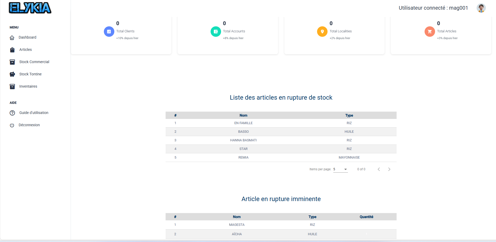

# Guide Utilisateur - Profil Storekeeper

_Ce document est une compilation de la documentation pour impression._

\newpage

# Bienvenue dans votre Espace Magasinier

Bonjour et bienvenue dans le guide dédié au **Magasinier**.

Votre rôle est essentiel : vous êtes le gardien du temple. C'est vous qui assurez que le stock physique correspond à ce qui est dans l'ordinateur, qui réceptionnez les marchandises et qui servez les commerciaux pour qu'ils puissent vendre.

Ce guide est là pour vous aider à maîtriser vos outils au quotidien.

## Votre Tableau de Bord (Dashboard)

Dès que vous vous connectez, vous arrivez sur votre **Tableau de Bord**. C'est votre tour de contrôle. Il vous dit tout de suite s'il y a le feu ou si tout va bien.

### 1. La Vue d'Ensemble
Les cartes en haut vous donnent les grands chiffres :
*   **Total Articles** : Combien de références différentes gérons-nous ?
*   D'autres indicateurs (Clients, etc.) pour info.

### 2. Les Alertes Stock (Votre priorité !)
C'est la partie la plus importante pour vous. Elle vous crie ce qu'il faut faire :

*   **Rupture de stock (Rouge)** : Ces produits sont à 0. Il n'y en a plus ! Il faut réapprovisionner d'urgence.
*   **Rupture imminente (Orange)** : Attention, le stock est bas. Préparez une commande fournisseur.

Vous avez vérifié les alertes ? Passons à la gestion de votre catalogue.

\newpage

---

# Gérer le Catalogue (Articles)

Le menu **Articles** est votre bible. C'est ici que sont listés tous les produits que l'entreprise vend.

---

## 1. Consulter le Catalogue

L'écran principal vous montre tout ce qui existe en rayon.
Pour chaque produit, vous voyez son Nom, sa Marque, son modèle, et son Type.

*Astuce : Utilisez la barre de recherche en haut pour trouver un produit rapidement par son nom.*

---

## 2. Ajouter un Nouveau Produit

Vous avez reçu une nouvelle référence ? Il faut la créer dans le système.

1.  Cliquez sur le bouton **Ajouter**.
2.  Remplissez la fiche d'identité du produit :
    *   **C'est quoi ?** (Nom, Marque, Modèle).
    *   **Quel type ?** (Moto, TV...).
    *   **Combien ça coûte ?** (Prix d'achat et Prix de vente).
        > **Règle d'or** : Le Prix de vente doit toujours être supérieur au Prix d'achat !
    *   **Quand s'inquiéter ?** (Point de commande) : C'est le seuil en dessous duquel l'alerte "Stock bas" se déclenchera.
3.  Cliquez sur **Valider**.

---

## 3. Mettre à jour un produit

Un prix a changé ? Une erreur de saisie ?
Dans la liste, utilisez les boutons d'action à droite :
*   Le **Crayon** pour modifier.
*   L'**Œil** pour voir tous les détails.
*   La **Corbeille** pour supprimer (Attention, ne supprimez pas un article qui a déjà du stock ou des ventes !).

Votre catalogue est à jour. Voyons maintenant comment faire entrer et sortir la marchandise.

\newpage

---

# Inventaires et Approvisionnements

C'est le cœur de votre métier : s'assurer que le stock est juste et bien rempli.

---

## 1. Faire entrer de la marchandise (Approvisionnement)

Le camion du fournisseur est là ? Il faut enregistrer ce qui rentre.

1.  Cliquez sur le bouton **+ Entrées**.
2.  Le formulaire s'ouvre :
    *   **Quoi ?** Sélectionnez les articles reçus dans la liste.
    *   **Combien ?** Tapez la quantité exacte que vous avez comptée au déchargement.
3.  Cliquez sur **Valider l'entrée** (Icône bleue).

Le stock augmente instantanément.

---

## 2. Faire un Inventaire (L'Heure de Vérité)

Régulièrement, il faut vérifier que le stock de l'ordinateur correspond au stock réel de l'entrepôt.

### a. Lancer l'opération
Cliquez sur **Créer un inventaire**.
Le système prend une "photo" du stock théorique à cet instant précis.

### b. Compter sur le terrain
1.  **Imprimer** : Cliquez sur **Télécharger PDF**. C'est votre feuille de comptage.
2.  **Compter** : Allez dans l'entrepôt avec votre feuille et comptez physiquement chaque article.
    *   *Conseil de pro : Ne regardez pas les quantités de l'ordinateur avant de compter, pour ne pas être influencé.*

### c. Saisir les résultats
Revenez devant l'écran :
1.  Cliquez sur **Saisir quantités physiques**.
2.  Remplissez la colonne **Quantité Physique** avec vos chiffres.
    *   Le système vous montre tout de suite les écarts en couleur (Rouge = Manquant, Vert = Surplus).
3.  Cliquez sur **Soumettre les quantités**.

---

## 3. Clôturer (Pour le Gestionnaire)

Cette partie est souvent réservée au Gestionnaire, mais il est bon que vous sachiez ce qui se passe.

Une fois votre comptage terminé, le Gestionnaire va :
1.  Analyser les écarts (Pourquoi il manque 2 laits ?).
2.  **Réconcilier** : Ajuster le stock informatique pour qu'il colle à votre comptage réel.
3.  **Clôturer** : Valider l'inventaire. C'est fini pour ce mois-ci !

Votre stock central est carré. Voyons maintenant comment servir les commerciaux.

\newpage

---

# Le Stock Tontine

Le principe est **exactement le même** que pour le Stock Commercial, mais attention : ce sont des stocks séparés !

Ce menu concerne uniquement les marchandises destinées aux contrats de Tontine (livraisons de fin d'année).

---

## 1. Livrer pour la Tontine

Allez dans **Stock Tontine > Demandes Sortie**.

*   Comme pour le stock commercial, vous ne voyez que les demandes **Validées** par le manager.
*   Préparez les lots tontine.
*   Cliquez sur le **Camion** pour livrer au commercial qui ira distribuer aux clients.

---

## 2. Retours Tontine

Si une livraison tontine échoue et que la marchandise revient :
1.  Allez dans **Stock Tontine > Retours**.
2.  Vérifiez le matériel.
3.  Validez pour le remettre dans votre stock Tontine central.

Voilà, vous maîtrisez maintenant tous les mouvements de stock de l'entrepôt !

\newpage

---

# Servir les Commerciaux (Stock Commercial)

Les commerciaux ont besoin de marchandises pour aller vendre. C'est vous qui les approvisionnez via ce menu.

---

## 1. Livrer un Commercial (Demandes Sortie)

Quand un commercial (ou le manager) fait une demande de matériel, c'est ici qu'elle arrive.

### La Règle d'Or de la Visibilité
> **Important** : Vous ne voyez dans votre liste **QUE** les demandes qui ont été **VALIDÉES** par un Manager.
> Si un commercial vous dit "J'ai fait une demande" mais que vous ne la voyez pas, c'est qu'elle est encore en attente de validation chez le patron.

### Comment livrer ?
1.  Allez dans **Stock Commercial > Demandes Sortie**.
2.  Repérez la demande (elle a le statut vert **Validé**).
3.  Préparez physiquement la marchandise.
4.  Quand vous remettez le matériel au commercial, cliquez sur le bouton **Livrer** (le petit camion bleu).

Hop ! La marchandise sort de votre stock et passe sous la responsabilité du commercial.

### Créer une demande vous-même
Parfois, c'est vous qui initiez la demande pour le commercial (s'il est devant vous).
1.  Cliquez sur **Nouvelle Demande**.
2.  Choisissez le commercial et les articles.
3.  Envoyez. (Elle devra quand même être validée par un manager avant que vous puissiez la livrer !).

---

## 2. Réceptionner les Retours

Parfois, les commerciaux ramènent du matériel (invendus, fin de journée). Il faut le remettre en stock.

1.  Allez dans **Stock Commercial > Retours**.
2.  Vous voyez la liste des retours déclarés.
3.  Vérifiez physiquement le matériel rapporté.
4.  Si tout est là, cliquez sur le bouton **Valider** (la coche verte).

Les articles réintègrent immédiatement votre stock central.

Vous savez gérer les flux avec les commerciaux. C'est la même chose pour la Tontine.

\newpage

---

