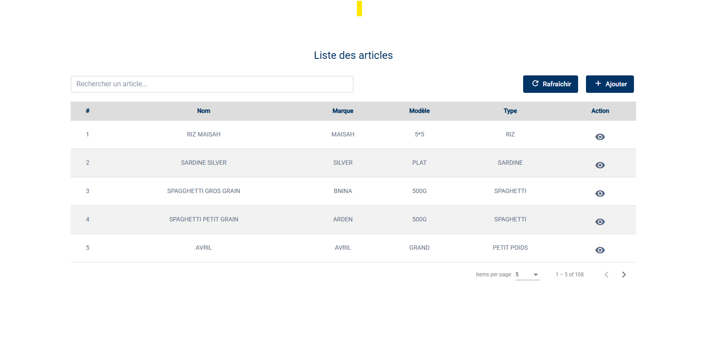

# Gérer le Catalogue (Articles)

Le menu **Articles** est votre bible. C'est ici que sont listés tous les produits que l'entreprise vend.

---

## 1. Consulter le Catalogue

L'écran principal vous montre tout ce qui existe en rayon.
Pour chaque produit, vous voyez son Nom, sa Marque, son modèle, et son Type.

*Astuce : Utilisez la barre de recherche en haut pour trouver un produit rapidement par son nom.*

---

## 2. Ajouter un Nouveau Produit

Vous avez reçu une nouvelle référence ? Il faut la créer dans le système.

1.  Cliquez sur le bouton **Ajouter**.
2.  Remplissez la fiche d'identité du produit :
    *   **C'est quoi ?** (Nom, Marque, Modèle).
    *   **Quel type ?** (Moto, TV...).
    *   **Combien ça coûte ?** (Prix d'achat et Prix de vente).
        > **Règle d'or** : Le Prix de vente doit toujours être supérieur au Prix d'achat !
    *   **Quand s'inquiéter ?** (Point de commande) : C'est le seuil en dessous duquel l'alerte "Stock bas" se déclenchera.
3.  Cliquez sur **Valider**.

---

## 3. Mettre à jour un produit

Un prix a changé ? Une erreur de saisie ?
Dans la liste, utilisez les boutons d'action à droite :
*   Le **Crayon** pour modifier.
*   L'**Œil** pour voir tous les détails.
*   La **Corbeille** pour supprimer (Attention, ne supprimez pas un article qui a déjà du stock ou des ventes !).

Votre catalogue est à jour. Voyons maintenant comment faire entrer et sortir la marchandise.
