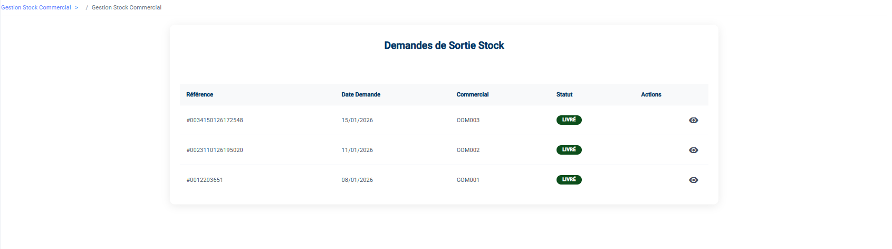

# Gestion Stock Commercial

Ce menu permet de gérer les flux de marchandises entre le magasin central et les commerciaux (Agents).

## 1. Demandes Sortie (Livraisons)

C'est ici que vous traitez les demandes de matériel validées par l'administration.

### Processus de Livraison
> [!IMPORTANT]
> **Règle de Visibilité** : En tant que magasinier, vous ne voyez apparaître dans votre liste **QUE** les demandes ayant déjà été validées par un Gestionnaire. Une demande en attente (`Créé`) est un brouillon invisible pour vous.

1.  Allez dans **Stock Commercial > Demandes Sortie**.
2.  Vous ne verrez que les demandes avec le statut Validé.
    *   Cela confirme que le manager a donné son feu vert.
3.  Cliquez sur le bouton **Livrer** (Icône camion bleu foncé <i class="material-icons" style="font-size:1em; vertical-align:middle;">local_shipping</i>).
4.  La marchandise est déduite de votre stock principal et transférée sur le stock du commercial.

### Créer une demande (Cas exceptionnel)

Si nécessaire, vous pouvez initier une demande pour un commercial :
1.  Cliquez sur **Nouvelle Demande**.
2.  **Commercial** : Sélectionnez le bénéficiaire.
3.  **Articles** : Ajoutez les produits et quantités.
4.  Cliquez sur **Envoyer**. La demande devra ensuite être validée par un manager.

## 2. Retours Stock

Gère le matériel rapporté par les commerciaux au magasin (Ex: invendus, produits défectueux).

### Enregistrer un Retour
1.  Allez dans **Stock Commercial > Retours**.
2.  Cliquez sur **Nouveau Retour**.
3.  Remplissez le formulaire :
    *   **Commercial** : Sélectionnez l'agent qui rapporte le matériel.
    *   **Articles à retourner** : Sélectionnez les produits. Le système vérifie que l'agent possède bien ces articles en stock.
4.  Validez le retour.

### Réceptionner (Validation)
Une fois le retour créé (Statut *Créé*), vous devez confirmer la réception physique :
1.  Dans la liste, cliquez sur le bouton de validation (Coche verte <i class="material-icons" style="font-size:1em; vertical-align:middle;">check_circle</i>).
2.  Les articles réintègrent votre stock principal.
