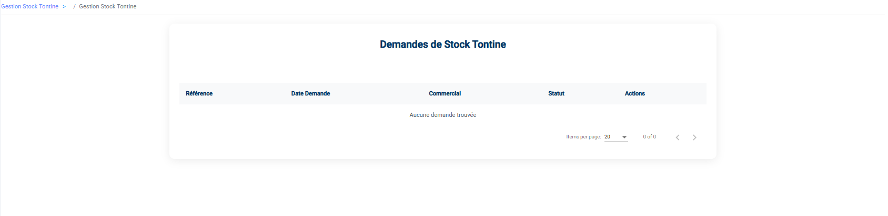

# Gestion Stock Tontine

Le module **Stock Tontine** fonctionne exactement sur le même principe que le Stock Commercial, mais il concerne spécifiquement les produits destinés aux contrats de Tontine.

## Fonctionnalités

### 1. Demandes Sortie

*   Permet de livrer les articles Tontine aux commerciaux pour qu'ils les distribuent aux clients finaux.
*   **Visibilité** : Le magasinier ne voit et ne traite que les demandes **Validé** par un gestionnaire. Les demandes non validées sont invisibles.
*   Action : Cliquez sur l'icône **Livrer** (Camion) pour déstocker.

### 2. Stock (Suivi)

*   Tableau de bord permettant de voir quel commercial détient quels articles Tontine.
*   Permet de suivre les "Restants" non encore livrés aux clients.

### 3. Retours
*   Permet de réintégrer au magasin central des articles Tontine non distribués ou retournés par un commercial.
*   Nécessite une création de retour puis une validation pour mise à jour du stock.
